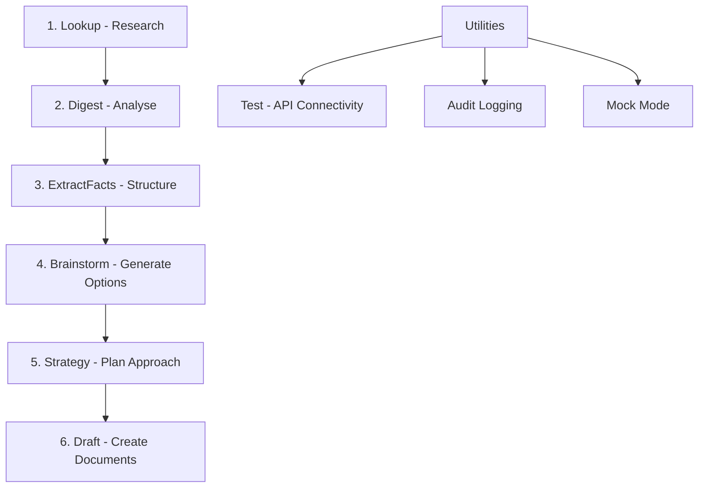
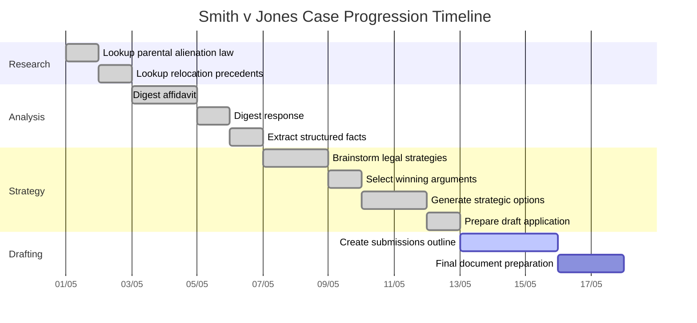

# LitAssist User Guide

## Introduction

LitAssist is a comprehensive legal workflow automation tool designed for Australian legal practice. It provides a structured end-to-end pipeline for litigation support:

```
ingest → analyse → structure → brainstorm → strategy → draft
```

This guide demonstrates how to use each workflow through a running example of a family court case, *Smith v Jones*, involving a complex child custody dispute with issues of interstate relocation and allegations of parental alienation.



## Running Example: Smith v Jones

To illustrate each workflow in a practical context, we'll use a fictional family court case with the following characteristics:

**Case Overview:** Smith v Jones (Federal Circuit and Family Court of Australia, Division 1)

**Key Parties:**
- Jennifer Smith (mother, 38): Formerly resided in Sydney, recently relocated to Brisbane for a senior hospital position
- Michael Jones (father, 40): Still residing in Sydney
- Emily Jones (12) and Thomas Jones (8): Currently living with their mother in Brisbane

**Core Issues:**
1. **Complex Parenting Arrangements**: The parents previously had a consent order with a week-about arrangement when both lived in Sydney.
2. **Interstate Relocation**: Ms. Smith relocated with the children to Brisbane in January 2025, citing a career opportunity. Mr. Jones filed a contravention application in February 2025.
3. **Allegations of Parental Alienation**: Mr. Jones alleges Ms. Smith is "poisoning the children against him," while Ms. Smith claims Mr. Jones exhibits controlling behavior.

**Procedural Status:**
- Interim parenting orders issued in April 2025
- Final hearing scheduled for June 2025

This running example provides context for understanding how each LitAssist workflow contributes to managing a complex family law matter from initial research through to final submissions.

## Key Features

**Global Installation Benefits:**
- ✅ **Use from anywhere** - `litassist` command available in any directory
- ✅ **Local outputs** - All files created in your current working directory
- ✅ **Single configuration** - One global config with all your API keys
- ✅ **Project isolation** - Each case directory gets its own logs and outputs

**Security & Organization:**
- ✅ **API keys in one secure location** - No duplication across projects
- ✅ **Automatic logging** - Every operation creates detailed audit logs
- ✅ **Australian English** - All outputs use Australian legal terminology

## Installation and Setup

**Quick Installation:**
```bash
# Install with pipx (see INSTALLATION.md for detailed instructions)
brew install pipx
pipx install -e /path/to/litassist
pipx ensurepath && source ~/.zshrc

# Setup configuration
cd /path/to/litassist
cp config.yaml.template config.yaml
# Edit config.yaml with your API keys
```

**Verify Installation:**
```bash
litassist --help
litassist test  # Test API connectivity
```

For complete installation instructions, troubleshooting, and alternative methods, see [INSTALLATION.md](INSTALLATION.md).

## Working Directory Setup

LitAssist works from any directory and creates outputs locally:

```bash
# Create project directory for Smith v Jones case
mkdir ~/legal-cases/smith-v-jones-2025
cd ~/legal-cases/smith-v-jones-2025

# LitAssist will create logs/ directory and case_facts.txt here
# All commands use global config but create outputs locally
```

## Workflow 1: Lookup - Rapid Case-Law Search

**Pipeline Phase**: Ingest (Research)

### Purpose

The `lookup` command performs rapid searches on AustLII for relevant case law using Google Custom Search, then processes the results through Gemini to produce a structured legal answer with citations.

### Command

```bash
./litassist.py lookup "your legal question" [--mode irac|broad] [--verify] [--engine google|jade]
```

Options:
- `--mode`: Choose between IRAC (Issue, Rule, Application, Conclusion) or a broader exploration
- `--verify`: Enable self-critique verification pass
- `--engine`: Choose search engine - 'google' for AustLII via CSE (default), 'jade' for Jade.io

### Example Usage

In our *Smith v Jones* case, we might need to quickly research the legal framework for parental alienation:

```bash
./litassist.py lookup "What is the legal framework for determining parental alienation in Australian family court cases?" --mode irac
```

**Output Example**:
```
Issue: What legal framework do Australian family courts use to determine cases involving parental alienation?

Rule: In Australia, parental alienation is addressed primarily through the Family Law Act 1975 (Cth), which emphasizes the best interests of the child as the paramount consideration in parenting matters. In Karabes v Karabes [2019] FamCAFC 3, the Full Court clarified that while parental alienation is not explicitly defined in the legislation, courts must consider:
1. The benefit to children of having a meaningful relationship with both parents (s60CC(2)(a))
2. The need to protect children from physical or psychological harm (s60CC(2)(b))
3. The willingness and ability of each parent to facilitate a relationship between the child and the other parent (s60CC(3)(c))

Application: When determining whether parental alienation has occurred, courts examine evidence of one parent systematically denigrating the other parent or deliberately interfering with parent-child contact without justification. In Miles & Zanelli [2022] FedCFamC1A 20, Justice Kent emphasized that courts must distinguish between legitimate protective behaviors and unjustified alienating behaviors. Evidence is typically provided through experts such as family consultants, psychiatrists, or psychologists as seen in Kappas & Drakos [2018] FamCA 37.

Conclusion: Australian family courts address parental alienation through the best interests framework of the Family Law Act. Courts apply a thorough examination of evidence regarding parental behavior and expert testimony, weighing the importance of meaningful relationships with both parents against any genuine protective concerns. Courts can order various remedies including changes to parenting arrangements, therapy interventions, or in extreme cases, changes to the child's primary residence as demonstrated in Ralton & Ralton [2016] FCWA 65.

Sources:
- Family Law Act 1975 (Cth), sections 60B, 60CC, https://www.austlii.edu.au/cgi-bin/viewdb/au/legis/cth/consol_act/fla1975114/
- Karabes v Karabes [2019] FamCAFC 3, https://www.austlii.edu.au/cgi-bin/viewdoc/au/cases/cth/FamCAFC/2019/3.html | https://jade.io/article/632302
- Miles & Zanelli [2022] FedCFamC1A 20, https://www.austlii.edu.au/cgi-bin/viewdoc/au/cases/cth/FedCFamC1A/2022/20.html | https://jade.io/article/909183  
- Kappas & Drakos [2018] FamCA 37, https://www.austlii.edu.au/cgi-bin/viewdoc/au/cases/cth/FamCA/2018/37.html | https://jade.io/article/572418
- Ralton & Ralton [2016] FCWA 65, https://www.austlii.edu.au/cgi-bin/viewdoc/au/cases/wa/FCWA/2016/65.html | https://jade.io/article/460030
```

### Next in Pipeline

After establishing the relevant legal frameworks through `lookup`, you can proceed to the `digest` workflow to analyze the case documents in detail.

## Workflow 2: Digest - Large Document Processing

**Pipeline Phase**: Analyse

### Purpose

The `digest` command processes large documents by splitting them into manageable chunks and using Claude to either summarize content chronologically or identify potential legal issues in each section.

### Command

```bash
./litassist.py digest <file> [--mode summary|issues] [--verify]
```

Options:
- `--mode`: Choose between chronological summary or issue-spotting (default: summary)
- `--verify`: Enable self-critique verification pass

### Handling Non-Legal Documents

While designed for legal content, the `digest` command can process various document types:

**Works well with**:
- Bank statements → Produces chronological financial events (use `--mode summary`)
- Commercial agreements → Extracts key terms and conditions
- Medical reports → Summarizes findings chronologically

**Limitations**:
- The system prompt specifies "Australian law only" which may affect interpretation
- Financial terms may be framed in legal contexts
- `--mode issues` is less effective for non-legal content

**Best practices**:
- Always use `--mode summary` for non-legal documents
- Use outputs as a starting point for further analysis

### Example Usage

For the *Smith v Jones* case, we have received a lengthy affidavit from our client that needs to be broken down:

```bash
./litassist.py digest examples/smith_affidavit.pdf --mode issues
```

**Output Example**:
```
--- Chunk 1 ---
Potential Legal Issues:

1. Jurisdictional Questions
   There appears to be a potential jurisdictional dispute as Ms. Smith has relocated from NSW to Queensland with the children without Mr. Jones's consent. This raises issues under Family Law Act s65DAA regarding relocation and may trigger the need for a specific "relocation order" from the court.

2. Parental Responsibility
   Ms. Smith's unilateral decision-making regarding the children's schooling and medical care potentially conflicts with the requirement for joint consultation on major long-term issues under s61DA of the Family Law Act, particularly as there seems to have been a previous parenting order establishing equal shared parental responsibility.

3. Family Violence Allegations
   Ms. Smith makes several references to "controlling behavior" and "emotional manipulation" which, while not explicitly characterized as family violence, could potentially be framed as coercive control under s4AB(2) of the Family Law Act. However, the allegations lack specific incidents and may require further particulars.

--- Chunk 2 ---
Potential Legal Issues:

4. Best Interests Considerations
   The children's expressed wishes to remain with their mother in Queensland raises consideration of s60CC(3)(a) regarding children's views, particularly for the 12-year-old child whose views may be given greater weight due to age and maturity.

5. Parental Alienation Concerns
   Mr. Jones's allegations that Ms. Smith is "poisoning the children against him" raise potential parental alienation issues. This relates to s60CC(3)(c) regarding the willingness of each parent to facilitate a relationship between the children and the other parent.
   
...
```

### Next in Pipeline

After analyzing the documents with `digest`, you need to extract key facts in a structured format using the `extractfacts` workflow.

## Workflow 3: ExtractFacts - Deterministic Fact Extraction

**Pipeline Phase**: Structure

### Purpose

The `extractfacts` command processes a document to extract relevant case facts and organizes them into a structured format with ten standard headings, providing a foundation for other commands that require structured facts.

**Note**: Input documents must be text-searchable PDFs for optimal fact extraction.

### Command

```bash
./litassist.py extractfacts <file> [--verify]
```

Options:
- `--verify`: Enable self-critique verification pass

### Required Output Format

The `extractfacts` command produces a `case_facts.txt` file with EXACTLY these 10 required headings:

1. **Parties**: Identify all parties involved in the matter
2. **Background**: Provide context including relationship between parties
3. **Key Events**: List significant events in chronological order with dates
4. **Legal Issues**: Enumerate the legal questions to be addressed
5. **Evidence Available**: Catalog all available evidence and documents
6. **Opposing Arguments**: Summarize the counterparty's position
7. **Procedural History**: Detail the procedural steps taken to date
8. **Jurisdiction**: Specify the relevant court/tribunal
9. **Applicable Law**: List statutes, regulations, and principles that apply
10. **Client Objectives**: State what the client aims to achieve

This structured format is used by both the `brainstorm` and `strategy` commands. The `strategy` command in particular performs strict validation requiring ALL headings to be present exactly as listed above.

Example files are available in the `/examples` directory:
- `example_strategy_headers.txt` - Template with all required headings
- `example_extractfacts_output.txt` - Sample output from extractfacts 
- `example_case_facts.txt` - Complete example with all headings populated

### Handling Non-Legal Documents

The `extractfacts` command is specifically designed for legal documents and forces content into a rigid 10-heading structure:

**Compatible document types**:
- Legal proceedings (optimal use case)
- Commercial contracts (reasonable fit with some adaptation)

**Challenging document types**:
- Bank statements (financial data forced into legal categories)
- Personal documents (may produce stretched interpretations)
- Medical records (terminology misalignments)

**Workarounds for non-legal documents**:
1. First use `digest --mode summary` to understand the document's content
2. Manually create a `case_facts.txt` file following the 10-heading format
3. Focus on relevant sections (leave others minimal but present)
4. Ensure all 10 headings exist in the file even if some have minimal content

### Example Usage

Now we need to create a structured fact sheet for the *Smith v Jones* case:

```bash
./litassist.py extractfacts examples/smith_jones_file.pdf
```

**Output Example**:

The command creates a `case_facts.txt` file in the current directory with a structured format that's compatible with both the `brainstorm` and `strategy` commands.

```
1. Parties
Applicant: Jennifer Smith (mother, 38)
Respondent: Michael Jones (father, 40)
Children: Emily Jones (12) and Thomas Jones (8)

2. Background
Parties had jointly-owned property in Sydney.
Ms. Smith accepted senior position in Brisbane hospital.
Children enrolled in Brisbane schools since February 2025.
Mr. Jones continues to reside in Sydney.
Current communication between parties is minimal and strained.

3. Key Events
- 2012: Parties married in Sydney
- 2013: Emily born
- 2017: Thomas born
- 2022: Parties separated but continued living in Sydney home
- 2023: Consent parenting orders established (week-about arrangement)
- January 2025: Ms. Smith relocated with children to Brisbane (citing job opportunity)
- February 2025: Mr. Jones filed contravention application

4. Legal Issues
1. Whether relocation constitutes breach of consent orders
2. Best interests assessment under s60CC considerations
3. Weight of children's views given their ages
4. Allegations of parental alienation

5. Evidence Available
1. Consent orders dated August 2023
2. School enrollment records
3. Employment contract from Brisbane hospital
4. Father's contravention application
5. Email correspondence between parties

...
```

### Next in Pipeline

With the structured case facts in place, you can now use the `brainstorm` workflow to generate novel legal arguments or remedies.

## Workflow 4: Brainstorm - Comprehensive Legal Strategy Generation

**Pipeline Phase**: Brainstorm

### Purpose

The `brainstorm` command uses Grok's creative capabilities to generate a comprehensive set of litigation strategies based on the facts provided, tailored to your specific party side and legal area. The command produces both orthodox and unorthodox strategies, along with an assessment of which are most likely to succeed.

### Command

```bash
./litassist.py brainstorm <case_facts_file> --side <party_side> --area <legal_area> [--verify]
```

Required parameters:
- `--side`: Which side you are representing (options depend on area):
  - Criminal cases: `accused` only
  - Civil/Commercial cases: `plaintiff` or `defendant`
  - Family/Administrative cases: `plaintiff`, `defendant`, or `respondent`
- `--area`: Legal area of the matter - `criminal`, `civil`, `family`, `commercial`, or `administrative`

**Note**: The command will warn you if you use incompatible side/area combinations (e.g., "plaintiff" in criminal cases) but will still generate strategies.

Options:
- `--verify`: Enable self-critique verification pass on generated strategies

### Example Usage

For the *Smith v Jones* case, we can use the structured facts to generate comprehensive legal strategies:

```bash
./litassist.py brainstorm examples/case_facts.txt --side plaintiff --area family
```

**Output Example**:
```
--- Family Law Strategies for Plaintiff ---

## ORTHODOX STRATEGIES

1. Best Interests Argument
   Focus on how the relocation to Brisbane serves the best interests of the children under s60CC of the Family Law Act. Emphasize improved quality of life, educational opportunities, and financial security.
   Key legal principles: Family Law Act 1975 (Cth) s60CA, s60CC; MRR v GR [2010] HCA 4, https://www.austlii.edu.au/cgi-bin/viewdoc/au/cases/cth/HCA/2010/4.html.

2. Children's Views Application
   Present evidence of 12-year-old Emily's expressed desire to remain in Brisbane, arguing her views should be given substantial weight due to her age and maturity.
   Key legal principles: Family Law Act 1975 (Cth) s60CC(3)(a); Bondelmonte v Bondelmonte [2017] HCA 8, https://www.austlii.edu.au/cgi-bin/viewdoc/au/cases/cth/HCA/2017/8.html | https://jade.io/article/522221.

3. Equal Shared Parental Responsibility Retention
   Argue that relocation does not necessitate changing equal shared parental responsibility, as technological solutions enable joint decision-making despite distance.
   Key legal principles: Family Law Act 1975 (Cth) s61DA; Goode & Goode [2006] FamCA 1346, https://www.austlii.edu.au/cgi-bin/viewdoc/au/cases/cth/FamCA/2006/1346.html | https://jade.io/article/5859.

[continues with 7 more orthodox strategies...]

## UNORTHODOX STRATEGIES

1. "Digital Domicile" Argument
   Assert that children's established online relationships with friends and family in Sydney constitute a digital domicile that mitigates relocation impacts, as geographic moves are less disruptive in the digital age.
   Key legal principles: Morgan & Miles [2007] FamCA 1230, https://www.austlii.edu.au/cgi-bin/viewdoc/au/cases/cth/FamCA/2007/1230.html; emerging international jurisprudence on technology in family law.

2. Educational Innovation Metric
   Commission specialized educational assessment comparing teaching methodologies between Brisbane and Sydney schools, establishing that Brisbane schools offer pedagogical approaches uniquely beneficial for these specific children.
   Key legal principles: Rice v Asplund [1979] FamCA 84 (material change threshold); s60CC(3)(f) regarding educational needs.

[continues with 8 more unorthodox strategies...]

## MOST LIKELY TO SUCCEED

1. Best Interests Argument
   Provides the strongest foundation as courts consistently prioritize children's interests above all other considerations.

2. Meaningful Relationship Maintenance Plan
   Practical and cooperative approach demonstrating willingness to facilitate father's relationship, addressing the court's primary concerns.

3. Substantial & Significant Time Alternative
   Realistic proposal that acknowledges the father's rights while adapting to the reality of distance.

4. Expert Evidence Strategy
   Independent expert opinion carries significant weight, particularly if a family consultant supports the current arrangements.

5. Status Quo Continuation
   Courts are often reluctant to disrupt settled arrangements where children are thriving.
```

### Next in Pipeline

With comprehensive strategies generated, you can now use the `strategy` workflow to develop targeted legal options for achieving specific outcomes.

## Workflow 5: Strategy - Generate Legal Options

**Pipeline Phase**: Strategy

### Purpose

The `strategy` command analyzes case facts to generate strategic legal options, recommended actions, and draft documents tailored to achieving a specific outcome. It produces comprehensive analysis including probability assessments, critical hurdles, and prioritized next steps.

### Command

```bash
./litassist.py strategy <case_facts_file> --outcome <desired_outcome>
```

Required parameters:
- `--outcome`: A single sentence describing the desired outcome

### Strict Format Requirements

The `strategy` command has strict input requirements:

**Required headings structure**:
The input file must contain EXACTLY these 10 headings in this order:

1. **Parties**
2. **Background** 
3. **Key Events**
4. **Legal Issues**
5. **Evidence Available**
6. **Opposing Arguments**
7. **Procedural History**
8. **Jurisdiction**
9. **Applicable Law**
10. **Client Objectives**

These headings must exactly match those created by the `extractfacts` command. The command performs strict validation and will fail with an error if any heading is missing or named differently.

**Required input format notes**:
- Validation explicitly checks for each heading ("Parties:", "Background:", etc.)
- Using different capitalization or wording will cause validation to fail
- Command will terminate with "Case facts file does not follow the required 10-heading structure" error if format requirements aren't met
- For example files showing the correct format, see `/examples/example_strategy_headers.txt`

**Processing mixed document sets**:
1. For multiple related documents (e.g., contract, financial statements, correspondence):
   - Process each document using `digest` first
   - Extract key information relevant to each heading
   - Manually create a consolidated `case_facts.txt` file
   - Ensure all 10 headings are present

**Benefits of rigid structure**:
- Enables structured data extraction (like legal issues extraction)
- Forces comprehensive analysis across all aspects
- Ensures consistent input for strategic analysis

**Limitations**:
- Less flexible for non-litigation contexts
- Requires preprocessing for non-standard documents
- May require manual reformatting

### Example Usage

For the *Smith v Jones* case, we can generate strategic options for specific litigation outcomes:

```bash
./litassist.py strategy examples/case_facts.txt --outcome "Secure interim orders allowing children to remain in Brisbane"
```

**Output Example**:
```
# STRATEGIC OPTIONS FOR: SECURE INTERIM ORDERS ALLOWING CHILDREN TO REMAIN IN BRISBANE

## OPTION 1: Application for Continuation of Interim Arrangements
* **Probability of Success**: 75%

* **Principal Hurdles**:
  1. Overcoming presumption against changing established living arrangements — *Rice v Asplund (1979) FLC 90-725*
  2. Addressing father's contravention application regarding unauthorized relocation — *Family Law Act 1975 s70NAE*

* **Critical Missing Facts**:
  - Evidence of children's adjustment to Brisbane schools
  - Financial comparison of mother's earning capacity in each location


## OPTION 2: Urgent Application based on Best Interests
* **Probability of Success**: 70%

* **Principal Hurdles**:
  1. Establishing urgency justifying immediate determination — *Johns & Johns [2004] FamCA 348*
  2. Demonstrating material change in circumstances — *Goode & Goode [2006] FamCA 1346*

* **Critical Missing Facts**:
  - Expert evidence regarding children's psychological wellbeing
  - Documentation of father's capacity to maintain contact


# RECOMMENDED NEXT STEPS

1. Obtain urgent affidavit from children's school counselors regarding adjustment
2. File Form 4 Application for Interim Orders within 7 days
3. Arrange independent children's lawyer appointment per s68L
4. Commission family report focusing on relocation impact
5. Document all attempts to facilitate father's contact with children


# DRAFT APPLICATION

IN THE FEDERAL CIRCUIT AND FAMILY COURT OF AUSTRALIA
FAMILY LAW DIVISION

File No: SYD2025/0123

### APPLICATION FOR INTERIM PARENTING ORDERS

**BETWEEN:**
JENNIFER SMITH
Applicant

**AND:**
MICHAEL JONES
Respondent

The Applicant applies for the following orders:

1. That pending final determination of these proceedings, the children Emily Jones (born 15/05/2013) and Thomas Jones (born 22/09/2017) live with the Applicant in Brisbane, Queensland.

2. That the children spend time with the Respondent:
   (a) Each alternate weekend from Friday after school to Sunday 6pm;
   (b) For half of all school holiday periods;
   (c) By electronic communication at times agreed between the parties.

3. That the parties have equal shared parental responsibility for major long-term decisions concerning the children.

**GROUNDS:**

1. The children have resided in Brisbane since January 2025 and are enrolled in schools there.

2. The Applicant's employment in Brisbane provides significantly enhanced financial security for the children.

3. Both children have adjusted well to their new environment as evidenced by school reports and counselor assessments.

4. The proposed orders facilitate meaningful time between the children and the Respondent while providing stability in the children's primary residence.

5. The best interests of the children are served by maintaining their current living arrangements pending final determination.

**Filed:** [Date]
**Applicant's Solicitor:** [Details]
```

### Next in Pipeline

With strategic options identified, you can now create comprehensive legal documents using the `draft` workflow.



## Workflow 6: Draft - Retrieval-Augmented Drafting

**Pipeline Phase**: Draft

### Purpose

The `draft` command implements a Retrieval-Augmented Generation workflow to create well-supported legal drafts. The process embeds document chunks, stores them in Pinecone, retrieves relevant passages using MMR re-ranking, and generates a draft with GPT-4o that incorporates these citations.

### Command

```bash
./litassist.py draft <pdf> <query> [--verify] [--diversity FLOAT]
```

Options:
- `--verify`: Enable self-critique verification pass
- `--diversity`: Control diversity of search results (0.0-1.0)

### Example Usage

For our *Smith v Jones* case, we can now draft a submission on the relocation issue:

```bash
./litassist.py draft examples/smith_bundle.pdf "outline of submissions regarding relocation of children in Smith v Jones"
```

**Output Example**:
```
# OUTLINE OF SUBMISSIONS
## SMITH v JONES (SYD2025/0123)
### ISSUE OF RELOCATION OF CHILDREN

1. INTRODUCTION

1.1 These submissions are made on behalf of the Applicant mother, Ms. Jennifer Smith, who seeks final parenting orders permitting her and the children, Emily (12) and Thomas (8), to remain in Brisbane.

1.2 The relocation occurred in January 2025 due to Ms. Smith's acceptance of a senior position at Brisbane Children's Hospital, which represents a significant career advancement and provides enhanced financial security for the children.

2. LEGAL FRAMEWORK

2.1 The paramount consideration is the best interests of the children (s60CA, Family Law Act 1975).

2.2 As noted in MRR v GR [2010] HCA 4 at [15]: "a court cannot order a person to live in a particular place. But it can, consistent with the terms of the Act, frame parenting orders in a way which could have the practical effect of requiring a parent to reside in a particular location if that parent wishes to have the child reside with or spend time with him or her."

2.3 In Morgan & Miles [2007] FamCA 1230, the Court emphasized that relocation cases are not a separate category of case but must be determined according to the same principles as all parenting cases, with the best interests of the children as the paramount consideration.

3. PRIMARY CONSIDERATIONS (s60CC(2))

3.1 Benefit to children of meaningful relationship with both parents
...

[Content continues with well-structured legal arguments incorporating citations from the document]
```


## Workflow 7: Test - API Connectivity Verification

**Pipeline Phase**: Utility

### Purpose

The `test` command verifies API connectivity with all external services used by LitAssist. It attempts to validate credentials for OpenAI, Pinecone, and Google CSE by making test API calls and reports success or failure for each service.

### Command

```bash
./litassist.py test
```

### Example Usage

Before beginning work on the *Smith v Jones* case, you can verify that all API connections are working properly:

```bash
./litassist.py test
```

**Output Example**:
```
Verifying API connections...
  - Testing OpenAI API... OK
  - Testing Pinecone API... OK
  - Testing Google CSE API... OK
All API connections verified.
```

This command is particularly useful when:
- Setting up LitAssist for the first time
- Troubleshooting connectivity issues
- After updating API keys in your config.yaml
- Before beginning important work to ensure all services are available

## End-to-End Pipeline Example

To demonstrate how these five workflows combine into a seamless end-to-end pipeline for the *Smith v Jones* case:

1. **Ingest (Lookup)**: Research legal frameworks for parental alienation and relocation cases in Australian family law.
   ```bash
   ./litassist.py lookup "What is the legal framework for determining parental alienation in Australian family court cases?"
   ./litassist.py lookup "What factors do Australian courts consider in relocation cases?" --mode broad
   ```

2. **Analyse (Digest)**: Process and analyze case documents to identify key issues and chronology.
   ```bash
   ./litassist.py digest examples/smith_affidavit.pdf --mode issues
   ./litassist.py digest examples/jones_response.pdf --mode summary
   ```

3. **Structure (ExtractFacts)**: Extract and organize case facts into a structured format.
   ```bash
   ./litassist.py extractfacts examples/smith_jones_file.pdf
   ```

4. **Brainstorm**: Generate comprehensive legal strategies tailored to party side and legal area.
   ```bash
   ./litassist.py brainstorm examples/case_facts.txt --side plaintiff --area family
   ```

5. **Strategy**: Generate targeted strategic options and draft documents for specific outcomes.
   ```bash
   ./litassist.py strategy examples/case_facts.txt --outcome "Secure interim orders allowing children to remain in Brisbane"
   ```

6. **Draft**: Create a well-supported legal submission incorporating citations from case documents.
   ```bash
   ./litassist.py draft examples/smith_bundle.pdf "outline of submissions regarding relocation of children in Smith v Jones"
   ```

## Conclusion

LitAssist streamlines legal workflows by automating research, analysis, and drafting processes. By following the end-to-end pipeline demonstrated in this guide, legal professionals can efficiently handle complex cases like *Smith v Jones* while ensuring thorough research, structured analysis, and well-supported legal arguments.

## Global Options

Options available for all commands:

```bash
./litassist.py [GLOBAL OPTIONS] <command> [ARGS] [OPTIONS]
```

- `--log-format [json|markdown]` - Set audit log format (default: markdown)
  - JSON format: Structured format for programmatic analysis
  - Markdown format: Human-readable format with clear sections
- `--verbose` - Enable detailed debug logging

## Testing with Mock Mode

When using placeholder API keys in your config.yaml file:
- Some commands will enter mock mode automatically
- This allows testing the CLI without active API subscriptions
- Mock mode provides sample responses to demonstrate functionality:
  - `lookup`: Returns sample AustLII results
  - `digest`: Uses local test document processing
  - `brainstorm`: Generates theoretical strategies
  - Other commands will indicate they require valid credentials

To exit mock mode, update config.yaml with valid API keys.

## Audit Logging

All command executions are logged for audit purposes:
- Logs stored in `logs/` directory
- Format: `logs/<command>_YYYYMMDD-HHMMSS.{json|md}`
- Contents include metadata, inputs, prompts, responses, and token usage
- Logs contain sensitive data - ensure proper access controls and encryption at rest

## Legal Disclaimer

All outputs from LitAssist are draft documents only and must be reviewed by qualified legal counsel before use in formal proceedings.
