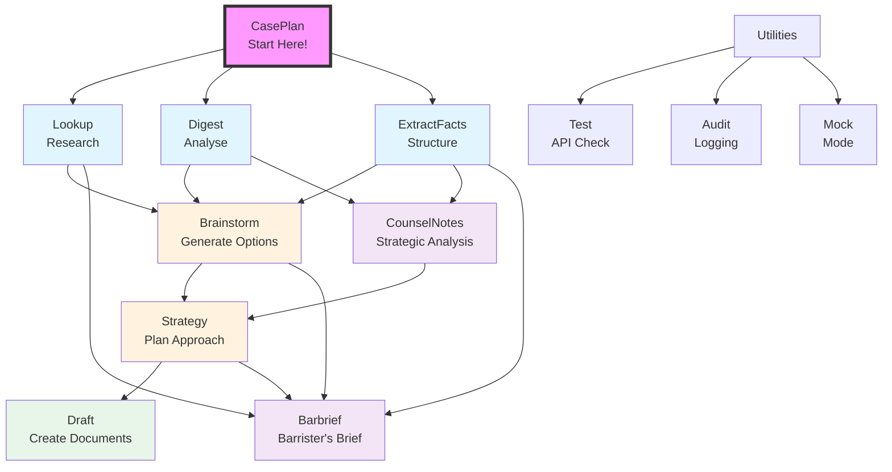

# LitAssist

**LitAssist** is a comprehensive legal workflow automation tool designed for Australian legal practice. It provides a structured end-to-end pipeline for litigation support:

```
plan → research → analyse → structure → brainstorm → strategy → draft
```

**Start with CasePlan:**  
ALWAYS begin with the `caseplan` command, even with a skeleton `case_facts.txt` file. It generates a complete litigation roadmap with executable commands, helping you systematically build your case. The plan includes cost estimates, time projections, and explains every technical choice.



## Core Commands

### Start Here: CasePlan
- **CasePlan**: START HERE! Automated phased workflow planning with executable scripts
  - Generates complete litigation roadmaps tailored to your case
  - Creates executable bash scripts with all commands ready to run
  - Explains every technical choice with "Switch rationale" comments
  - Adapts to case complexity: minimal, standard, or comprehensive workflows

### Primary Workflow Commands
- **Lookup**: Rapid case-law research (Jade.io database via Google Custom Search + Google Gemini)  
- **Digest**: Mass document processing (chronological summaries or issue-spotting via Claude)  
- **ExtractFacts**: Automatic extraction of case facts into a structured file  
- **Brainstorm**: Creative legal strategy generation (unorthodox strategies via Grok)  
- **Strategy**: Targeted legal options with probability assessments and draft documents (enhanced reasoning via o3-pro)
- **Draft**: Citation-rich document creation (superior technical writing via o3-pro)

### Specialized Commands
- **CounselNotes**: Strategic advocate analysis with structured extractions (Claude)  
- **Barbrief**: Comprehensive barrister's briefs for litigation (extended output via o3-pro)

For detailed usage guidance, see the [LitAssist User Guide](docs/user/LitAssist_User_Guide.md).

## Installation

### Quick Start

```bash
# 1. Clone repository
git clone https://github.com/your-org/litassist.git
cd litassist

# 2. Install globally with pipx (recommended)
brew install pipx
pipx install -e .
pipx inject litassist tiktoken
pipx ensurepath
source ~/.zshrc

# For local development with pip instead of pipx
# use the pinned requirements to avoid version issues
# (openai==0.28.1, google-api-python-client, etc.)
#
# pip install -r requirements.txt

# 3. Setup configuration
cp config.yaml.template config.yaml
# Edit config.yaml with your API keys

# 4. Copy config to global location
mkdir -p ~/.config/litassist
cp config.yaml ~/.config/litassist/

# 5. Use from anywhere
cd ~/any-directory/
litassist caseplan case_facts.txt
```

**For detailed installation options, troubleshooting, and advanced setup, see the [Installation Guide](INSTALLATION.md)**

## Configuration

Required API keys in `config.yaml` (see [config.yaml.template](config.yaml.template) for reference):

```yaml
openrouter:
  api_key:    "YOUR_OPENROUTER_KEY"
  api_base:   "https://openrouter.ai/api/v1"   # optional

openai:
  api_key:          "YOUR_OPENAI_KEY"  # For embeddings only - o3-pro requires BYOK via OpenRouter
  embedding_model:  "text-embedding-3-small"

google_cse:
  api_key:  "YOUR_GOOGLE_API_KEY"
  cse_id:   "YOUR_JADE_CSE_ID"    # Google CSE for Jade.io

pinecone:
  api_key:     "YOUR_PINECONE_KEY"
  environment: "YOUR_PINECONE_ENV"   # e.g. "us-east-1-aws"
  index_name:  "legal-rag"

llm:
  use_token_limits: false    # Enable conservative token limits for AI responses (default: false = use model defaults)

general:
  heartbeat_interval: 10  # Progress indicator interval in seconds (default: 10)
  max_chars: 200000       # Document chunking: characters per chunk for digest/extractfacts (default: 200000 ≈ 50K tokens)
  rag_max_chars: 8000     # Document chunking: characters per chunk for draft command embeddings (default: 8000 ≈ 1600 words)
```

### OpenRouter Configuration

OpenRouter is the primary API gateway for all LLM calls. Some models require BYOK (Bring Your Own Key) setup:

**Models requiring BYOK:**
- OpenAI o3-pro (strategy, draft, barbrief commands)
- Some Claude Opus models (check availability)
- Certain Gemini models in specific regions

**Quick BYOK Setup:**
1. Go to [OpenRouter Settings](https://openrouter.ai/settings/integrations)
2. Add your API keys under integrations:
   - **OpenAI**: Requires Tier 4+ API key with o3-pro access (standard keys won't work)
   - **Anthropic**: Any valid API key
3. Save and verify model availability on your dashboard

### Model Configuration & BYOK Requirements

LitAssist uses cutting-edge AI models specifically optimized for legal work:

| Command | Model | BYOK Required | Purpose |
|---------|-------|--------------|---------|
| **caseplan** | Claude 4 Sonnet/Opus | No | Workflow planning - START HERE! |
| **lookup** | Google Gemini 2.5 Pro | No | Rapid case-law research |
| **digest** | Claude 4 Sonnet | No | Document analysis and summarization |
| **extractfacts** | Claude 4 Sonnet | No | Structured fact extraction |
| **brainstorm** | Claude 4 Sonnet / Grok 3 | No | Conservative vs creative strategies |
| **strategy** | OpenAI o3-pro | **Yes** | Enhanced multi-step legal reasoning |
| **draft** | OpenAI o3-pro | **Yes** | Superior technical legal writing |
| **counselnotes** | Claude 4 Opus | No | Strategic advocate analysis |
| **barbrief** | OpenAI o3-pro | **Yes** | Comprehensive barrister's briefs |

#### Required BYOK Setup

Commands using restricted models (`strategy`, `draft`, `barbrief`) require BYOK setup on OpenRouter. Without BYOK, these commands will fail with authentication errors.

**Note:** Check the [OpenRouter Models page](https://openrouter.ai/models) to verify which models are available with your API key vs. requiring BYOK.

For detailed API configuration, model availability, and troubleshooting, see the [LitAssist User Guide](docs/user/LitAssist_User_Guide.md#configuration).

## Command Reference

Basic usage:
```bash
litassist [GLOBAL OPTIONS] <command> [ARGS] [OPTIONS]
```

Global options:
- `--log-format [json|markdown]`: Choose audit-log format (default: json)
- `--verbose`: Enable debug-level logging

### Core Pipeline Commands

### 1. caseplan - Your Starting Point

**ALWAYS START HERE!** This command is your litigation GPS, generating a complete roadmap tailored to your case.

```bash
# Step 1: Get budget recommendation based on case complexity
litassist caseplan case_facts.txt

# Step 2: Generate full plan with executable script
litassist caseplan case_facts.txt --budget standard

# Step 3: Execute the generated workflow
bash caseplan_commands_standard_*.txt
```

**Key Features:**
- **Complexity Analysis**: Evaluates legal, factual, procedural, and strategic complexity
- **Budget Levels**: 
  - `minimal`: Quick matters, 5-7 phases
  - `standard`: Typical litigation, 10-12 phases  
  - `comprehensive`: Complex cases, 15-25 phases
- **Context**: Use `--context "breach of contract"` to guide analysis and prioritize relevant workflow phases
- **Executable Output**: Creates bash script with all commands ready to run
- **Switch Explanations**: Every technical choice explained inline

**Example Output:**
```bash
# Phase 1: Extract Initial Facts
litassist extractfacts contract.pdf emails.pdf
# Switch rationale: Standard extraction, no special parameters needed

# Phase 2: Research Contract Breach Elements
litassist lookup "elements of contract breach and damages" --mode irac --comprehensive
# Switch rationale: --comprehensive for detailed analysis, --mode irac for structured output
```

### 2. lookup - Rapid case-law search with automatic citation
   ```bash
   litassist lookup "What defences exist to adverse costs orders?"
   litassist lookup "Question?" --mode broad --comprehensive
   litassist lookup "contract formation elements" --extract citations
   litassist lookup "negligence principles" --extract principles  
   litassist lookup "discovery requirements" --extract checklist
   ```
   
   Options:
   - `--mode [irac|broad]`: Analysis format (default: irac)
   - `--extract [citations|principles|checklist]`: Extract specific information in structured format
   - `--comprehensive`: Use exhaustive analysis with up to 40 sources (vs 5 standard)

### 3. digest - Process large documents for summaries or issues

```bash
litassist digest bundle.pdf --mode [summary|issues]
```

### 4. extractfacts - Extract structured case facts from documents

```bash
# Single file
litassist extractfacts document.pdf

# Multiple files
litassist extractfacts file1.pdf file2.txt file3.pdf

# Creates: extractfacts_[combined_slugs]_YYYYMMDD_HHMMSS.txt
# Note: case_facts.txt must be created or edited manually
```

### 5. brainstorm - Generate comprehensive legal strategies with reasoning traces

```bash
# Default: uses case_facts.txt if present in current directory
litassist brainstorm --side [plaintiff|defendant|accused] --area [criminal|civil|family|commercial|administrative]

# Specify facts file(s) explicitly
litassist brainstorm --facts case_facts.txt --side plaintiff --area civil

# Use multiple facts files with glob patterns
litassist brainstorm --facts 'case_*.txt' --side plaintiff --area civil

# Add research context (supports glob patterns)
litassist brainstorm --side plaintiff --area civil --research 'outputs/lookup_*.txt'

# Multiple research files with selective patterns
litassist brainstorm --side plaintiff --area civil --research 'outputs/lookup_*gift*.txt' --research 'outputs/lookup_*trust*.txt'

# Creates: brainstorm_[area]_[side]_YYYYMMDD_HHMMSS.txt (main strategies)
#          brainstorm_[area]_[side]_YYYYMMDD_HHMMSS_orthodox_reasoning.txt
#          brainstorm_[area]_[side]_YYYYMMDD_HHMMSS_unorthodox_reasoning.txt  
#          brainstorm_[area]_[side]_YYYYMMDD_HHMMSS_analysis_reasoning.txt
# Note: strategies.txt must be created or edited manually
```

### 6. strategy - Generate targeted legal options and draft documents

```bash
litassist strategy case_facts.txt --outcome "Obtain interim injunction against defendant"
# Or incorporate brainstormed strategies
litassist strategy case_facts.txt --outcome "..." --strategies strategies.txt
```

### 7. draft - Create citation-rich legal drafts with intelligent document recognition

```bash
# Single document
litassist draft case_facts.txt "skeleton argument on jurisdictional error"
# Multiple documents (automatically recognizes case_facts.txt and strategies.txt)
litassist draft case_facts.txt strategies.txt "argument based on strategy #3"
# Mix text files and PDFs
litassist draft case_facts.txt bundle.pdf "comprehensive submission"
```

### 8. counselnotes - Generate strategic advocate analysis

```bash
# Single document
litassist counselnotes document.pdf
# Multiple documents
litassist counselnotes doc1.pdf doc2.txt doc3.pdf
# Extract specific sections
litassist counselnotes case_bundle.pdf --extract all
```

### 9. barbrief - Generate comprehensive barrister's briefs for litigation

```bash
# Basic brief for trial
litassist barbrief case_facts.txt --hearing-type trial
# Appeal brief with strategies
litassist barbrief case_facts.txt --hearing-type appeal --strategies strategies.txt
# Full brief with all materials
litassist barbrief case_facts.txt --hearing-type interlocutory \
  --strategies strategies.txt \
  --research lookup_report1.txt --research lookup_report2.txt \
  --documents affidavit.pdf --documents exhibit_a.pdf \
  --context "Focus on jurisdictional issues" \
  --verify
```

Required:
- Case facts in 10-heading format (from extractfacts)
- `--hearing-type [trial|directions|interlocutory|appeal]`

Options:
- `--strategies FILE`: Brainstormed strategies
- `--research FILE`: Lookup/research reports (multiple allowed)
- `--documents FILE`: Supporting documents (multiple allowed)
- `--context TEXT`: Additional context to guide the analysis
- `--verify`: Enable citation verification

### Utility Commands

- **test** - Verify API connectivity
  ```bash
  litassist test
  ```

## Example Files

The [`examples/`](examples/) directory contains sample files for testing all commands, based on the fictional *Smith v Jones* family law case.

## Output Files & Logging

### Command Output Files
All commands now save their output to timestamped text files without overwriting existing files:

- **caseplan**: `caseplan_[budget]_YYYYMMDD_HHMMSS.txt` and `caseplan_commands_[budget]_YYYYMMDD_HHMMSS.txt`
- **lookup**: `lookup_[query_slug]_YYYYMMDD_HHMMSS.txt`
- **digest**: `digest_[mode]_[filename_slug]_YYYYMMDD_HHMMSS.txt`
- **brainstorm**: `brainstorm_[area]_[side]_YYYYMMDD_HHMMSS.txt`
- **extractfacts**: `extractfacts_[filename_slug]_YYYYMMDD_HHMMSS.txt`
- **strategy**: `strategy_[outcome_slug]_YYYYMMDD_HHMMSS.txt`
- **draft**: `draft_[query_slug]_YYYYMMDD_HHMMSS.txt`
- **counselnotes**: `counselnotes_[filename_slug]_YYYYMMDD_HHMMSS.txt`
- **barbrief**: `barbrief_[hearing_type]_YYYYMMDD_HHMMSS.txt`

Each output file includes metadata headers with command parameters and timestamps.

### Output Organization
- Command outputs are automatically stored in the `outputs/` directory
- Detailed logs are saved in `logs/<command>_YYYYMMDD-HHMMSS.{json|md}`
- Progress indicators keep you informed during long-running operations (configurable heartbeat interval)
- Network errors are caught and displayed with user-friendly messages

### Model Configuration
Each command uses optimized LLM models and parameters:
- **Factual tasks** (lookup, extractfacts): `temperature=0` for accuracy
- **Creative tasks** (brainstorm, draft): `temperature=0.5-0.9` for innovation
- **Verification**: Always uses `temperature=0` for consistency

**Note**:  
- Document chunking (`max_chars`) and AI output limits (`use_token_limits`) are separate systems.  
- tiktoken is required for accurate token counting and large document handling.  
- All output is now ASCII/ANSI only (no emoji).  
- See the [LitAssist User Guide](docs/user/LitAssist_User_Guide.md#llm-models-and-parameter-configuration) for details.

## Disclaimer

This tool provides drafts and summaries only. All outputs must be reviewed by qualified legal counsel before filing or submission.

---

For detailed instructions, workflows, and examples, see the [LitAssist User Guide](docs/user/LitAssist_User_Guide.md).