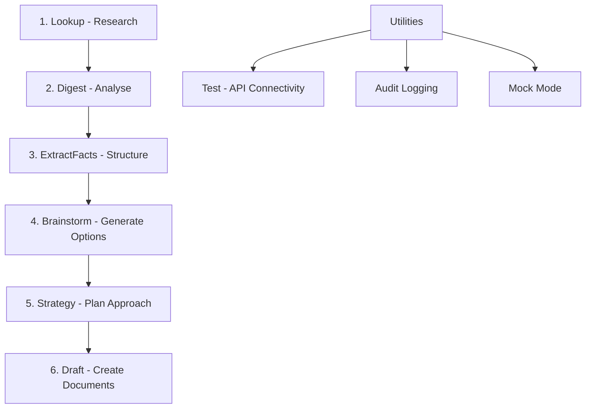

# LitAssist

**LitAssist** is a command-line tool for automated litigation support workflows, tailored to Australian law. It leverages large language models (LLMs) and a managed vector store to provide an end-to-end pipeline:



- **Lookup**: Rapid case-law research (Google Custom Search + Google Gemini)  
- **Digest**: Mass-document processing (Chronological summaries or issue-spotting via Claude)  
- **ExtractFacts**: Automatic extraction of case facts into a structured file  
- **Brainstorm**: Creative legal strategy generation (Unorthodox strategies via Grok)  
- **Strategy**: Targeted legal options with probability assessments and draft documents
- **Draft**: Citation-rich document creation (Retrieval-Augmented Generation with GPT-4o)  

For detailed usage guidance, see [LitAssist_User_Guide.md](LitAssist_User_Guide.md).

## 🔧 Installation

```bash
# Clone repository
git clone https://github.com/your-org/litassist.git
cd litassist

# Create and activate virtual environment
python3 -m venv .venv
source .venv/bin/activate

# Install dependencies
pip install -r requirements.txt

# Setup configuration
cp config.yaml.template config.yaml
# Edit config.yaml with your API keys

# Make script executable
chmod +x litassist.py
```

## ⚙️ Configuration

Required API keys in `config.yaml`:

```yaml
openrouter:
  api_key:    "YOUR_OPENROUTER_KEY"
  api_base:   "https://openrouter.ai/api/v1"   # optional

openai:
  api_key:          "YOUR_OPENAI_KEY"
  embedding_model:  "text-embedding-3-small"

google_cse:
  api_key:  "YOUR_GOOGLE_API_KEY"
  cse_id:   "YOUR_GOOGLE_CSE_ID"

pinecone:
  api_key:     "YOUR_PINECONE_KEY"
  environment: "YOUR_PINECONE_ENV"   # e.g. "us-east-1-aws"
  index_name:  "legal-rag"
```

## 🚀 Command Reference

Basic usage:
```bash
./litassist.py [GLOBAL OPTIONS] <command> [ARGS] [OPTIONS]
```

Global options:
- `--log-format [json|markdown]`: Choose audit-log format (default: markdown)
- `--verbose`: Enable debug-level logging

### Core Pipeline Commands

1. **lookup** - Rapid case-law search with automatic citation
   ```bash
   ./litassist.py lookup "What defences exist to adverse costs orders?"
   ./litassist.py lookup "Question?" --mode broad --engine jade --verify
   ```

2. **digest** - Process large documents for summaries or issues
   ```bash
   ./litassist.py digest bundle.pdf --mode [summary|issues] --verify
   ```

3. **extractfacts** - Extract structured case facts from documents
   ```bash
   ./litassist.py extractfacts document.pdf --verify
   ```

4. **brainstorm** - Generate comprehensive legal strategies
   ```bash
   ./litassist.py brainstorm case_facts.txt --side [plaintiff|defendant|accused] --area [criminal|civil|family|commercial|administrative] --verify
   ```

5. **strategy** - Generate targeted legal options and draft documents
   ```bash
   ./litassist.py strategy case_facts.txt --outcome "Obtain interim injunction against defendant"
   ```

6. **draft** - Create citation-rich legal drafts
   ```bash
   ./litassist.py draft bundle.pdf "skeleton argument on jurisdictional error" --verify --diversity 0.3
   ```

### Utility Commands

- **test** - Verify API connectivity
  ```bash
  ./litassist.py test
  ```

## 📁 Example Files

The `examples/` directory contains sample files for testing all commands, based on the fictional *Smith v Jones* family law case.

## 📂 Logging & Monitoring

- Logs stored in `logs/<command>_YYYYMMDD-HHMMSS.{json|md}`
- Progress indicators for long-running operations
- Network errors are caught with user-friendly messages

## ⚖️ Disclaimer

This tool provides drafts and summaries only. All outputs should be reviewed by qualified counsel before filing or submission.

---

For detailed instructions, workflows, and examples, see [LitAssist_User_Guide.md](LitAssist_User_Guide.md).
