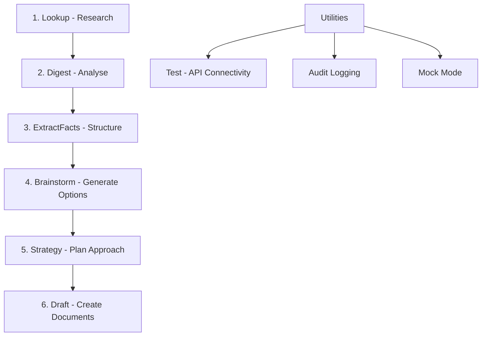

# LitAssist

**LitAssist** is a command-line tool for automated litigation support workflows, tailored to Australian law. It leverages large language models (LLMs) and a managed vector store to provide an end-to-end pipeline:



- **Lookup**: Rapid case-law research (Google Custom Search + Google Gemini)  
- **Digest**: Mass-document processing (Chronological summaries or issue-spotting via Claude)  
- **ExtractFacts**: Automatic extraction of case facts into a structured file  
- **Brainstorm**: Creative legal strategy generation (Unorthodox strategies via Grok)  
- **Strategy**: Targeted legal options with probability assessments and draft documents
- **Draft**: Citation-rich document creation (Retrieval-Augmented Generation with GPT-4o)  

For detailed usage guidance, see [LitAssist_User_Guide.md](LitAssist_User_Guide.md).

## 🔧 Installation

### Quick Start

```bash
# 1. Clone repository
git clone https://github.com/your-org/litassist.git
cd litassist

# 2. Install globally with pipx (recommended)
brew install pipx
pipx install -e .
pipx ensurepath
source ~/.zshrc

# 3. Setup configuration
cp config.yaml.template config.yaml
# Edit config.yaml with your API keys

# 4. Use from anywhere
cd ~/any-directory/
litassist digest document.pdf
```

**📖 For detailed installation options, troubleshooting, and advanced setup, see [INSTALLATION.md](INSTALLATION.md)**

## ⚙️ Configuration

Required API keys in `config.yaml`:

```yaml
openrouter:
  api_key:    "YOUR_OPENROUTER_KEY"
  api_base:   "https://openrouter.ai/api/v1"   # optional

openai:
  api_key:          "YOUR_OPENAI_KEY"
  embedding_model:  "text-embedding-3-small"

google_cse:
  api_key:  "YOUR_GOOGLE_API_KEY"
  cse_id:   "YOUR_GOOGLE_CSE_ID"

pinecone:
  api_key:     "YOUR_PINECONE_KEY"
  environment: "YOUR_PINECONE_ENV"   # e.g. "us-east-1-aws"
  index_name:  "legal-rag"

general:
  heartbeat_interval: 10  # Progress indicator interval in seconds (default: 10)
```

## 🚀 Command Reference

Basic usage:
```bash
./litassist.py [GLOBAL OPTIONS] <command> [ARGS] [OPTIONS]
```

Global options:
- `--log-format [json|markdown]`: Choose audit-log format (default: markdown)
- `--verbose`: Enable debug-level logging

### Core Pipeline Commands

1. **lookup** - Rapid case-law search with automatic citation
   ```bash
   ./litassist.py lookup "What defences exist to adverse costs orders?"
   ./litassist.py lookup "Question?" --mode broad --engine jade
   ```

2. **digest** - Process large documents for summaries or issues
   ```bash
   ./litassist.py digest bundle.pdf --mode [summary|issues]
   ```

3. **extractfacts** - Extract structured case facts from documents
   ```bash
   ./litassist.py extractfacts document.pdf
   ```

4. **brainstorm** - Generate comprehensive legal strategies (saves to strategies.txt)
   ```bash
   ./litassist.py brainstorm case_facts.txt --side [plaintiff|defendant|accused] --area [criminal|civil|family|commercial|administrative]
   ```

5. **strategy** - Generate targeted legal options and draft documents
   ```bash
   ./litassist.py strategy case_facts.txt --outcome "Obtain interim injunction against defendant"
   # Or incorporate brainstormed strategies
   ./litassist.py strategy case_facts.txt --outcome "..." --strategies strategies.txt
   ```

6. **draft** - Create citation-rich legal drafts with intelligent document recognition
   ```bash
   # Single document
   ./litassist.py draft case_facts.txt "skeleton argument on jurisdictional error"
   # Multiple documents (automatically recognizes case_facts.txt and strategies.txt)
   ./litassist.py draft case_facts.txt strategies.txt "argument based on strategy #3"
   # Mix text files and PDFs
   ./litassist.py draft case_facts.txt bundle.pdf "comprehensive submission"
   ```

### Utility Commands

- **test** - Verify API connectivity
  ```bash
  ./litassist.py test
  ```

## 📁 Example Files

The `examples/` directory contains sample files for testing all commands, based on the fictional *Smith v Jones* family law case.

## 📂 Output Files & Logging

### Command Output Files
All commands now save their output to timestamped text files without overwriting existing files:

- **lookup**: `lookup_[query_slug]_YYYYMMDD_HHMMSS.txt`
- **digest**: `digest_[mode]_[filename_slug]_YYYYMMDD_HHMMSS.txt`
- **brainstorm**: `strategies.txt` (current) + `brainstorm_[area]_[side]_YYYYMMDD_HHMMSS.txt` (archive)
- **extractfacts**: `case_facts.txt` (current) + `extractfacts_[filename_slug]_YYYYMMDD_HHMMSS.txt` (archive)
- **strategy**: `strategy_[outcome_slug]_YYYYMMDD_HHMMSS.txt`
- **draft**: `draft_[query_slug]_YYYYMMDD_HHMMSS.txt`

Each output file includes metadata headers with command parameters and timestamps.

### Audit Logging
- Detailed logs stored in `logs/<command>_YYYYMMDD-HHMMSS.{json|md}`
- Progress indicators for long-running operations (configurable heartbeat interval)
- Network errors are caught with user-friendly messages

## ⚖️ Disclaimer

This tool provides drafts and summaries only. All outputs should be reviewed by qualified counsel before filing or submission.

---

For detailed instructions, workflows, and examples, see [LitAssist_User_Guide.md](LitAssist_User_Guide.md).
