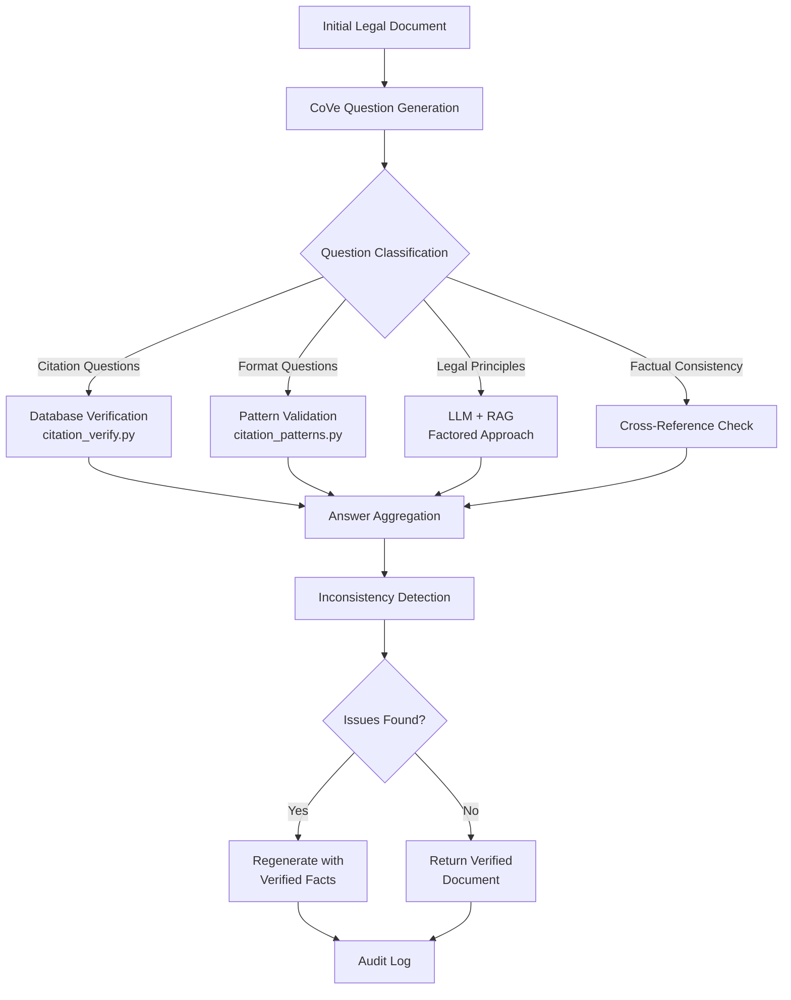

# Legal Chain of Verification (CoVe) Implementation Plan

## Executive Summary

Implementing Chain of Verification (CoVe) for legal documents to address the critical hallucination problem in legal AI, where research shows 69-88% hallucination rates in legal queries. This plan combines Meta AI's CoVe methodology with LitAssist's existing verification infrastructure to create a legally defensible verification system.

## Background: The Legal Hallucination Crisis

Research from Stanford HAI and Oxford Journal of Legal Analysis reveals:
- Legal hallucinations occur in **69-88% of legal queries** to state-of-the-art LLMs
- In common law systems, *stare decisis* requires absolute fidelity to historical case law
- Any misstatement of binding law makes an LLM lose professional utility
- Legal sanctions and professional liability make accuracy paramount

## What is Chain of Verification (CoVe)?

Based on Meta AI research (arXiv:2309.11495), CoVe is a four-step self-verification process:

1. **Generate baseline response** - Initial LLM output
2. **Plan verification questions** - Generate questions to fact-check the response
3. **Execute verifications independently** - Answer questions without bias from original
4. **Generate final verified response** - Incorporate verification results

The "factored" approach (preventing the model from attending to prior answers) reduces repeated hallucinations.

## Our Enhanced Legal CoVe Architecture

### Core Innovation: Hybrid Verification

Unlike standard CoVe which relies solely on LLM self-verification, our approach combines:
- **External validation** via legal databases (Jade.io)
- **Pattern matching** for citation formats
- **LLM verification** for legal principles
- **Cross-reference checking** for factual consistency

### System Architecture



## Implementation Details

### 1. Question Generation Module

```python
# litassist/verification/cove.py

class LegalCoVe:
    """Chain of Verification for legal documents with external validation"""
    
    def generate_verification_questions(self, content, doc_type):
        """Generate domain-specific verification questions"""
        
        questions = {
            'citations': [],      # Real case verification
            'statutes': [],       # Current law verification
            'principles': [],     # Legal doctrine verification
            'consistency': [],    # Internal consistency
            'dates': [],         # Temporal verification
            'parties': []        # Party name consistency
        }
        
        # Use LLM to generate targeted questions
        prompt = PROMPTS.get('cove.question_generation').format(
            content=content,
            doc_type=doc_type
        )
        
        return self.parse_questions(llm_response)
```

### 2. Hybrid Verification Executor

```python
def execute_hybrid_verification(self, questions):
    """Route questions to appropriate validators"""
    
    answers = {}
    for category, question_list in questions.items():
        for question in question_list:
            if category == 'citations':
                # Use existing citation_verify.py
                answers[question] = self.verify_citation_database(question)
            elif category == 'statutes':
                # Check current legislation
                answers[question] = self.verify_statute_current(question)
            elif category == 'principles':
                # Factored LLM verification
                answers[question] = self.verify_principle_factored(question)
            elif category == 'consistency':
                # Cross-reference checking
                answers[question] = self.check_internal_consistency(question)
                
    return answers
```

### 3. Question Templates

```yaml
# litassist/prompts/cove.yaml

cove:
  question_generation: |
    Analyze this legal document and generate verification questions.
    
    For each citation, ask:
    - Is [case name] correctly cited with year and court?
    - Does [case] actually establish [principle claimed]?
    
    For each statute, ask:
    - Is [section X] of [Act] currently in force?
    - Does [section] actually state [claimed provision]?
    
    For legal principles, ask:
    - Is [principle] correctly attributed to [source]?
    - Does [doctrine] apply to [these facts]?
    
    For consistency, ask:
    - Are all dates consistent throughout?
    - Are party names spelled consistently?
    - Do facts align across all sections?

  factored_verification: |
    Answer this question based ONLY on your legal knowledge.
    Do NOT consider any prior responses.
    Question: {question}
    Provide a brief, factual answer with source if known.
```

### 4. Integration Points

#### Option A: Add as New Verification Stage
```python
# litassist/verification/config.py
COMMAND_CONFIGS = {
    'extractfacts': {
        'stages': ['pattern', 'database', 'cove', 'llm'],
        'cove_config': {
            'question_types': ['citations', 'statutes', 'consistency'],
            'max_questions': 20,
            'factored': True
        }
    }
}
```

#### Option B: Replace LLM Critique with CoVe
```python
COMMAND_CONFIGS = {
    'strategy': {
        'stages': ['pattern', 'database', 'cove'],  # CoVe replaces generic LLM
        'cove_config': {
            'comprehensive': True,
            'external_validation': True
        }
    }
}
```

## Example Verification Questions

### Citation Verification
- "Is 'Donoghue v Stevenson [1932] AC 562' a real House of Lords case?"
- "Was Mabo v Queensland (No 2) decided in 1992 by the High Court?"
- "Does Carlill v Carbolic Smoke Ball Company establish unilateral contracts?"

### Statutory Verification
- "Is section 18 of the Australian Consumer Law about misleading conduct?"
- "Has the Trade Practices Act 1974 been replaced by Competition and Consumer Act 2010?"
- "Is section 52 still in force or has it been repealed?"

### Principle Verification
- "Is the 'neighbor principle' correctly attributed to Lord Atkin?"
- "Does the 'reasonable person test' apply in negligence cases?"
- "Is strict liability applicable to the facts described?"

### Consistency Verification
- "Is the accident date consistently stated as March 15, 2023?"
- "Is the plaintiff's name spelled 'Smith' throughout?"
- "Do the claimed damages align with the injury description?"

## Implementation Phases

### Phase 1: Basic CoVe (Week 1)
- [ ] Create `litassist/verification/cove.py` with question generation
- [ ] Add simple question templates for citations
- [ ] Integrate with existing verification chain
- [ ] Test with extractfacts command

### Phase 2: Hybrid Verification (Week 2)
- [ ] Implement question routing to external validators
- [ ] Connect to citation_verify.py for database checks
- [ ] Add factored LLM verification
- [ ] Create audit logging for questions/answers

### Phase 3: Advanced Features (Week 3)
- [ ] Add document-type-specific question templates
- [ ] Implement confidence scoring for answers
- [ ] Create inconsistency detection algorithms
- [ ] Add regeneration with verified facts

### Phase 4: Production Hardening (Week 4)
- [ ] Performance optimization for question batching
- [ ] Comprehensive test suite
- [ ] Documentation and examples
- [ ] Integration with all commands

## Detailed Implementation Steps

### IMMEDIATE: Basic CoVe Question Generation (2-3 hours)

#### Implementation
```python
# litassist/verification/cove.py (NEW - ~50 lines)

class BasicCoVe:
    def generate_questions(self, content: str) -> List[str]:
        """Generate basic verification questions from content"""
        
        # Extract citations using existing citation_patterns.py
        citations = extract_citations(content)
        
        questions = []
        for citation in citations:
            # Simple template-based questions
            questions.append(f"Is {citation} a real case?")
            questions.append(f"Is the year in {citation} correct?")
        
        # Extract claimed principles (basic regex)
        principles = re.findall(r"establishes? that (.+?)(?:\.|,)", content)
        for principle in principles:
            questions.append(f"Is this legal principle correct: {principle}?")
        
        return questions
```

#### Integration
```python
# In litassist/verification/stages.py (ADD ~20 lines)

class CoVeStage:
    def process(self, content, context):
        cove = BasicCoVe()
        questions = cove.generate_questions(content)
        
        # For now, just log questions (no execution yet)
        logger.info(f"Generated {len(questions)} verification questions")
        
        # Pass questions to context for next stage
        context['cove_questions'] = questions
        return StageResult(success=True)
```

#### Files to Modify
- Create: `litassist/verification/cove.py` (50 lines)
- Modify: `litassist/verification/stages.py` (+20 lines)
- Modify: `litassist/verification/config.py` (+1 line per command)

---

### STEP 2: Enhanced Question Routing (4-5 hours)

#### Implementation
```python
# litassist/verification/question_router.py (NEW - ~100 lines)

class QuestionRouter:
    """Routes verification questions to appropriate validators"""
    
    def classify_question(self, question: str) -> str:
        """Classify question type for routing"""
        
        if re.search(r'\[\d{4}\]|HCA|FCA|VSC|NSWCA', question):
            return 'citation'
        elif re.search(r'section \d+|Act \d{4}', question):
            return 'statute'
        elif 'principle' in question or 'doctrine' in question:
            return 'principle'
        elif 'date' in question or 'when' in question:
            return 'temporal'
        else:
            return 'general'
    
    def route_and_answer(self, question: str) -> dict:
        """Route to appropriate validator and get answer"""
        
        q_type = self.classify_question(question)
        
        if q_type == 'citation':
            # Use existing citation_verify.py
            citation = self.extract_citation(question)
            verified, _ = verify_all_citations(citation)
            return {
                'question': question,
                'answer': 'Yes' if verified else 'No',
                'source': 'jade_database',
                'confidence': 0.95 if verified else 0.1
            }
        
        elif q_type == 'statute':
            # Check statute validity (new functionality)
            return self.verify_statute(question)
        
        elif q_type == 'principle':
            # Use LLM with factored approach
            return self.verify_principle_factored(question)
        
        return {'question': question, 'answer': 'Unable to verify', 'confidence': 0.0}
```

#### Enhanced CoVe Stage
```python
# Modify litassist/verification/stages.py

class EnhancedCoVeStage:
    def process(self, content, context):
        cove = BasicCoVe()
        router = QuestionRouter()
        
        questions = cove.generate_questions(content)
        answers = []
        
        for question in questions:
            answer = router.route_and_answer(question)
            answers.append(answer)
            
            if answer['confidence'] < 0.5:
                logger.warning(f"Low confidence answer: {answer}")
        
        # Detect issues
        issues = [a for a in answers if a['confidence'] < 0.5]
        
        if issues and context.get('strict_mode'):
            return StageResult(
                success=False,
                issues=issues,
                should_stop=True
            )
        
        return StageResult(success=True, data={'answers': answers})
```

---

### STEP 3: Advanced Factored Verification (6-8 hours)

#### Implementation
```python
# litassist/verification/factored_cove.py (NEW - ~150 lines)

class FactoredCoVe:
    """Implements Meta's factored approach to prevent bias"""
    
    def verify_principle_factored(self, question: str) -> dict:
        """Answer question independently without original context"""
        
        # Create isolated LLM client
        client = LLMClientFactory.for_command('verify')
        
        # Factored prompt - NO original document context
        prompt = """
        Answer this legal question based ONLY on established law.
        Do NOT consider any document or prior context.
        Provide sources if known.
        
        Question: {question}
        
        Answer format:
        - Answer: [Yes/No/Partially correct]
        - Legal basis: [Case or statute]
        - Confidence: [0-100]%
        """.format(question=question)
        
        response, _ = client.complete([
            {"role": "system", "content": "You are a legal expert. Answer based only on established law."},
            {"role": "user", "content": prompt}
        ])
        
        return self.parse_factored_response(response)
    
    def detect_inconsistencies(self, content: str, answers: List[dict]) -> List[str]:
        """Compare factored answers against original content"""
        
        inconsistencies = []
        
        for answer in answers:
            if answer['confidence'] > 0.8:
                # High confidence answer conflicts with content
                if self.conflicts_with_content(content, answer):
                    inconsistencies.append({
                        'type': 'factual_error',
                        'claim': answer['question'],
                        'truth': answer['answer'],
                        'severity': 'high'
                    })
        
        return inconsistencies
    
    def regenerate_with_facts(self, content: str, verified_facts: dict) -> str:
        """Regenerate content with verified facts"""
        
        prompt = """
        Revise this legal document using ONLY verified facts.
        
        Original document:
        {content}
        
        Verified facts:
        {facts}
        
        Inconsistencies found:
        {issues}
        
        Generate corrected version maintaining structure but fixing errors.
        """
        
        # Use LLM to regenerate with constraints
        return self.constrained_regeneration(prompt)
```

#### Integration with Verification Chain
```python
# Modify litassist/verification/config.py

COMMAND_CONFIGS = {
    'extractfacts': {
        'stages': ['pattern', 'database', 'factored_cove', 'final_review'],
        'cove_config': {
            'factored': True,
            'max_questions': 20,
            'regenerate_on_error': True,
            'confidence_threshold': 0.7
        }
    }
}
```

---

### STEP 4: Ultimate Legal-Specific Templates (8-10 hours)

#### Implementation
```python
# litassist/verification/legal_templates.py (NEW - ~200 lines)

class LegalQuestionTemplates:
    """Domain-specific question generation for legal documents"""
    
    AFFIDAVIT_QUESTIONS = [
        "Is the deponent's name consistent throughout?",
        "Are all exhibits properly referenced?",
        "Is the jurat properly formatted?",
        "Are dates in chronological order?",
        "Do paragraph numbers follow sequentially?"
    ]
    
    PLEADING_QUESTIONS = [
        "Is the cause of action clearly stated?",
        "Are all necessary parties included?",
        "Is the relief sought specific and quantifiable?",
        "Are material facts distinguished from evidence?",
        "Is the jurisdiction properly pleaded?"
    ]
    
    CONTRACT_QUESTIONS = [
        "Are all defined terms used consistently?",
        "Are consideration clauses valid?",
        "Are termination conditions clearly specified?",
        "Do warranty limitations comply with ACL?",
        "Are dispute resolution clauses enforceable?"
    ]
    
    def generate_document_specific_questions(self, content: str, doc_type: str) -> List[str]:
        """Generate questions based on document type"""
        
        # Detect document type if not specified
        if not doc_type:
            doc_type = self.detect_document_type(content)
        
        base_questions = self.get_template_questions(doc_type)
        
        # Add dynamic questions based on content analysis
        dynamic_questions = self.generate_dynamic_questions(content, doc_type)
        
        # Add citation-specific questions
        citation_questions = self.generate_citation_questions(content)
        
        # Add cross-reference questions
        xref_questions = self.generate_consistency_questions(content)
        
        return base_questions + dynamic_questions + citation_questions + xref_questions
```

#### Advanced Question Generation
```python
# litassist/prompts/cove_legal.yaml (NEW)

cove_legal:
  affidavit_analysis: |
    Analyze this affidavit and generate verification questions for:
    
    1. Formal requirements:
       - Is sworn/affirmed statement present?
       - Is witness qualification stated?
       - Are annexures properly marked?
    
    2. Content verification:
       - Are facts within deponent's knowledge?
       - Are opinions properly qualified?
       - Is hearsay properly identified?
    
    3. Consistency checks:
       - Do dates align with external documents?
       - Are monetary amounts consistent?
       - Do names match throughout?
  
  strategic_advice_analysis: |
    For strategic legal advice, verify:
    
    1. Legal basis:
       - Is each strategy grounded in valid law?
       - Are success probabilities realistic?
       - Are risks properly identified?
    
    2. Precedent accuracy:
       - Does each cited case support the proposition?
       - Are distinguishing factors acknowledged?
       - Is the ratio decidendi correctly stated?
    
    3. Practical considerations:
       - Are costs estimates reasonable?
       - Are timeframes realistic?
       - Are procedural requirements met?
```

#### Complete Integration
```python
# litassist/verification/legal_cove.py (FINAL - ~300 lines)

class LegalCoVe:
    """Complete Legal Chain of Verification implementation"""
    
    def __init__(self, config: dict):
        self.router = QuestionRouter()
        self.templates = LegalQuestionTemplates()
        self.factored = FactoredCoVe()
        self.config = config
    
    def full_verification_pipeline(self, content: str, doc_type: str = None) -> dict:
        """Complete CoVe pipeline for legal documents"""
        
        # Step 1: Generate comprehensive questions
        questions = self.templates.generate_document_specific_questions(
            content, doc_type
        )
        
        # Step 2: Execute hybrid verification
        answers = []
        for question in questions:
            if self.config.get('factored'):
                answer = self.factored.verify_principle_factored(question)
            else:
                answer = self.router.route_and_answer(question)
            answers.append(answer)
        
        # Step 3: Detect inconsistencies
        issues = self.factored.detect_inconsistencies(content, answers)
        
        # Step 4: Regenerate if needed
        if issues and self.config.get('regenerate_on_error'):
            verified_content = self.factored.regenerate_with_facts(
                content, 
                verified_facts={a['question']: a['answer'] for a in answers}
            )
        else:
            verified_content = content
        
        # Step 5: Create audit trail
        audit = {
            'timestamp': datetime.now().isoformat(),
            'document_type': doc_type,
            'questions_asked': len(questions),
            'issues_found': len(issues),
            'confidence_scores': [a['confidence'] for a in answers],
            'average_confidence': sum(a['confidence'] for a in answers) / len(answers),
            'regenerated': verified_content != content,
            'verification_sources': set(a.get('source', 'llm') for a in answers)
        }
        
        return {
            'content': verified_content,
            'audit': audit,
            'issues': issues,
            'qa_pairs': list(zip(questions, answers))
        }
```

## Implementation Timeline Summary

| Step | Description | New Files | Lines | Time | Impact |
|------|------------|-----------|-------|------|--------|
| **Immediate** | Basic question generation | 1 file | 50 | 2-3 hrs | Questions logged |
| **Step 2** | Question routing to validators | 2 files | 150 | 4-5 hrs | External validation |
| **Step 3** | Factored verification | 1 file | 150 | 6-8 hrs | Bias prevention |
| **Step 4** | Legal templates & full integration | 3 files | 500 | 8-10 hrs | Production ready |

**Total: ~850 lines of new code across 7 files**

Each step builds on the previous, creating a progressively more sophisticated system that ultimately provides legally defensible verification with full audit trails.

## Expected Outcomes

### Metrics
- **Baseline**: 69-88% hallucination rate (research data)
- **Standard CoVe**: ~30-40% reduction (Meta's results)
- **Legal CoVe Target**: <10% hallucination rate through external validation

### Quality Improvements
1. **Every citation verified** against legal databases
2. **Every statute checked** for current validity
3. **Every principle validated** through factored verification
4. **Every fact cross-referenced** for consistency
5. **Full audit trail** for professional liability

## Files to Create

```
litassist/verification/
├── cove.py                    # Core CoVe implementation (~200 lines)
├── questions.py               # Question generation logic (~100 lines)
├── validators.py              # Question-specific validators (~150 lines)
└── templates/
    ├── citation_questions.yaml
    ├── statute_questions.yaml
    └── principle_questions.yaml
```

## Integration with Current Work

This builds on the context-passing enhancement just implemented:
1. Citation report from Stage 1 → Informs CoVe questions
2. CoVe verification results → Passed to final verification
3. All contexts flow through the pipeline

## Risk Mitigation

1. **Performance**: Cache question/answer pairs for common queries
2. **Cost**: Limit questions based on document length and command
3. **Accuracy**: Use factored approach to prevent bias propagation
4. **Reliability**: Fallback to standard verification if CoVe fails

## Success Criteria

- [ ] Hallucination rate reduced to <10% for citations
- [ ] All High Court cases correctly verified
- [ ] Statutory references validated against current law
- [ ] Legal principles accurately attributed
- [ ] Full audit trail for every verification

## References

- Meta AI CoVe Paper: arXiv:2309.11495 (Dhuliawala et al., 2023)
- Legal Hallucinations Study: Oxford Journal of Legal Analysis (2024)
- Stanford HAI Report: "Hallucinating Law" (2023)
- Implementation Examples: github.com/ritun16/chain-of-verification

---

*Last Updated: 2025-08-21*
*Status: Ready for Implementation*
*Priority: HIGH - Addresses critical legal accuracy requirements*