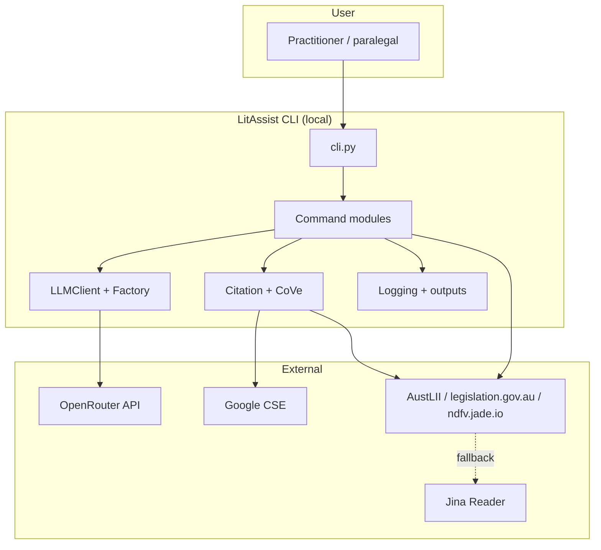
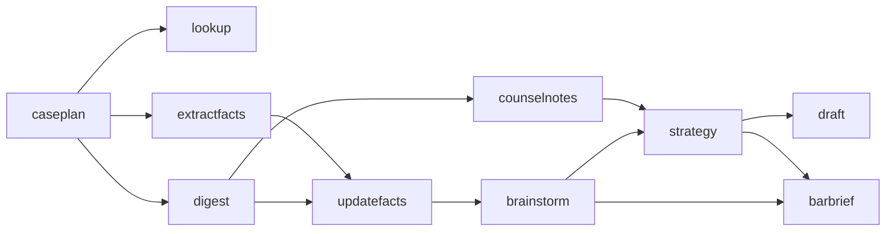
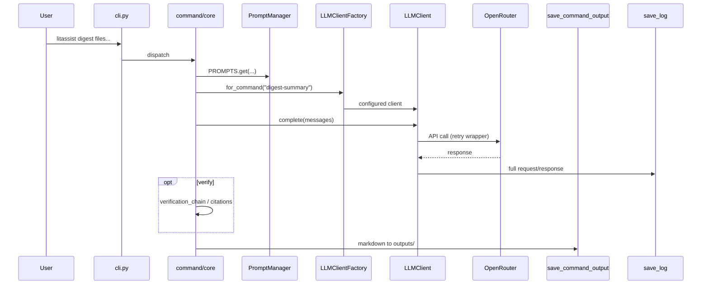

# LitAssist Architecture Report

Last updated: 12/06/2026

**Repository:** `/Users/witt/Projects/litassist`  
**Package version:** 3.0.0 (`setup.py`)  
**Primary doc:** `docs/development/architecture.md` (last updated 12/06/2026)  
**Graph snapshot:** 188 files, 1,416 nodes, 13,113 edges (05/06/2026)

---

## 1. Executive summary

LitAssist is a **Python 3.11+ CLI** for AI-assisted **Australian litigation workflows**. It is not a chat wrapper: it is a **command-oriented pipeline** where each step (research, digest, fact extraction, strategy, drafting) has its own prompts, model profile, and output contract.

Architecturally it follows a **layered monolith**:

| Layer | Responsibility |
|-------|----------------|
| **CLI** | Click entry, global options, credential checks |
| **Commands** | User-facing workflows (`litassist/commands/`) |
| **LLM** | OpenRouter client, retries, per-command model config |
| **Citation** | Offline patterns + online CSE/AustLII verification |
| **Infrastructure** | Config, logging, prompts, shared utils |

All LLM traffic goes through **OpenRouter**. Legal source discovery uses **Google Custom Search Engine (CSE)**. Full-text retrieval uses **curl_cffi** (TLS impersonation) with **Jina Reader** as fallback.

---

## 2. System context



**Deployment model:** Local install via `pip` / `setup.py`; config at `~/.config/litassist/config.yaml` only. No embedded server; orchestration is subprocess-based for multi-step runs (`caseplan`).

---

## 3. Design principles (from codebase practice)

1. **Prompts in YAML, not Python** — `litassist/prompts/*.yaml` loaded by `PromptManager`; stable keys via `PROMPTS.get()`.
2. **Model config in YAML** — `litassist/llm/model_configs.yaml`; factory resolves `command` or `command-subtype` keys; **no silent fallbacks** (missing key → `KeyError`).
3. **Fail fast on bad LLM structure** — prefer prompt-enforced JSON/markers over regex parsing.
4. **Full audit trail** — every LLM request/response logged without truncation (`logging/`).
5. **Australian legal defaults** — system prompts, citation verification against trusted hosts, placeholders for missing facts.
6. **Offline unit tests** — pytest mocks APIs; real-API scripts live in `test-scripts/`.

---

## 4. Repository layout

```
litassist/                    # Installable package (console_scripts: litassist)
  cli.py                      # Click root group
  config.py                   # ~/.config/litassist/config.yaml
  prompts.py                  # PromptManager → prompts/*.yaml
  citation_patterns.py        # Offline citation format checks
  citation_context.py         # Full-text fetch for citations (cache → CSE → fetch)
  verification_chain.py       # Multi-stage verification orchestrator
  commands/                   # 13 command packages (see §5)
  llm/                        # client, factory, api_handlers, retry, tools
  citation/                   # verify, google_cse, austlii, legislation, cache
  logging/                    # task events, output_saver, markdown/json writers
  utils/                      # file_ops, case_facts, formatting, truncation, rtf
  prompts/                    # 13 YAML template files

tests/unit/                   # 63 test modules (offline, mocked)
test-scripts/                 # Manual real-API checks
docs/                         # User guide + development docs
outputs/, logs/               # Runtime artifacts (gitignored in practice)
scripts/release/              # Bash release tooling
```

**Sources of truth (explicit in docs):**

| Concern | File |
|---------|------|
| Registered CLI commands | `litassist/commands/__init__.py` |
| Model per command/subcommand | `litassist/llm/model_configs.yaml` |
| Feature roadmap | `ROADMAP.md` |
| Technical debt / bugs | `TODO.md` |

---

## 5. Command layer

Thirteen commands register in `register_commands()`:

| Command | Primary role | Notable submodules |
|---------|--------------|-------------------|
| `caseplan` | Litigation roadmap + Python runner | `plan_generator`, `command_extractor`, `budget_assessor` |
| `lookup` | Case-law research over fetched full text | `fetchers`, `search`, `processors` |
| `digest` | Bulk document summarisation / issue-spotting | `processors`, `chunker`, `emergency_handler` |
| `extractfacts` | Structured `case_facts` extraction | `single_extractor`, `multi_extractor`, `document_reader` |
| `updatefacts` | Merge upstream outputs into `case_facts` | `core` |
| `brainstorm` | Orthodox + unorthodox strategies + analysis | `orthodox_generator`, `unorthodox_generator`, `analysis_generator`, `citation_regenerator` |
| `strategy` | Ranked legal options + draft doc | `ranker`, `document_generator`, `validators` |
| `draft` | Citation-rich drafting | `prompt_builder`, `document_processor` |
| `counselnotes` | Advocate-style strategic analysis | `analysis_processor`, `consolidator`, `extraction_processor` |
| `barbrief` | Barrister brief assembly | `brief_generator`, `section_builder`, `document_reader` |
| `verify` | Post-hoc citation / reasoning / soundness checks | `citation_verifier`, `reasoning_handler`, `soundness_checker` |
| `verify-cove` | Chain-of-Verification CLI wrapper | `cove_runner`, `document_reader`, `fallback_handler` |
| `refresh` | Regenerate `model_capabilities.yaml` from OpenRouter | — |

**Typical command package shape:**

- `__init__.py` — Click command definition
- `core.py` — orchestration
- Helper modules for chunking, prompts, or I/O

**Recommended workflow (product design):**



---

## 6. CLI entry (`litassist/cli.py`)

- **Framework:** Click `@click.group()` with global `--log-format` (json | markdown) and `--verbose`.
- **Lazy config:** Config loads inside the CLI callback so `--help` works without valid API keys.
- **BYOK awareness:** Hard-coded set `BYOK_REQUIRED_MODELS` (e.g. `openai/o3-pro`) because OpenRouter does not expose BYOK status in API responses.
- **Credential validation:** `validate_credentials()` probes Google CSE and OpenRouter before expensive runs.
- **Command registration:** `register_commands(cli)` from `litassist.commands`.

---

## 7. LLM subsystem

### 7.1 Factory (`litassist/llm/factory.py`)

- Loads `model_configs.yaml` and `model_capabilities.yaml` (latter from `litassist refresh`).
- **`LLMClientFactory.for_command(name)`** returns an `LLMClient` with command-specific temperature, `top_p`, `thinking_effort`, `enforce_citations`, `disable_tools`, etc.
- Sub-types use hyphenated keys (e.g. `lookup-irac`, `brainstorm-unorthodox`, `cove-answers-heavy`).

### 7.2 Client (`litassist/llm/client.py`)

- Single **`complete(messages)`** path for generation.
- Prepends **base system prompts** (Australian law, anti-injection, anti-hallucination) unless model is o1/o3-style (system merged into user message).
- Delegates HTTP to **`execute_api_call_with_retry`** (`api_handlers.py`).
- Optional **citation enforcement** and **tool calls** (when not disabled).
- **`LLMVerificationMixin`** for self-critique flows.
- Heartbeat progress messages on long calls (`utils.core.heartbeat`).

### 7.3 Model assignments (28 config keys)

| Family | Example slugs | Typical use |
|--------|---------------|-------------|
| Anthropic | `claude-sonnet-4.6`, `claude-opus-4.7` | extractfacts, digest, caseplan, CoVe stages |
| OpenAI | `o3-pro`, `gpt-5.5` | draft, counselnotes, barbrief, verification |
| Google | `gemini-3.5-flash` | lookup, updatefacts (large context, lower cost) |
| xAI | `grok-4.20` | brainstorm-unorthodox |

**Design note:** Comments in `model_configs.yaml` document *why* each model was chosen (context window, citation behaviour, cost). Parameters are **not** duplicated in Python for lookup modes — new modes must add YAML keys.

### 7.4 Supporting LLM modules

| Module | Role |
|--------|------|
| `api_handlers.py` | Retries, streaming wrap, OpenRouter error parsing |
| `retry_handler.py` | Citation-failure retries with message enhancement |
| `citation_handler.py` | Post-generation citation verification hook |
| `parameter_handler.py` | Model-specific parameter filtering |
| `response_parser.py` | Content + token usage extraction |
| `tools.py` | Optional tool definitions for models that support tools |

---

## 8. Citation and verification

Three complementary mechanisms:

### 8.1 Offline — `citation_patterns.py`

- Extract and validate citation **format** without network.
- Used as fast first gate in `verification_chain.py`.

### 8.2 Online — `litassist/citation/`

| Module | Role |
|--------|------|
| `verify.py` | Orchestrates `verify_single_citation` / `verify_all_citations` |
| `google_cse.py` | CSE search; **trusted host** filtering |
| `austlii.py` | Direct AustLII URL construction / verification |
| `legislation.py` | Legislation normalisation and international checks |
| `cache.py` | Persistent verification cache (avoids repeat CSE cost) |

### 8.3 Full text — `citation_context.py`

- Fetches authoritative text for CoVe / deep verification: cache → CSE → HTTP fetch pipeline.

### 8.4 Verification chain — `verification_chain.py`

Stages (configurable `skip_stages`, `heavy` mode):

1. **Patterns** — offline format check; may short-circuit strict commands (`extractfacts`, `strategy`, `draft`).
2. **Database** — `verify_all_citations`; may short-circuit on unverified citations.
3. **LLM verification** — uses `verification` / `verification-heavy` model configs.
4. Additional CoVe-related stages for factored Q&A (see `verify_cove` command).

### 8.5 Chain of Verification (CoVe)

- **`verification_chain.py`** (shared orchestration) + **`commands/verify_cove/`** (CLI, readers, fallbacks).
- Four conceptual LLM stages with dedicated config keys: `cove-questions`, `cove-answers`, `cove-verify`, `cove-final` (+ heavy variants).
- Preflight / fallback saves so partial runs are not lost.

### 8.6 `verify` command (standalone)

Separate from inline chain: citation report, reasoning trace check, soundness check — each with normal and `-heavy` model profiles.

---

## 9. Document ingestion (`lookup/fetchers.py`)

The fetcher is the most operationally complex non-LLM component. Pipeline (documented in `architecture.md`):

1. Local path → `read_document` (PDF/pdfplumber, RTF/striprtf, plain text).
2. `jade.io` main domain skipped; `ndfv.jade.io` → Jina `/download` rewrite.
3. AustLII `*.pdf` → `.html` rewrite (Cloudflare blocks PDF fetches).
4. Rate limiting (2–3 s jitter between AustLII requests).
5. `curl_cffi` GET (Chrome 136 impersonation).
6. Magic-byte routing (PDF/RTF).
7. Content-Type guard → Jina if non-text.
8. `legislation.gov.au` TOC follow for OEBPS link.
9. BeautifulSoup text extraction.
10. Challenge / SPA / gibberish detection → Jina fallback (never for austlii.edu.au hosts, which always Cloudflare-challenge Jina and are guarded since 11/06/2026).
11. Return cleaned text.

Unit tests heavily cover URL normalisation, 404 behaviour, challenge detection, and RTF — reflecting past production pain on AustLII/Jade.

---

## 10. Configuration

**Location:** `~/.config/litassist/config.yaml` only (enforced in `config.py`; repo `config.yaml` is local dev, not auto-edited).

**Precedence:** Environment variables → YAML → code defaults.

**Required capabilities:**

- OpenRouter API key (all LLM calls).
- Google CSE key + search engine ID (citation verification and lookup search).

**Override:** `LITASSIST_CONFIG` env var for tests.

---

## 11. Logging and outputs

### 11.1 Audit logs (`litassist/logging/`)

- **`log_task_event()`** — structured task lifecycle events.
- **`save_log()`** — full LLM request/response payloads (never truncated per project rules).
- Formats: JSON or Markdown (`--log-format` / config).
- Written under `logs/` with collision-safe timestamps (monotonic sub-second suffix).

### 11.2 Command outputs (`logging/output_saver.py`)

- **`save_command_output()`** — single write sink for command artifacts.
- Default dir: `outputs/` or **`LITASSIST_OUTPUT_DIR`** when set by `caseplan` runner.
- Filename includes timestamp + monotonic component to prevent same-second overwrites.

---

## 12. Caseplan orchestration (multi-step isolation)

`caseplan` is the **workflow compiler**:

1. LLM generates a phased plan with fenced `litassist ...` command lines.
2. **`command_extractor.py`** parses fences, validates with `shlex`, rejects unsafe lines.
3. Emits a **Python runner** (`.py`), not bash — each step is `subprocess.run(args, shell=False)`.
4. Runner creates `outputs/run_<timestamp>/`, sets `LITASSIST_OUTPUT_DIR`, rewrites `outputs/...` and `case_facts` paths into the run directory.
5. Seeds `case_facts` from cwd without mutating the original.

This design gives **repeatable, isolated runs** and prevents shell injection from model-generated command text.

---

## 13. Prompt management

- **13 YAML files** under `litassist/prompts/` (base, lookup, strategies, verification, caseplan, barbrief, etc.).
- **`PromptManager`** lazy-loads and deep-merges all YAML into one dict.
- Access: `PROMPTS.get("key.path")`, `get_system_prompt()`, `get_format_template()`.
- Document separators in prompts use **`=== NAME ===`** only (project-wide convention).

---

## 14. End-to-end data flow (single command)



---

## 15. Structural analysis (knowledge graph)

### 15.1 Communities (logical modules)

| Community | Size (nodes) | Cohesion | Notes |
|-----------|--------------|----------|-------|
| `unit-command` | 652 | 0.13 | Largest; mirrors `tests/unit` |
| `lookup-extract` | 134 | 0.05 | Core command implementations |
| `llm-retry` | 50 | 0.08 | API retry + citation retry |
| `utils-message` | 46 | 0.06 | ANSI terminal helpers |
| `citation-citation` | 15 | 0.04 | Small, focused package |
| `logging-write` | 18 | 0.01 | Hub for cross-cutting logging |

### 15.2 Coupling warnings

The graph flags **high cross-community call volume**:

- `lookup-extract` → `logging-write` (56 call edges)
- `lookup-extract` → `utils-message` (37)
- `llm-retry` → `utils-message` (14)

This is expected for a CLI that logs every step and prints coloured status — but it means **commands are not isolated from logging/formatting concerns**.

### 15.3 Critical execution flows (by criticality)

| Flow | Criticality | Depth | Role |
|------|-------------|-------|------|
| `verify_citations_if_requested` | 0.82 | 4 | Post-generation citation gate |
| `validate_and_verify_citations` | 0.81 | 3 | Combined validation |
| `run_verification_chain` | 0.79 | 4 | Shared verification orchestrator |
| `verify_citations` | 0.78 | 4 | Standalone verify command path |
| `execute_cove_pipeline` | 0.75 | 5 | CoVe CLI |
| `brainstorm` / `strategy` / `extractfacts` / `draft` | 0.71–0.71 | 2 | Core product commands |
| `lookup` | 0.52 | 2 | Research (fetch + log heavy) |

Verification paths rank highest in **criticality** — failures there affect trust in all generative commands.

### 15.4 Test coverage shape

- **565 test nodes** vs **516 function nodes** — tests are a first-class architectural layer.
- **2,590 `TESTED_BY` edges** in the graph.
- 63 files under `tests/unit/` including dedicated suites for fetchers, AustLII URL rules, model config integrity, YAML prompts, and verify/CoVe commands.

---

## 16. Testing architecture

| Tier | Location | Network | Purpose |
|------|----------|---------|---------|
| Unit | `tests/unit/` | Mocked | CI-safe regression |
| Manual integration | `test-scripts/` | Real APIs | Costly validation |
| Release | `scripts/release/` | Bash checks | Packaging / release |

`conftest.py` provides shared fixtures.

---

## 17. External dependencies (runtime)

From `requirements.txt` / architecture docs (representative):

- **click** — CLI
- **openai** (via OpenRouter-compatible client) — completions
- **google-api-python-client** — CSE
- **curl_cffi** — protected site fetch
- **pdfplumber**, **beautifulsoup4**, **striprtf** — document parsing
- **pyyaml** — config and prompts
- **pytz** — Australia/Sydney date injection in prompts

---

## 18. Architectural strengths

1. **Clear command boundaries** — each litigation task maps to a package with explicit outputs.
2. **Centralised model governance** — one YAML file + integrity tests.
3. **Defence in depth on citations** — offline patterns, online CSE with trusted hosts, optional CoVe.
4. **Operational hardening on fetch** — extensive unit tests for AustLII/Jade edge cases.
5. **Auditability** — full LLM logs and timestamped outputs suit legal workflow review.
6. **Safe multi-step execution** — caseplan Python runner with `shell=False` and per-run directories.

---

## 19. Architectural risks and tradeoffs

| Risk | Detail |
|------|--------|
| **Monolithic coupling to logging** | Most commands call `log_task_event` / formatting helpers directly — changes to logging ripple widely. |
| **Low community cohesion in commands** | Graph cohesion ~0.05 for `lookup-extract` — commands share patterns but are not a formal framework. |
| **Config single point** | Only `~/.config/litassist/config.yaml`; no per-matter config without env hacks. |
| **External fragility** | AustLII/Cloudflare/Jade behaviour drives complex fetcher logic; ongoing maintenance burden. |
| **Cost concentration** | o3-pro / Opus on draft, barbrief, counselnotes — caseplan can chain many paid steps. |
| **BYOK manual list** | Must hand-maintain `BYOK_REQUIRED_MODELS` in `cli.py`. |
| **Large runtime dirs** | `outputs/` and `logs/` can grow without bound. |

---

## 20. Extension points (for future contributors)

1. **New command** — add package under `commands/`, register in `__init__.py`, add `model_configs.yaml` key(s), add prompt YAML, add unit tests.
2. **New lookup mode** — add `lookup-<mode>` in `model_configs.yaml` (comment in file warns against Python-only params).
3. **New model** — run `litassist refresh` for capabilities; update config key; run `test_model_config_integrity.py`.
4. **Stricter verification** — extend `verification_chain.py` stages or `enforce_citations` on client.

---

## 21. Related documentation

- User-facing workflow: `docs/user/LitAssist_User_Guide.md`
- Install: `INSTALLATION.md`
- Canonical architecture summary: `docs/development/architecture.md`
- Changes over time: `CHANGELOG.md`
- Planned work: `ROADMAP.md`, `TODO.md`