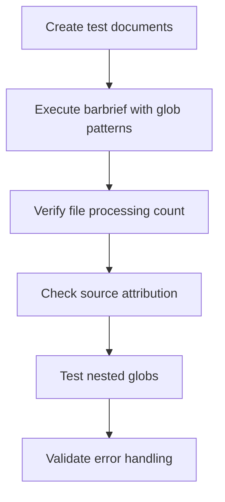
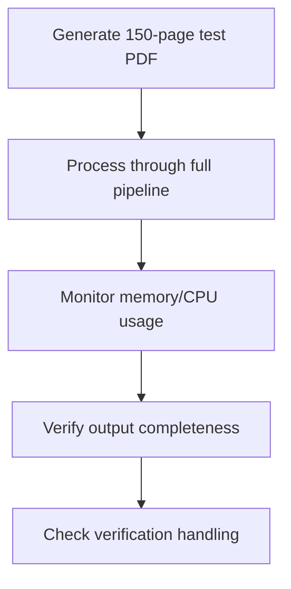
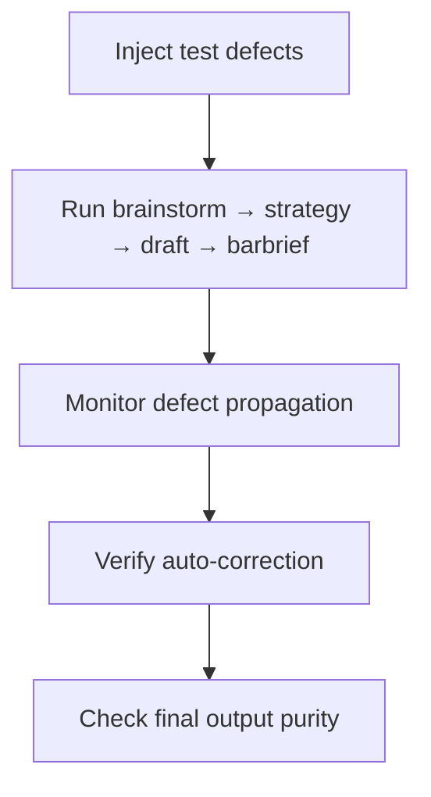
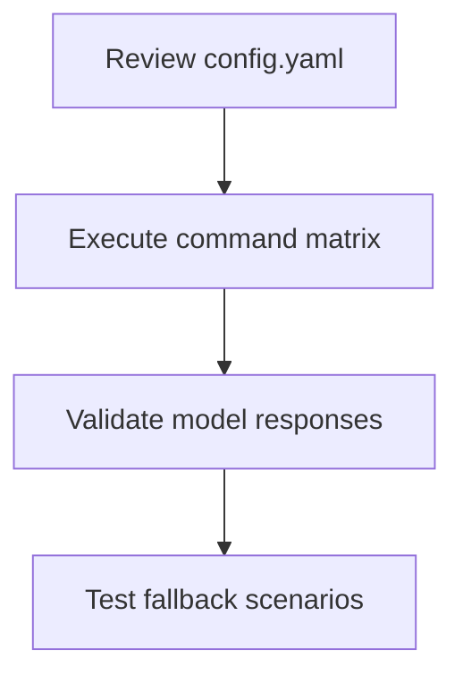

# LitAssist Verification Plan v1.0

## 1. Glob Implementation Validation


**Test Cases:**
```bash
litassist barbrief inputs/*.pdf --research lookup_*.json
litassist barbrief **/affidavits/*-v2.pdf --strategy strategy_?.md
litassist barbrief invalid_[.pdf # Should show pattern error
```

## 2. Token Limit Stress Test


**Threshold Checks:**
- 16K token input with 50 citations
- 3K token output with 10-section structure
- Concurrent processing of 5 large files

## 3. Verification Chain Integrity


**Defect Types Tested:**
1. Invalid citation format (Smith v Jones 2030)
2. Contradictory legal principles
3. Missing reasoning trace

## 4. Model Configuration Audit


**Implementation Checklist:**
- [ ] Create `/stress-test` directory with sample documents
- [ ] Develop automated test scripts
- [ ] Add memory profiling to test harness
- [ ] Document findings in VERIFICATION_REPORT.md

Last updated: 2025-07-08
