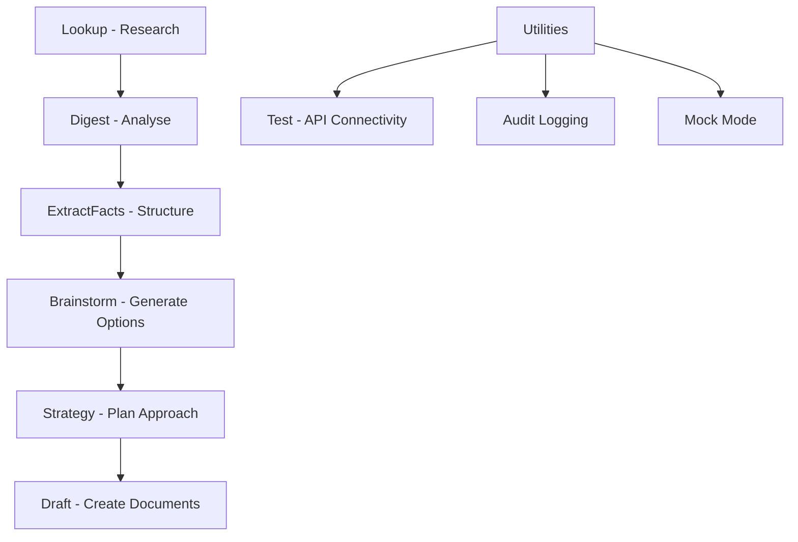
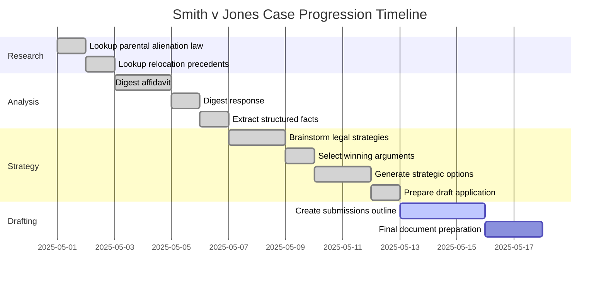

# LitAssist User Guide

## Introduction

LitAssist is a comprehensive legal workflow automation tool designed for Australian legal practice. It provides a structured end-to-end pipeline for litigation support:

```
ingest → analyse → structure → brainstorm → strategy → draft
```

*New in 2025: Added **counselnotes** command for strategic analysis from an advocate's perspective, complementing the neutral analysis provided by digest. Also added **barbrief** command for generating comprehensive barrister's briefs.*

This guide demonstrates how to use each workflow through a running example of a family court case, *Smith v Jones*, involving a complex child custody dispute with issues of interstate relocation and allegations of parental alienation.

**Important Note**: Many users find the distinction between `brainstorm` and `strategy` commands confusing. In brief: **brainstorm explores all possible legal approaches comprehensively**, while **strategy develops specific tactical implementation plans for particular outcomes**. See [Understanding Brainstormed Strategies vs Strategic Options](#understanding-brainstormed-strategies-vs-strategic-options) for a detailed explanation of these crucial differences.



## Running Example: Smith v Jones

To illustrate each workflow in a practical context, we'll use a fictional family court case with the following characteristics:

**Case Overview:** Smith v Jones (Federal Circuit and Family Court of Australia, Division 1)

**Key Parties:**
- Jennifer Smith (mother, 38): Formerly resided in Sydney, recently relocated to Brisbane for a senior hospital position
- Michael Jones (father, 40): Still residing in Sydney
- Emily Jones (12) and Thomas Jones (8): Currently living with their mother in Brisbane

**Core Issues:**
1. **Complex Parenting Arrangements**: The parents previously had a consent order with a week-about arrangement when both lived in Sydney.
2. **Interstate Relocation**: Ms. Smith relocated with the children to Brisbane in January 2025, citing a career opportunity. Mr. Jones filed a contravention application in February 2025.
3. **Allegations of Parental Alienation**: Mr. Jones alleges Ms. Smith is "poisoning the children against him," while Ms. Smith claims Mr. Jones exhibits controlling behavior.

**Procedural Status:**
- Interim parenting orders issued in April 2025
- Final hearing scheduled for June 2025

This running example provides context for understanding how each LitAssist workflow contributes to managing a complex family law matter from initial research through to final submissions.

## Key Features

**Global Installation Benefits:**
- ✅ **Use from anywhere** - `litassist` command available in any directory
- ✅ **Local outputs** - All files created in your current working directory
- ✅ **Single configuration** - One global config with all your API keys
- ✅ **Project isolation** - Each case directory gets its own outputs/ and logs/ subdirectories

**File Management & Organization:**
- ✅ **Timestamped outputs** - All commands save to unique timestamped files (never overwrites)
- ✅ **Archive preservation** - Commands like extractfacts and brainstorm maintain both current files and timestamped archives
- ✅ **API keys in one secure location** - No duplication across projects
- ✅ **Automatic logging** - Every operation creates detailed audit logs
- ✅ **Australian English** - All outputs use Australian legal terminology

**Citation Verification & Quality Control:**
- ✅ **Zero-tolerance citation verification** - All legal references validated against AustLII database
- ✅ **Real-time online validation** - HEAD requests verify case existence on AustLII during generation
- ✅ **Intelligent regeneration** - Commands automatically fix citation issues where possible
- ✅ **Quality over quantity** - Strategy commands discard options with unfixable citation problems
- ✅ **Enhanced error messages** - Clear explanations of citation failures with specific actions taken
- ✅ **Verification status transparency** - Always informed when verification runs and why

**Legal Reasoning & Analysis (New June 2025):**
- ✅ **Multi-section reasoning traces** - Brainstorm saves separate reasoning files for orthodox, unorthodox, and analysis sections
- ✅ **Transparent legal reasoning** - See the logic behind strategy selection and "most likely to succeed" analysis
- ✅ **Structured analysis** - Each reasoning trace includes issue, applicable law, application to facts, and conclusion
- ✅ **Comprehensive timing** - All operations timed and logged for performance monitoring
- ✅ **Centralized configuration** - Log format and other settings moved to config.yaml for consistency

## Citation Quality Control

LitAssist employs a comprehensive two-phase citation checking system to ensure all legal references are accurate and verifiable:

### Phase 1: Citation Validation (Offline Pattern Analysis)

**Purpose**: Detect potentially problematic citation patterns without requiring internet access

**What it catches**:
- **AI Hallucinations**: Generic case names like "Smith v Jones" that are commonly fabricated
- **Impossible Citations**: Future dates, non-existent courts, anachronistic references
- **Suspicious Patterns**: Placeholder names, single-letter parties, "Corporation v Corporation"
- **Format Issues**: Malformed parallel citations, unrealistic page numbers

**How it works**:
- Runs instantly as part of pattern matching
- Uses comprehensive pattern library based on Australian legal citation formats
- No internet connection required
- Provides immediate feedback on problematic patterns

**Example detections**:
```
GENERIC CASE NAME: Smith v Jones
→ FAILURE: Both parties use common surnames (possible AI hallucination)
→ ACTION: Flagging for manual verification

ANACHRONISTIC CITATION: [1970] FCAFC 123
→ FAILURE: Full Federal Court not established until 1977
→ ACTION: Excluding impossible historical reference
```

### Phase 2: Citation Verification (Online Database Checks)

**Purpose**: Confirm that citations actually exist in legal databases

**What it verifies**:
- **Australian Cases**: Checks against AustLII database in real time
- **International Citations**: Recognizes UK, US, NZ citations as valid but not verifiable in Australian databases
- **Traditional Citations**: Accepts format like "(1980) 146 CLR 40" temporarily
- **Medium-Neutral Citations**: Validates format like "[2020] HCA 41" and retrieves URLs

**How it works**:
- Makes real-time HEAD requests to AustLII to verify case existence
- Handles international citations appropriately (marked as recognized but not verifiable)
- Provides URLs for verified Australian cases
- Runs during content generation to ensure accuracy

**Example verifications**:
```
[2020] HCA 41
→ Verified: True
→ URL: https://www.austlii.edu.au/cgi-bin/viewdoc/au/cases/cth/HCA/2020/41.html

[1932] AC 562
→ Verified: True  
→ Reason: UK/International citation (Appeal Cases) - not in Australian databases
```

### How They Work Together

The two systems complement each other:

1. **Validation** runs first to catch obvious problems through pattern analysis
2. **Verification** confirms that remaining citations actually exist
3. Together they provide comprehensive quality control

**Example workflow**:
```
Input text: "See Smith v Jones [2025] HCA 99"

Phase 1 (Validation):
- Detects "Smith v Jones" as generic case name
- Detects "[2025] HCA 99" as future citation

Phase 2 (Verification):  
- Would check AustLII but validation already flagged issues
- Both problems reported to user
```

### Understanding Citation Logs

LitAssist creates two types of citation-related logs:

#### Citation Validation Logs
**Location**: `logs/citation_validation_YYYYMMDD-HHMMSS.{json|md}`

**When issues found**:
```markdown
## Details
- Method: validate_citation_patterns
- Input Text Length: 19560 characters
- Online Verification: True
- Issues Found: 3

## Issues Found
- GENERIC CASE NAME: Brown v Wilson
- FUTURE CITATION: [2026] VSC 123
- COURT NOT RECOGNIZED: [2020] XYZ 45
```

**When no issues found**: Minimal log showing successful validation

#### Citation Verification Session Logs
**Location**: `logs/citation_verification_session_YYYYMMDD-HHMMSS.{json|md}`

**Contents**:
```markdown
## Summary
- Citations Found: 15
- Verified: 12
- Unverified: 3

## Verified Citations
- [2020] HCA 41
- (1984) 155 CLR 549
- [2019] FCAFC 185

## Unverified Citations
- [2020] HCA 999: Not found in available databases
- Smith v Jones: Generic case name pattern

## International Citations
- [1932] AC 562: UK citation - not in Australian databases
- 123 U.S. 456: US citation - not in Australian databases
```

### Command-Specific Citation Handling

Different commands handle citation issues differently:

| Command | Validation | Verification | Response to Issues |
|---------|------------|--------------|-------------------|
| lookup | ✓ | ✓ | Warnings in output (Jade.io-only, AustLII-verified, supports --comprehensive flag) |
| digest | ✓ | ✓ | Warnings per chunk |
| extractfacts | ✓ | ✓ | Enhanced error messages |
| brainstorm | ✓ | ✓ | Regenerates problematic strategies |
| strategy | ✓ | ✓ | Discards options with bad citations |
| draft | ✓ | ✓ | Appends warnings to draft |
| counselnotes | ✓ | ✓ (with --verify) | Warnings in analysis |
| barbrief | ✓ | ✓ (with --verify) | Verification report generated |

### Best Practices

1. **Review all citation warnings** - They indicate potential reliability issues
2. **Check logs for patterns** - Frequent generic names may indicate AI hallucination
3. **Verify international citations manually** - System can't check non-Australian databases
4. **Use verification for critical documents** - Court filings should have zero citation issues

### Benefits

- **Professional Protection**: Prevents reliance on non-existent cases
- **Quality Assurance**: Ensures all legal references are verifiable
- **Audit Trail**: Complete logs for compliance and review
- **Time Savings**: Automatic detection prevents manual citation checking

## Installation and Setup

**Quick Installation:**
```bash
# Install with pipx (see INSTALLATION.md for detailed instructions)
brew install pipx
pipx install -e /path/to/litassist
pipx ensurepath && source ~/.zshrc

# Setup configuration
cd /path/to/litassist
cp config.yaml.template config.yaml
# Edit config.yaml with your API keys
```

**Verify Installation:**
```bash
litassist --help
litassist test  # Test API connectivity
```

For complete installation instructions, troubleshooting, and alternative methods, see [INSTALLATION.md](/INSTALLATION.md).

## Configuration

### config.yaml Settings

**New June 2025 - Centralized Configuration**: Log format and other settings have been moved from CLI options to config.yaml for consistency and user convenience.

Key configuration options in the `general` section:
```yaml
general:
  heartbeat_interval: 10    # Progress indicator interval in seconds (default: 10)
  max_chars: 20000          # Maximum characters per chunk for document processing (default: 20000)
  rag_max_chars: 8000       # Maximum characters per chunk for RAG retrieval (default: 8000)
  log_format: "json"        # Format for audit logs: "json" or "markdown" (default: json)
```

### Log Format Configuration

**Previous behavior**: Required `--log-format` CLI option every time
```bash
# Old way - had to specify every time
litassist --log-format markdown lookup "contract law"
```

**New behavior**: Set once in config.yaml, use everywhere
```yaml
# In config.yaml
general:
  log_format: "markdown"  # Set your preference once
```

```bash
# Now just run commands - uses config.yaml setting
litassist lookup "contract law"

# Override config.yaml for one-off changes
litassist --log-format json lookup "contract law"  
```

**Benefits**:
- ✅ Set your preference once in config.yaml
- ✅ Consistent logging format across all commands
- ✅ CLI option still available for overrides
- ✅ Aligns with other configuration patterns

## Working Directory Setup

LitAssist works from any directory and creates outputs locally:

```bash
# Create project directory for Smith v Jones case
mkdir ~/legal-cases/smith-v-jones-2025
cd ~/legal-cases/smith-v-jones-2025

# LitAssist will create outputs/ and logs/ directories here
# All commands use global config but create outputs locally
```

## Output File Management

### Timestamped Output Files
All LitAssist commands save their results to timestamped text files in the `outputs/` directory, ensuring no output is ever lost:

**Manual Working Files** (created and edited by user):
- `case_facts.txt` - Manually maintained case facts file
- `strategies.txt` - Manually maintained strategies file

**Timestamped Archive Files** (never overwritten):
- `lookup_[query_slug]_YYYYMMDD_HHMMSS.txt` - Search results
- `digest_[mode]_[filename_slug]_YYYYMMDD_HHMMSS.txt` - Document analysis
- `extractfacts_[filename_slug]_YYYYMMDD_HHMMSS.txt` - Extracted facts from documents
- `brainstorm_[area]_[side]_YYYYMMDD_HHMMSS.txt` - Generated legal strategies
- `strategy_[outcome_slug]_YYYYMMDD_HHMMSS.txt` - Strategic analysis and draft documents
- `draft_[query_slug]_YYYYMMDD_HHMMSS.txt` - Generated legal drafts

**Example output after running commands:**
```
smith-v-jones-2025/
├── case_facts.txt                                    # Manually created/edited
├── strategies.txt                                    # Manually created/edited
├── outputs/                                          # All command outputs
│   ├── extractfacts_smith_jones_file_20250523_143022.txt
│   ├── brainstorm_family_plaintiff_20250523_144501.txt
│   ├── strategy_interim_orders_20250523_150245.txt
│   └── draft_outline_submissions_20250523_151030.txt
└── logs/                                             # Detailed audit logs
    ├── extractfacts_20250523-143022.md
    ├── brainstorm_20250523-144501.md
    └── strategy_20250523-150245.md
```

### Benefits of Timestamped Files
- **No data loss** - Previous outputs are never overwritten
- **Version history** - Track evolution of strategies and arguments
- **Easy sharing** - Send specific timestamped files to colleagues
- **Manual control** - Working files (case_facts.txt, strategies.txt) remain under user control

## Clean CLI Output Format

**All LitAssist commands now show clean summaries instead of dumping full content to your terminal.**

### What You See on Screen
Every command follows this consistent, professional output pattern:

```
✅ [Command] complete!
📄 Output saved to: outputs/[filename]_YYYYMMDD_HHMMSS.txt
📊 [Processing statistics and summary]
💡 View full [content]: open outputs/[filename]_YYYYMMDD_HHMMSS.txt
```

### Example: Before vs After

**Before (overwhelming terminal output):**
```bash
$ litassist lookup "contract formation elements"
[2000+ lines of legal analysis dumped to terminal]
```

**After (clean summary):**
```bash
$ litassist lookup "contract formation elements"
Found links:
- https://austlii.edu.au/cgi-bin/viewdoc/au/cases/cth/HCA/1893/23.html
- https://austlii.edu.au/cgi-bin/viewdoc/au/cases/cth/HCA/1968/1.html

✅ Lookup complete!
📄 Output saved to: outputs/lookup_contract_formation_elements_20250606_143022.txt
📊 Legal analysis for: contract formation elements
🔍 Searched 2 sources:
   1. Carlill v Carbolic Smoke Ball Co
   2. Australian Woollen Mills v Commonwealth
💡 View full analysis: open outputs/lookup_contract_formation_elements_20250606_143022.txt
```

### Benefits of Clean Output
- **Readable terminal** - No overwhelming text walls
- **Clear file locations** - Always know where your content is saved
- **Processing transparency** - See exactly what was done
- **Professional workflow** - Focus on next steps, not parsing output
- **Full content preserved** - Everything saved to timestamped files

### Accessing Full Content
To read the complete analysis, drafts, or strategies:
```bash
# Option 1: Use the provided command
open outputs/lookup_contract_formation_elements_20250606_143022.txt

# Option 2: Use any text editor
code outputs/lookup_contract_formation_elements_20250606_143022.txt
vim outputs/lookup_contract_formation_elements_20250606_143022.txt

# Option 3: View in terminal
cat outputs/lookup_contract_formation_elements_20250606_143022.txt
```

## Workflow 1: Lookup - Rapid Case-Law Search

**Pipeline Phase**: Ingest (Research)

### Purpose

The `lookup` command performs rapid searches on Jade.io for relevant case law, then processes the results through Gemini to produce a structured legal answer with citations. All citations are verified in real time against Jade.io. When using `--comprehensive`, the command can also search broader Australian legal sources if a secondary CSE is configured.

### Command

```bash
./litassist.py lookup "your legal question" [--mode irac|broad] [--extract citations|principles|checklist] [--comprehensive] [--context "contextual info"]
```

Options:
- `--mode`: Choose between IRAC (Issue, Rule, Application, Conclusion) or a broader exploration
- `--extract`: Extract specific information in a structured format for workflow efficiency
- `--comprehensive`: Use exhaustive analysis with up to 40 Jade.io sources instead of 5, plus additional sources from a secondary CSE if configured (default: false)
- `--context`: Provide contextual information to guide and focus the lookup analysis (new feature)

#### Analysis Modes:
- **IRAC** (default): Structured legal analysis (Issue, Rule, Application, Conclusion) with precise, deterministic answers
- **Broad**: Creative exploration for more expansive legal thinking

**Recommended Combinations:**
- **IRAC mode**: Standard research for structured case law analysis (default: 5 Jade.io sources)
- **IRAC + comprehensive**: Exhaustive structured analysis (up to 40 Jade.io sources + 10 broader sources if secondary CSE configured)
- **Broad mode**: Creative legal research for novel arguments (default: 5 Jade.io sources)
- **Broad + comprehensive**: Exploratory research with maximum coverage (up to 40 Jade.io sources + 10 broader sources if secondary CSE configured)

#### Extract Options for Workflow Efficiency

The `--extract` option formats output for specific professional workflows:

**Extract Citations (`--extract citations`)**
- **Purpose**: Generate clean citation lists for court documents and research databases
- **Output**: Formatted list of case citations and legislation references
- **Use Cases**:
  - Building a "Cases Cited" section for court briefs
  - Adding citations to advice letters and legal opinions
  - Creating research databases for complex matters
  - Quick reference lists for oral arguments

**Extract Principles (`--extract principles`)**
- **Purpose**: Extract legal rules and principles in structured format for client communications
- **Output**: Bullet-pointed legal principles suitable for advice letters
- **Use Cases**:
  - Client advice letters requiring clear legal explanations
  - Training materials for junior lawyers
  - Settlement negotiations explaining legal positions
  - Mediation briefs summarizing applicable law

**Extract Checklist (`--extract checklist`)**
- **Purpose**: Generate actionable requirements and practical steps
- **Output**: Checkbox format listing evidence needed and steps to take
- **Use Cases**:
  - Pre-trial preparation ensuring complete coverage
  - File review checklists for complex matters
  - Due diligence processes
  - Client intake procedures for specific legal areas
  - Junior lawyer training and supervision

**Benefits of Extract Options:**
- **Copy-paste ready**: Clean, structured output eliminates manual formatting
- **Context switching reduction**: Get exactly what you need without parsing walls of text
- **Professional output**: Client-ready formatting for immediate use
- **Quality assurance**: Structured checklists ensure nothing is missed

### Example Usage

#### Standard Lookup

In our *Smith v Jones* case, we might need to quickly research the legal framework for parental alienation:

```bash
./litassist.py lookup "What is the legal framework for determining parental alienation in Australian family court cases?" --mode irac
```

#### Using Extract Options

**For court brief preparation (citations needed):**
```bash
./litassist.py lookup "self defence assault requirements" --extract citations
```

**For client advice letter (principles needed):**
```bash
./litassist.py lookup "negligence medical malpractice elements" --extract principles
```

**For case preparation (checklist needed):**
```bash
./litassist.py lookup "unfair dismissal evidence requirements" --extract checklist
```

**Output Example**:
```
Issue: What legal framework do Australian family courts use to determine cases involving parental alienation?

Rule: In Australia, parental alienation is addressed primarily through the Family Law Act 1975 (Cth), which emphasizes the best interests of the child as the paramount consideration in parenting matters. In Karabes v Karabes [2019] FamCAFC 3, the Full Court clarified that while parental alienation is not explicitly defined in the legislation, courts must consider:
1. The benefit to children of having a meaningful relationship with both parents (s60CC(2)(a))
2. The need to protect children from physical or psychological harm (s60CC(2)(b))
3. The willingness and ability of each parent to facilitate a relationship between the child and the other parent (s60CC(3)(c))

Application: When determining whether parental alienation has occurred, courts examine evidence of one parent systematically denigrating the other parent or deliberately interfering with parent-child contact without justification. In Miles & Zanelli [2022] FedCFamC1A 20, Justice Kent emphasized that courts must distinguish between legitimate protective behaviors and unjustified alienating behaviors. Evidence is typically provided through experts such as family consultants, psychiatrists, or psychologists as seen in Kappas & Drakos [2018] FamCA 37.

Conclusion: Australian family courts address parental alienation through the best interests framework of the Family Law Act. Courts apply a thorough examination of evidence regarding parental behavior and expert testimony, weighing the importance of meaningful relationships with both parents against any genuine protective concerns. Courts can order various remedies including changes to parenting arrangements, therapy interventions, or in extreme cases, changes to the child's primary residence as demonstrated in Ralton & Ralton [2016] FCWA 65.

Sources:
- Family Law Act 1975 (Cth), sections 60B, 60CC, https://www.austlii.edu.au/cgi-bin/viewdb/au/legis/cth/consol_act/fla1975114/
- Karabes v Karabes [2019] FamCAFC 3, https://www.austlii.edu.au/cgi-bin/viewdoc/au/cases/cth/FamCAFC/2019/3.html | https://jade.io/article/632302
- Miles & Zanelli [2022] FedCFamC1A 20, https://www.austlii.edu.au/cgi-bin/viewdoc/au/cases/cth/FedCFamC1A/2022/20.html | https://jade.io/article/909183  
- Kappas & Drakos [2018] FamCA 37, https://www.austlii.edu.au/cgi-bin/viewdoc/au/cases/cth/FamCA/2018/37.html | https://jade.io/article/572418
- Ralton & Ralton [2016] FCWA 65, https://www.austlii.edu.au/cgi-bin/viewdoc/au/cases/wa/FCWA/2016/65.html | https://jade.io/article/460030
```

**Extract Examples:**

**Citations Output** (using `--extract citations`):
```
CITATIONS FOUND:
Crimes Act 1900 (NSW) s 418
R v Brown [2019] NSWCCA 123
R v Katarzynski [2002] NSWSC 613
R v Smith [2020] NSWDC 45
```

**Principles Output** (using `--extract principles`):
```
LEGAL PRINCIPLES:
• Self-defence requires reasonable belief of imminent threat to person or property
• Force used must be proportionate to the perceived threat
• Defendant's subjective belief is critical, not objective reasonableness
• No duty to retreat if threat is imminent and escape not safely possible
• Burden of proof shifts to prosecution to disprove self-defence beyond reasonable doubt
```

**Checklist Output** (using `--extract checklist`):
```
PRACTICAL CHECKLIST:
□ Evidence of threat made against defendant
□ Defendant's subjective belief documented
□ Proportionality of response to threat level
□ Witness statements supporting threat perception
□ No available avenue of safe retreat
□ Medical evidence of injuries sustained
□ Police statements and reports
□ Character evidence supporting credibility
```

### Advanced Usage and Workflow Integration

#### Combining Extract Options with Other Parameters

**Strategic Research Combinations:**
```bash
# For complex constitutional matters - use Jade for landmark cases + broad analysis
./litassist.py lookup "implied freedom of political communication" --mode broad --extract principles

# For urgent court prep - use comprehensive mode for thorough coverage + structured analysis  
./litassist.py lookup "summary judgment applications" --mode irac --extract checklist --comprehensive

# For client communications - extract principles in accessible format
./litassist.py lookup "unfair contract terms consumer law" --mode broad --extract principles
```

#### File Organization and Naming

**Output Structure:**
```
outputs/
├── lookup_citations_contract_breach_20250406_143022.txt
├── lookup_principles_negligence_20250406_143156.txt
├── lookup_checklist_defamation_20250406_143340.txt
└── lookup_constitutional_law_20250406_143445.txt (default format)
```

**File Naming Convention:**
- `lookup_[extract]_[question_slug]_[timestamp].txt` (with extract option)
- `lookup_[question_slug]_[timestamp].txt` (default format)
- Question slug: First 50 chars, special chars removed, spaces as underscores

#### Integration with LitAssist Command Pipeline

**End-to-End Workflow Examples:**

**1. Court Brief Preparation Workflow**
```bash
# Step 1: Research legal framework and collect citations
./litassist.py lookup "negligence medical malpractice" --extract citations

# Step 2: Analyze case documents for facts
./litassist.py digest case_bundle.pdf --mode issues

# Step 3: Extract structured facts for strategy
./litassist.py extractfacts medical_reports.pdf

# Step 4: Draft argument using research and facts
./litassist.py draft case_facts.txt "negligence argument medical malpractice"
```

**2. Client Advice Letter Workflow**
```bash
# Step 1: Research principles in client-friendly format
./litassist.py lookup "employment termination unfair dismissal" --extract principles

# Step 2: Analyze employment documents
./litassist.py digest employment_file.pdf --mode summary

# Step 3: Create advice structure using principles from lookup output
# Copy principles from outputs/lookup_principles_employment_*.txt into advice letter template
```

**3. Due Diligence Workflow**
```bash
# Step 1: Create compliance checklist
./litassist.py lookup "corporate governance ASX requirements" --extract checklist

# Step 2: Analyze corporate documents against checklist
./litassist.py digest board_minutes.pdf --mode issues

# Step 3: Cross-reference findings with compliance requirements
# Use checklist from outputs/lookup_checklist_corporate_*.txt as review framework
```

#### Real-World Integration Patterns

**Pattern 1: Research → Analysis → Action**
- **Lookup (extract citations)** → **Digest (mode issues)** → **Draft argument**
- Establishes legal authority, identifies case issues, creates persuasive document

**Pattern 2: Principles → Facts → Strategy** 
- **Lookup (extract principles)** → **Extractfacts** → **Brainstorm strategies**
- Understands law, structures facts, develops arguments

**Pattern 3: Checklist → Review → Compliance**
- **Lookup (extract checklist)** → **Digest documents** → **Manual compliance review**
- Creates framework, analyzes documents, ensures completeness

#### Workflow Efficiency Tips

**Copying Output Between Commands:**
```bash
# Extract citations for court brief
./litassist.py lookup "contract formation requirements" --extract citations

# Copy citations from outputs/lookup_citations_contract_*.txt
# Paste into draft command input file for automatic citation inclusion

./litassist.py draft case_facts.txt "contract formation argument" 
# LitAssist will incorporate the existing research into the draft
```

**File Management for Complex Matters:**
```bash
# Organize lookup results by legal area
mkdir research_negligence research_contract research_defamation

# Move relevant lookup outputs to topic folders
mv outputs/lookup_*negligence* research_negligence/
mv outputs/lookup_*contract* research_contract/
```

**Iterative Research Refinement:**
```bash
# Start broad, then narrow focus
./litassist.py lookup "contract law" --mode broad --extract principles
./litassist.py lookup "specific performance remedies" --mode irac --extract citations  
./litassist.py lookup "equity specific performance discretion" --extract checklist --comprehensive
```

#### Performance and Cost Considerations

**Efficient Research Strategies:**
- Use `--extract citations` when you only need case references (faster processing)
- Use `--engine jade` for specific topic areas with known landmark cases
- Use `--mode irac` for structured legal analysis, `--mode broad` for creative approaches
- Combine extract options with targeted questions rather than broad topics

**Output Reuse:**
- Extract outputs are designed for copy-paste into other documents
- Citations lists can be directly included in court briefs
- Principles sections can be incorporated into advice letters
- Checklists can serve as templates for multiple similar matters

### Next in Pipeline

After establishing the relevant legal frameworks through `lookup`, you can proceed to the `digest` workflow to analyze the case documents in detail.

## Workflow 2: Digest - Large Document Processing

**Pipeline Phase**: Analyse

### Purpose

The `digest` command processes large documents by splitting them into manageable chunks and using Claude to either summarize content chronologically or identify potential legal issues in each section.

### Command

```bash
./litassist.py digest <file> [--mode summary|issues] [--hint <hint_text>]
```

Options:
- `--mode`: Choose between chronological summary or issue-spotting (default: summary)
- `--hint`: Optional guidance to focus the analysis on specific aspects (e.g., "focus on parental alienation claims" or "analyze financial discrepancies")

**Output**: All analysis saved to timestamped files: `digest_[mode]_[filename_slug]_YYYYMMDD_HHMMSS.txt`

**Citation Quality Control**: All digest outputs undergo automatic citation verification. If any citations are found to be invalid or unverifiable, clear warnings are displayed at the top of each chunk's output explaining the specific issues and actions taken.

### Handling Non-Legal Documents

While designed for legal content, the `digest` command can process various document types:

**Works well with**:
- Bank statements → Produces chronological financial events (use `--mode summary`)
- Commercial agreements → Extracts key terms and conditions
- Medical reports → Summarizes findings chronologically

**Limitations**:
- The system prompt specifies "Australian law only" which may affect interpretation
- Financial terms may be framed in legal contexts
- `--mode issues` is less effective for non-legal content

**Best practices**:
- Always use `--mode summary` for non-legal documents
- Use outputs as a starting point for further analysis
- All results saved to timestamped files: `lookup_[query_slug]_YYYYMMDD_HHMMSS.txt`

### Example Usage

#### Basic Usage
For the *Smith v Jones* case, we have received a lengthy affidavit from our client that needs to be broken down:

```bash
./litassist.py digest examples/smith_affidavit.pdf --mode issues
```

#### Using the --hint Option
When you need focused analysis on specific aspects of a document:

```bash
# Focus on parental alienation allegations
./litassist.py digest examples/smith_affidavit.pdf --mode issues --hint "focus on parental alienation claims and evidence"

# Analyze financial aspects
./litassist.py digest financial_statements.pdf --mode summary --hint "analyze income discrepancies and hidden assets"

# Medical document analysis
./litassist.py digest medical_report.pdf --mode summary --hint "identify disability impacts on parenting capacity"
```

**Benefits of --hint**:
- Directs AI attention to critical aspects
- Ensures important details aren't overlooked
- Particularly useful for lengthy documents
- Helps when reviewing documents for specific litigation theories

**Output Example**:
```
--- Chunk 1 ---
Potential Legal Issues:

1. Jurisdictional Questions
   There appears to be a potential jurisdictional dispute as Ms. Smith has relocated from NSW to Queensland with the children without Mr. Jones's consent. This raises issues under Family Law Act s65DAA regarding relocation and may trigger the need for a specific "relocation order" from the court.

2. Parental Responsibility
   Ms. Smith's unilateral decision-making regarding the children's schooling and medical care potentially conflicts with the requirement for joint consultation on major long-term issues under s61DA of the Family Law Act, particularly as there seems to have been a previous parenting order establishing equal shared parental responsibility.

3. Family Violence Allegations
   Ms. Smith makes several references to "controlling behavior" and "emotional manipulation" which, while not explicitly characterized as family violence, could potentially be framed as coercive control under s4AB(2) of the Family Law Act. However, the allegations lack specific incidents and may require further particulars.

--- Chunk 2 ---
Potential Legal Issues:

4. Best Interests Considerations
   The children's expressed wishes to remain with their mother in Queensland raises consideration of s60CC(3)(a) regarding children's views, particularly for the 12-year-old child whose views may be given greater weight due to age and maturity.

5. Parental Alienation Concerns
   Mr. Jones's allegations that Ms. Smith is "poisoning the children against him" raise potential parental alienation issues. This relates to s60CC(3)(c) regarding the willingness of each parent to facilitate a relationship between the children and the other parent.
   
...
```

### Next in Pipeline

After analyzing the documents with `digest`, you need to extract key facts in a structured format using the `extractfacts` workflow.

## Workflow 3: ExtractFacts - Deterministic Fact Extraction

**Pipeline Phase**: Structure

### Purpose

The `extractfacts` command processes a document to extract relevant case facts and organizes them into a structured format with ten standard headings, providing a foundation for other commands that require structured facts.

**Note**: Input documents must be text-searchable PDFs for optimal fact extraction.

**Citation Quality Control**: ExtractFacts includes mandatory citation verification with enhanced error messages. Any problematic citations are flagged with specific failure reasons (e.g., "GENERIC CASE NAME", "FUTURE CITATION") and clear actions taken (e.g., "Flagging for manual verification", "Excluding impossible future case"). This ensures the extracted facts provide a reliable foundation for subsequent strategic analysis.

### Command

```bash
./litassist.py extractfacts <file>
```

**Note:** This command includes automatic verification for accuracy and completeness - no additional flag needed. The --verify flag is ignored as verification is mandatory for this foundational command.

### Required Output Format

The `extractfacts` command produces a `case_facts.txt` file with EXACTLY these 10 required headings:

1. **Parties**: Identify all parties involved in the matter
2. **Background**: Provide context including relationship between parties
3. **Key Events**: List significant events in chronological order with dates
4. **Legal Issues**: Enumerate the legal questions to be addressed
5. **Evidence Available**: Catalog all available evidence and documents
6. **Opposing Arguments**: Summarize the counterparty's position
7. **Procedural History**: Detail the procedural steps taken to date
8. **Jurisdiction**: Specify the relevant court/tribunal
9. **Applicable Law**: List statutes, regulations, and principles that apply
10. **Client Objectives**: State what the client aims to achieve

This structured format is used by both the `brainstorm` and `strategy` commands. The `strategy` command in particular performs strict validation requiring ALL headings to be present exactly as listed above.

Example files are available in the `/examples` directory:
- `example_strategy_headers.txt` - Template with all required headings
- `example_extractfacts_output.txt` - Sample output from extractfacts 
- `example_case_facts.txt` - Complete example with all headings populated

### Handling Non-Legal Documents

The `extractfacts` command is specifically designed for legal documents and forces content into a rigid 10-heading structure:

**Compatible document types**:
- Legal proceedings (optimal use case)
- Commercial contracts (reasonable fit with some adaptation)

**Challenging document types**:
- Bank statements (financial data forced into legal categories)
- Personal documents (may produce stretched interpretations)
- Medical records (terminology misalignments)

**Workarounds for non-legal documents**:
1. First use `digest --mode summary` to understand the document's content
2. Manually create a `case_facts.txt` file following the 10-heading format
3. Focus on relevant sections (leave others minimal but present)
4. Ensure all 10 headings exist in the file even if some have minimal content

### Example Usage

Now we need to create a structured fact sheet for the *Smith v Jones* case:

```bash
./litassist.py extractfacts examples/smith_jones_file.pdf
```

**Output Example**:

The command creates:
- `extractfacts_[filename_slug]_YYYYMMDD_HHMMSS.txt` - Timestamped output file with structured facts
- Note: To use with other commands, manually create/update `case_facts.txt`

```
1. Parties
Applicant: Jennifer Smith (mother, 38)
Respondent: Michael Jones (father, 40)
Children: Emily Jones (12) and Thomas Jones (8)

2. Background
Parties had jointly-owned property in Sydney.
Ms. Smith accepted senior position in Brisbane hospital.
Children enrolled in Brisbane schools since February 2025.
Mr. Jones continues to reside in Sydney.
Current communication between parties is minimal and strained.

3. Key Events
- 2012: Parties married in Sydney
- 2013: Emily born
- 2017: Thomas born
- 2022: Parties separated but continued living in Sydney home
- 2023: Consent parenting orders established (week-about arrangement)
- January 2025: Ms. Smith relocated with children to Brisbane (citing job opportunity)
- February 2025: Mr. Jones filed contravention application

4. Legal Issues
1. Whether relocation constitutes breach of consent orders
2. Best interests assessment under s60CC considerations
3. Weight of children's views given their ages
4. Allegations of parental alienation

5. Evidence Available
1. Consent orders dated August 2023
2. School enrollment records
3. Employment contract from Brisbane hospital
4. Father's contravention application
5. Email correspondence between parties

...
```

### Next in Pipeline

With the structured case facts in place, you can now use the `brainstorm` workflow to generate novel legal arguments or remedies.

## Workflow 4: Brainstorm - Comprehensive Legal Strategy Generation

**Pipeline Phase**: Brainstorm

### Purpose

The `brainstorm` command uses Grok's creative capabilities to generate a comprehensive set of litigation strategies based on the facts provided, tailored to your specific party side and legal area. The command produces both orthodox and unorthodox strategies, along with an assessment of which are most likely to succeed.

**Important**: Brainstormed strategies are **conceptual foundations** for legal approaches, not detailed implementation plans. For tactical implementation with probability assessments and obstacle analysis, see the [strategy command](#workflow-5-strategy---generate-legal-options) and the comprehensive comparison in [Understanding Brainstormed Strategies vs Strategic Options](#understanding-brainstormed-strategies-vs-strategic-options).

**Output**: The brainstormed strategies are saved to:
- `brainstorm_[area]_[side]_YYYYMMDD_HHMMSS.txt` - Main strategies file with comprehensive strategy options
- `brainstorm_[area]_[side]_YYYYMMDD_HHMMSS_orthodox_reasoning.txt` - Legal reasoning behind orthodox strategy selection
- `brainstorm_[area]_[side]_YYYYMMDD_HHMMSS_unorthodox_reasoning.txt` - Reasoning behind unorthodox strategy development  
- `brainstorm_[area]_[side]_YYYYMMDD_HHMMSS_analysis_reasoning.txt` - **Most important:** Analysis of why certain strategies are "most likely to succeed"
- Note: To use with other commands, manually create/update `strategies.txt`

**New June 2025 - Multi-Section Reasoning Traces**: The brainstorm command now captures the legal reasoning behind each major section, providing unprecedented transparency into the strategic analysis process.

**Quality Control ("Option B" Implementation)**: When citation issues are detected, brainstorm uses selective regeneration - only individual strategies with citation problems are regenerated, while verified strategies are preserved unchanged. This "quality over quantity" approach ensures users receive fewer but higher-quality strategies rather than many options requiring manual review for citation issues.

### Command

```bash
./litassist.py brainstorm <case_facts_file> --side <party_side> --area <legal_area> [--verify] [--research <lookup_file>...]
```

Required parameters:
- `--side`: Which side you are representing (options depend on area):
  - Criminal cases: `accused` only
  - Civil/Commercial cases: `plaintiff` or `defendant`
  - Family/Administrative cases: `plaintiff`, `defendant`, or `respondent`
- `--area`: Legal area of the matter - `criminal`, `civil`, `family`, `commercial`, or `administrative`
- `--verify` (optional): Run AI verification to review strategy viability and identify risks. Automatically enabled when using Grok models due to hallucination tendencies (see [Using the --verify Switch](#using-the--verify-switch))
- `--research` (optional): One or more lookup report files to inform orthodox strategies with case law research (research-informed mode)

**Note**: The command will warn you if you use incompatible side/area combinations (e.g., "plaintiff" in criminal cases) but will still generate strategies.

### Example Usage

#### Basic Usage
For the *Smith v Jones* case, we can use the structured facts to generate comprehensive legal strategies:

```bash
./litassist.py brainstorm examples/case_facts.txt --side plaintiff --area family
```

#### Research-Informed Mode
When you have already conducted legal research using the lookup command:

```bash
# First, conduct research on relevant topics
./litassist.py lookup "parental alienation family law australia"
./litassist.py lookup "relocation orders best interests child"

# Then use the research to inform brainstorming
./litassist.py brainstorm examples/case_facts.txt --side plaintiff --area family \
  --research outputs/lookup_parental_alienation_*.txt \
  --research outputs/lookup_relocation_orders_*.txt
```

**Benefits of Research-Informed Mode**:
- Orthodox strategies grounded in actual case law
- More accurate legal precedents and citations
- Strategies aligned with current judicial thinking
- Reduced risk of citation hallucinations

**Output Example**:
```
--- Family Law Strategies for Plaintiff ---

## ORTHODOX STRATEGIES

1. Best Interests Argument
   Focus on how the relocation to Brisbane serves the best interests of the children under s60CC of the Family Law Act. Emphasize improved quality of life, educational opportunities, and financial security.
   Key legal principles: Family Law Act 1975 (Cth) s60CA, s60CC; MRR v GR [2010] HCA 4, https://www.austlii.edu.au/cgi-bin/viewdoc/au/cases/cth/HCA/2010/4.html.

2. Children's Views Application
   Present evidence of 12-year-old Emily's expressed desire to remain in Brisbane, arguing her views should be given substantial weight due to her age and maturity.
   Key legal principles: Family Law Act 1975 (Cth) s60CC(3)(a); Bondelmonte v Bondelmonte [2017] HCA 8, https://www.austlii.edu.au/cgi-bin/viewdoc/au/cases/cth/HCA/2017/8.html | https://jade.io/article/522221.

3. Equal Shared Parental Responsibility Retention
   Argue that relocation does not necessitate changing equal shared parental responsibility, as technological solutions enable joint decision-making despite distance.
   Key legal principles: Family Law Act 1975 (Cth) s61DA; Goode & Goode [2006] FamCA 1346, https://www.austlii.edu.au/cgi-bin/viewdoc/au/cases/cth/FamCA/2006/1346.html | https://jade.io/article/5859.

[continues with 7 more orthodox strategies...]

## UNORTHODOX STRATEGIES

1. "Digital Domicile" Argument
   Assert that children's established online relationships with friends and family in Sydney constitute a digital domicile that mitigates relocation impacts, as geographic moves are less disruptive in the digital age.
   Key legal principles: Morgan & Miles [2007] FamCA 1230, https://www.austlii.edu.au/cgi-bin/viewdoc/au/cases/cth/FamCA/2007/1230.html; emerging international jurisprudence on technology in family law.

2. Educational Innovation Metric
   Commission specialized educational assessment comparing teaching methodologies between Brisbane and Sydney schools, establishing that Brisbane schools offer pedagogical approaches uniquely beneficial for these specific children.
   Key legal principles: Rice v Asplund [1979] FamCA 84 (material change threshold); s60CC(3)(f) regarding educational needs.

[continues with 8 more unorthodox strategies...]

## MOST LIKELY TO SUCCEED

1. Best Interests Argument
   Provides the strongest foundation as courts consistently prioritize children's interests above all other considerations.

2. Meaningful Relationship Maintenance Plan
   Practical and cooperative approach demonstrating willingness to facilitate father's relationship, addressing the court's primary concerns.

3. Substantial & Significant Time Alternative
   Realistic proposal that acknowledges the father's rights while adapting to the reality of distance.

4. Expert Evidence Strategy
   Independent expert opinion carries significant weight, particularly if a family consultant supports the current arrangements.

5. Status Quo Continuation
   Courts are often reluctant to disrupt settled arrangements where children are thriving.
```

### Next in Pipeline

With comprehensive strategies generated, you can now use the `strategy` workflow to develop targeted legal options for achieving specific outcomes. **Key Distinction**: The brainstormed strategies provide creative foundations and legal principles, while the strategy command transforms these into specific tactical implementation plans with probability assessments and obstacle analysis. See [Understanding Brainstormed Strategies vs Strategic Options](#understanding-brainstormed-strategies-vs-strategic-options) for detailed comparison.

## Workflow 5: Strategy - Generate Legal Options

**Pipeline Phase**: Strategy

### Purpose

The `strategy` command analyzes case facts to generate strategic legal options, recommended actions, and draft documents tailored to achieving a specific outcome. It produces comprehensive analysis including probability assessments, critical hurdles, and prioritized next steps.

**Important**: Strategic options are **tactical implementation plans** for specific outcomes, not broad conceptual exploration. For comprehensive creative ideation and exploration of all possible approaches, see the [brainstorm command](#workflow-4-brainstorm---comprehensive-legal-strategy-generation). For a detailed comparison of these fundamentally different approaches, see [Understanding Brainstormed Strategies vs Strategic Options](#understanding-brainstormed-strategies-vs-strategic-options).

**Output**: All analysis saved to timestamped files: 
- `strategy_[outcome_slug]_YYYYMMDD_HHMMSS.txt` - Main strategic options and recommendations
- `strategy_[outcome_slug]_YYYYMMDD_HHMMSS_reasoning.txt` - Detailed legal reasoning traces for each option

### Command

```bash
./litassist.py strategy <case_facts_file> --outcome <desired_outcome> [--strategies <strategies_file>]
```

Required parameters:
- `--outcome`: A single sentence describing the desired outcome

Optional parameters:
- `--strategies`: Path to strategies.txt from brainstorm command. When provided, the command efficiently uses pre-analyzed "most likely to succeed" strategies, with intelligent gap-filling analysis only when needed

**Note:** This command includes automatic verification for accuracy - no additional flag needed. If you use the --verify flag, you'll see a warning that it's being ignored since verification is mandatory for strategic analysis.

**Intelligent Strategy Prioritization**: Strategy now efficiently uses brainstormed strategies as foundations for strategic options. When strategies.txt is provided:

- **If "most likely to succeed" strategies exist**: Uses them directly without re-analysis (maximum efficiency)
- **If insufficient "most likely" strategies**: Intelligently analyzes remaining strategies to fill gaps using Claude 3.5 Sonnet
- **If no "most likely" section**: Analyzes all available strategies and ranks them specifically for the desired outcome

This efficiency-first approach avoids duplicate analysis while ensuring brainstormed work directly feeds into strategic planning with intelligent gap-filling when needed.

**Quality Control ("Option B" Implementation)**: Strategy uses individual generation with immediate validation - each strategic option is generated and verified separately. Options with citation issues are immediately discarded rather than presented with warnings. This ensures users only see strategic options with verified citations, preventing professional liability risks from relying on options with known citation problems. Additionally, reasoning traces are saved to separate `*_reasoning.txt` files for transparency while keeping the main strategy file focused and actionable.

### Strict Format Requirements

The `strategy` command has strict input requirements:

**Required headings structure**:
The input file must contain EXACTLY these 10 headings in this order:

1. **Parties**
2. **Background** 
3. **Key Events**
4. **Legal Issues**
5. **Evidence Available**
6. **Opposing Arguments**
7. **Procedural History**
8. **Jurisdiction**
9. **Applicable Law**
10. **Client Objectives**

These headings must exactly match those created by the `extractfacts` command. The command performs strict validation and will fail with an error if any heading is missing or named differently.

**Required input format notes**:
- Validation explicitly checks for each heading ("Parties:", "Background:", etc.)
- Using different capitalization or wording will cause validation to fail
- Command will terminate with "Case facts file does not follow the required 10-heading structure" error if format requirements aren't met
- For example files showing the correct format, see `/examples/example_strategy_headers.txt`

**Processing mixed document sets**:
1. For multiple related documents (e.g., contract, financial statements, correspondence):
   - Process each document using `digest` first
   - Extract key information relevant to each heading
   - Manually create a consolidated `case_facts.txt` file
   - Ensure all 10 headings are present

**Benefits of rigid structure**:
- Enables structured data extraction (like legal issues extraction)
- Forces comprehensive analysis across all aspects
- Ensures consistent input for strategic analysis

**Limitations**:
- Less flexible for non-litigation contexts
- Requires preprocessing for non-standard documents
- May require manual reformatting

### Example Usage

For the *Smith v Jones* case, we can generate strategic options for specific litigation outcomes:

```bash
# Using case facts only
./litassist.py strategy examples/case_facts.txt --outcome "Secure interim orders allowing children to remain in Brisbane"

# Using case facts + brainstormed strategies (recommended workflow)
./litassist.py strategy examples/case_facts.txt --outcome "Secure interim orders allowing children to remain in Brisbane" --strategies strategies.txt
```

**When using --strategies option**: The command uses an efficiency-first approach:

**Scenario 1 - Complete "Most Likely" Available (Best Case)**:
```
📋 Using 3 pre-analyzed 'most likely to succeed' strategies
```
No additional analysis needed - maximum time and cost savings.

**Scenario 2 - Insufficient "Most Likely" (Smart Gap-Filling)**:
```
📋 Using 2 pre-analyzed 'most likely to succeed' strategies
🧠 Analyzing remaining 15 strategies to fill 2 slots...
📊 Intelligently selected 2 additional strategies
```
Minimal additional analysis to complete the strategic options.

**Scenario 3 - No "Most Likely" Section (Full Analysis)**:
```
🧠 No 'most likely' strategies found - analyzing 17 strategies for 'interim orders'...
📊 Selected top 4 strategies based on legal analysis
```
Comprehensive analysis only when pre-analysis isn't available.

**Output Example**:
```
# STRATEGIC OPTIONS FOR: SECURE INTERIM ORDERS ALLOWING CHILDREN TO REMAIN IN BRISBANE

## OPTION 1: Application for Continuation of Interim Arrangements
* **Probability of Success**: 75%

* **Principal Hurdles**:
  1. Overcoming presumption against changing established living arrangements — *Rice v Asplund (1979) FLC 90-725*
  2. Addressing father's contravention application regarding unauthorized relocation — *Family Law Act 1975 s70NAE*

* **Critical Missing Facts**:
  - Evidence of children's adjustment to Brisbane schools
  - Financial comparison of mother's earning capacity in each location


## OPTION 2: Urgent Application based on Best Interests
* **Probability of Success**: 70%

* **Principal Hurdles**:
  1. Establishing urgency justifying immediate determination — *Johns & Johns [2004] FamCA 348*
  2. Demonstrating material change in circumstances — *Goode & Goode [2006] FamCA 1346*

* **Critical Missing Facts**:
  - Expert evidence regarding children's psychological wellbeing
  - Documentation of father's capacity to maintain contact


# RECOMMENDED NEXT STEPS

1. Obtain urgent affidavit from children's school counselors regarding adjustment
2. File Form 4 Application for Interim Orders within 7 days
3. Arrange independent children's lawyer appointment per s68L
4. Commission family report focusing on relocation impact
5. Document all attempts to facilitate father's contact with children


# DRAFT APPLICATION

IN THE FEDERAL CIRCUIT AND FAMILY COURT OF AUSTRALIA
FAMILY LAW DIVISION

File No: SYD2025/0123

### APPLICATION FOR INTERIM PARENTING ORDERS

**BETWEEN:**
JENNIFER SMITH
Applicant

**AND:**
MICHAEL JONES
Respondent

The Applicant applies for the following orders:

1. That pending final determination of these proceedings, the children Emily Jones (born 15/05/2013) and Thomas Jones (born 22/09/2017) live with the Applicant in Brisbane, Queensland.

2. That the children spend time with the Respondent:
   (a) Each alternate weekend from Friday after school to Sunday 6pm;
   (b) For half of all school holiday periods;
   (c) By electronic communication at times agreed between the parties.

3. That the parties have equal shared parental responsibility for major long-term decisions concerning the children.

**GROUNDS:**

1. The children have resided in Brisbane since January 2025 and are enrolled in schools there.

2. The Applicant's employment in Brisbane provides significantly enhanced financial security for the children.

3. Both children have adjusted well to their new environment as evidenced by school reports and counselor assessments.

4. The proposed orders facilitate meaningful time between the children and the Respondent while providing stability in the children's primary residence.

5. The best interests of the children are served by maintaining their current living arrangements pending final determination.

**Filed:** [Date]
**Applicant's Solicitor:** [Details]
```

### Next in Pipeline

With strategic options identified, you can now create comprehensive legal documents using the `draft` workflow.



## Understanding Brainstormed Strategies vs Strategic Options

**This is a crucial distinction that many users find confusing.** The `brainstorm` and `strategy` commands serve fundamentally different purposes in the LitAssist workflow, even though both deal with legal strategy. Understanding these differences is essential for effective use of the tool.

### Overview of the Two Approaches

**Brainstormed Strategies** (from `brainstorm` command):
- **Purpose**: Creative exploration and comprehensive ideation
- **Scope**: Wide-ranging exploration of all possible legal approaches
- **Output**: Comprehensive list of strategic concepts with legal foundations
- **Mindset**: "What are all the ways we could approach this problem?"

**Strategic Options** (from `strategy` command):  
- **Purpose**: Tactical implementation planning for specific outcomes
- **Scope**: Focused analysis of how to achieve a particular result
- **Output**: Detailed implementation plans with probability assessments
- **Mindset**: "How do we specifically execute these approaches to win?"

### Fundamental Differences

| Aspect | Brainstormed Strategies | Strategic Options |
|--------|------------------------|-------------------|
| **Primary Goal** | Comprehensive exploration | Tactical implementation |
| **Question Answered** | "What could we argue?" | "How do we win this specific outcome?" |
| **Content Focus** | Legal principles and case law | Probability, hurdles, missing evidence |
| **Analysis Depth** | Broad conceptual coverage | Deep tactical analysis |
| **Outcome Specificity** | General strategic themes | Targeted for specific result |
| **Risk Assessment** | General confidence levels | Specific probability percentages |
| **Implementation Detail** | Legal foundations | Concrete next steps and documents |
| **Evidence Requirements** | Cites supporting law | Identifies missing facts |
| **Creative Scope** | Includes unorthodox approaches | Focuses on most viable paths |

### Detailed Comparison with Examples

#### Brainstormed Strategy Example:
```
1. Resulting Trust Claim
   Argue that a resulting trust arose when Osipov provided purchase money but title went to Wong.
   Key principles: Calverley v Green (1984) 155 CLR 242; Trustees of the Property of 
   John Daniel Cummins v Cummins [2006] HCA 6
```

**Characteristics:**
- High-level legal concept
- Supporting case law provided
- General approach described
- Foundation for further development

#### Strategic Option Example:
```
## OPTION 1: CLAIM FOR A PURCHASE MONEY RESULTING TRUST
* **Probability of Success**: 90%
* **Principal Hurdles**:
  1. Overcoming the presumption that registration in Wong's name indicates a gift — 
     Calverley v Green (1984) 155 CLR 242 at 246
  2. Establishing lack of donative intent despite possible inferences from joint residence 
     and marriage — Muschinski v Dodds (1985) 160 CLR 583 at 613
* **Critical Missing Facts**:
  - Any direct testimony or written statements by Wong indicating Osipov's gifting intention
  - Any evidence as to why Osipov allowed registration and insurance under Wong's name beyond the license issue
```

**Characteristics:**
- Specific probability assessment (90%)
- Detailed obstacle identification
- Pinpoint case citations with specific paragraphs
- Identifies exact evidence gaps
- Implementation-ready analysis

### When to Use Each Approach

#### Use Brainstorm When:
- ✅ **Starting a new matter** and need to explore all possible angles
- ✅ **Complex legal problem** requiring creative solutions
- ✅ **Client consultation** to present comprehensive options
- ✅ **Research phase** to ensure nothing is overlooked
- ✅ **Building strategy foundation** for later tactical planning
- ✅ **Teaching/training** to demonstrate legal thinking
- ✅ **Collaborative planning** with team members
- ✅ **Uncertain outcomes** requiring multiple approaches

#### Use Strategy When:
- ✅ **Specific outcome required** (e.g., "obtain interim injunction")
- ✅ **Court deadline approaching** and need actionable plan
- ✅ **Client decision made** about desired approach
- ✅ **Implementation planning** for chosen strategy
- ✅ **Resource allocation** decisions required
- ✅ **Probability assessment** needed for client advice
- ✅ **Document drafting** preparation with specific goals
- ✅ **Settlement negotiations** requiring tactical analysis

### How They Work Together in Practice

#### The Optimal Workflow Pattern:

**Phase 1: Comprehensive Exploration (Brainstorm)**
```bash
# Generate comprehensive strategic foundation
litassist brainstorm case_facts.txt --side plaintiff --area civil
```
- Creates 20+ strategic approaches (orthodox + unorthodox)
- Identifies "most likely to succeed" strategies
- Provides rich legal foundations and case law
- Offers creative and conventional approaches

**Phase 2: Tactical Implementation (Strategy)**  
```bash
# Build specific implementation plan
litassist strategy case_facts.txt --outcome "obtain injunctive relief" --strategies strategies.txt
```
- Uses "most likely to succeed" strategies as foundation
- Adds probability assessments and risk analysis
- Identifies implementation obstacles and evidence gaps
- Creates specific action plans and draft documents

#### The Efficiency Benefits:

When you provide a `--strategies` file to the strategy command, it demonstrates sophisticated intelligence:

**Scenario 1 - Complete "Most Likely" Available:**
```
📋 Using 4 pre-analyzed 'most likely to succeed' strategies
🎯 Generating option 1...
    📋 Building on most_likely strategy: 'Resulting Trust Claim'
```
- **Benefit**: Maximum efficiency - no duplicate analysis
- **Result**: Direct transformation of brainstormed concepts into tactical plans

**Scenario 2 - Intelligent Gap-Filling:**
```
📋 Using 2 pre-analyzed 'most likely to succeed' strategies
🧠 Analyzing remaining 15 strategies to fill 2 slots...
📊 Intelligently selected 2 additional strategies
```
- **Benefit**: Minimal additional analysis only where needed
- **Result**: Optimized use of both human and AI analysis

### Output Integration and File Management

#### Brainstorm Outputs:
- `brainstorm_[area]_[side]_YYYYMMDD_HHMMSS.txt` - Main strategies file
- `brainstorm_[area]_[side]_YYYYMMDD_HHMMSS_orthodox_reasoning.txt` - Orthodox strategy reasoning
- `brainstorm_[area]_[side]_YYYYMMDD_HHMMSS_unorthodox_reasoning.txt` - Unorthodox strategy reasoning  
- `brainstorm_[area]_[side]_YYYYMMDD_HHMMSS_analysis_reasoning.txt` - "Most likely" analysis reasoning

#### Strategy Outputs:
- `strategy_[outcome_slug]_YYYYMMDD_HHMMSS.txt` - Strategic options and implementation plans
- `strategy_[outcome_slug]_YYYYMMDD_HHMMSS_reasoning.txt` - Detailed reasoning traces for each option

#### File Integration Pattern:
```bash
# Use brainstorm output directly with strategy command
litassist strategy case_facts.txt --outcome "specific goal" --strategies brainstorm_civil_plaintiff_20250607_143022.txt

# Or copy to working file for manual editing
cp brainstorm_civil_plaintiff_20250607_143022.txt strategies.txt
# Edit strategies.txt to add client preferences, remove unsuitable options, etc.
litassist strategy case_facts.txt --outcome "specific goal" --strategies strategies.txt
```

### Common Usage Patterns and Best Practices

#### Pattern 1: Comprehensive Legal Analysis
```bash
# Full exploration → targeted implementation
litassist brainstorm case_facts.txt --side plaintiff --area commercial
litassist strategy case_facts.txt --outcome "summary judgment" --strategies strategies.txt
litassist draft case_facts.txt strategies.txt "summary judgment application"
```
**Use for**: Complex matters requiring thorough analysis

#### Pattern 2: Quick Tactical Planning  
```bash
# Direct strategic implementation without brainstorming
litassist strategy case_facts.txt --outcome "interim injunction"
```
**Use for**: Urgent matters with clear objectives

#### Pattern 3: Iterative Development
```bash
# Multiple strategic analyses for different outcomes
litassist brainstorm case_facts.txt --side defendant --area civil
litassist strategy case_facts.txt --outcome "strike out application" --strategies strategies.txt
litassist strategy case_facts.txt --outcome "summary judgment defense" --strategies strategies.txt
litassist strategy case_facts.txt --outcome "counterclaim" --strategies strategies.txt
```
**Use for**: Multi-faceted matters with several potential approaches

#### Pattern 4: Client Consultation Preparation
```bash
# Comprehensive options for client discussion
litassist brainstorm case_facts.txt --side plaintiff --area family
# Review brainstorm output with client to select preferred approaches
# Then create implementation plan for chosen direction
litassist strategy case_facts.txt --outcome "custody modification" --strategies strategies.txt
```
**Use for**: Client-centered strategic planning

### Integration with Draft Command

**Using Brainstorm Output for Drafting (Recommended):**
- Rich legal foundations and precedents
- Multiple strategic angles to weave together
- Comprehensive case law for substantive arguments
- Automatic recognition as structured strategies

**Using Strategy Output for Drafting:**  
- Tactical implementation context
- Specific probability assessments
- Focused on particular outcomes
- Requires manual integration as supporting document

### Key Takeaways

1. **Brainstorm = Exploration**: "What are all our options?" (Comprehensive creative ideation)
2. **Strategy = Implementation**: "How do we execute this specific plan?" (Tactical analysis and planning)
3. **They're complementary**: Brainstorm provides the foundation, Strategy provides the implementation roadmap
4. **Efficiency matters**: Using them together leverages pre-analysis and avoids duplication
5. **File management**: Understand the different output types and how to use them effectively
6. **Workflow integration**: Each serves a distinct role in the end-to-end legal workflow

**Bottom Line**: Think of brainstorm as your "legal research and ideation assistant" and strategy as your "tactical implementation planner." Both are essential, but they serve fundamentally different purposes in building a winning case.

## Workflow 6: Draft - Retrieval-Augmented Drafting

**Pipeline Phase**: Draft

### Purpose

The `draft` command creates well-supported legal drafts with intelligent document recognition and context building. It produces comprehensive legal documents by combining case facts, strategies, and supporting materials into persuasive, well-cited submissions.

### Document Processing Modes

**Small Files (Direct LLM Processing):**
- Text files (.txt) under 50,000 characters passed directly to LLM
- Provides complete context and comprehensive drafts
- **Recommended for case facts and strategies**

**Large Files (Embedding/Retrieval):**
- PDFs and large files processed through Pinecone RAG
- Extracts relevant passages using semantic search
- More limited context but handles large documents

### File Format Requirements

**CRITICAL: Use .txt extensions for structured documents**

```bash
# ✅ CORRECT - Direct processing, rich context
./litassist.py draft case_facts.txt strategies.txt "submissions"

# ❌ INCORRECT - Forces embedding/retrieval, limited context  
./litassist.py draft case_facts.md strategies.md "submissions"
```

**Why file extensions matter:**
- `.txt` files: Processed directly by LLM (full context)
- `.md` files: Forced into embedding/retrieval (snippets only)
- `.pdf` files: Always use embedding/retrieval (appropriate for large documents)

### Automatic Document Type Detection

- **Files named `case_facts.txt`** → Recognized as structured case facts
- **Files named `strategies.txt`** → Recognized as brainstormed legal strategies  
- **Files containing `"# Legal Strategies"` header** → Recognized as brainstorm output
- **Other text files** → Treated as supporting documents
- **PDFs and large files** → Use embedding/retrieval for relevant passages

### Smart Context Building

The command structures different document types with clear headers:
- `=== CASE FACTS ===` - Structured factual foundation
- `=== LEGAL STRATEGIES FROM BRAINSTORMING ===` - Strategic options and precedents
- `=== SUPPORTING DOCUMENT: filename ===` - Additional context
- `=== Retrieved Context ===` - Relevant passages from large documents

### Adaptive Prompting

System instructions change based on document types provided:
- **Case facts only**: Focus on factual foundation
- **Strategies only**: Consider strategic options marked as "most likely to succeed"
- **Both**: Use facts as foundation, incorporate strategic analysis
- **Supporting docs**: Additional context for comprehensive drafting

**Output**: All drafts saved to timestamped files: `draft_[query_slug]_YYYYMMDD_HHMMSS.txt`

**Citation Quality Control**: Draft outputs undergo comprehensive citation verification. Any unverifiable legal references are flagged with detailed warnings appended to the draft, including specific failure types and recommended actions. Auto-verification is triggered when content contains case citations, statutory references, or strong legal conclusions.

### Command

```bash
./litassist.py draft <document> [<document> ...] <query> [--diversity FLOAT] [--verify]
```

Arguments:
- `<document>`: One or more paths to knowledge base documents (PDF or text files)
  - Can combine multiple sources: `case_facts.txt strategies.txt`
  - Text files are passed entirely to the LLM
  - PDFs use embedding/retrieval for relevant chunks
- `<query>`: The legal topic or argument to draft (must be the last argument)

Options:
- `--diversity`: Control diversity of search results (0.0-1.0) - only applies to PDF/large file processing
- `--verify`: Optional AI verification to check citations, arguments, and compliance. Automatically triggered when content contains case citations, statutory references, percentage claims, or strong legal conclusions to ensure accuracy in high-stakes legal drafting (see [Using the --verify Switch](#using-the--verify-switch))

### Brainstorm vs Strategy Integration

**Understanding the difference between brainstorm and strategy outputs:**

| Aspect | Brainstorm Output | Strategy Output |
|--------|-------------------|-----------------|
| **Content Type** | Comprehensive legal strategies with citations | Strategic analysis + basic application |
| **Legal Foundation** | Rich precedents and principles for each strategy | Focused tactical recommendations |
| **Draft Integration** | Excellent for substantive legal writing | Provides planning context |
| **Auto-Recognition** | Contains `"# Legal Strategies"` header | Generic document format |
| **Best Use** | **Foundation for comprehensive drafts** | Tactical planning and simple applications |

### Recommended Integration Workflows

**Optimal Workflow (Brainstorm → Draft):**
```bash
# 1. Generate comprehensive strategies with legal foundations
./litassist.py brainstorm case_facts.txt --side plaintiff --area family

# 2. Use brainstorm output for rich legal drafting (automatically recognized)
./litassist.py draft case_facts.txt brainstorm_family_plaintiff_20250606_143022.txt "comprehensive outline of submissions"
```

**Alternative Workflow (Strategy → Draft):**
```bash
# 1. Generate tactical analysis for specific outcome
./litassist.py strategy case_facts.txt --outcome "secure interim orders"

# 2. Use strategy output as supporting document (requires manual integration)
./litassist.py draft case_facts.txt strategy_interim_orders_20250606_143022.txt "detailed submissions"
```

**Why brainstorm output is preferred for drafting:**
- **Richer legal citations**: Each strategy includes relevant precedents and principles
- **Multiple strategic angles**: Draft can weave together various approaches
- **Automatic recognition**: Integrates seamlessly as structured strategies
- **Comprehensive coverage**: 10 orthodox + 10 unorthodox + analysis provides depth

### Example Usage

For our *Smith v Jones* case, we can now draft a submission on the relocation issue using different input combinations:

```bash
# Using just the case facts (basic drafting)
./litassist.py draft case_facts.txt "outline of submissions regarding relocation of children in Smith v Jones"

# Using case facts + brainstorm output (RECOMMENDED - rich legal foundation)
./litassist.py draft case_facts.txt brainstorm_family_plaintiff_20250606_143022.txt "comprehensive outline of submissions"

# Using case facts + strategy output (tactical context)
./litassist.py draft case_facts.txt strategy_interim_orders_20250606_143022.txt "submissions for interim hearing"

# Using multiple sources including PDFs (comprehensive context)
./litassist.py draft case_facts.txt brainstorm_family_plaintiff_20250606_143022.txt examples/smith_bundle.pdf "comprehensive submission on relocation"
```

**File naming for optimal integration:**
```bash
# For automatic recognition, use these patterns:
cp brainstorm_family_plaintiff_20250606_143022.txt strategies.txt
./litassist.py draft case_facts.txt strategies.txt "submissions"

# Or use direct file references (brainstorm auto-recognized by header):
./litassist.py draft case_facts.txt brainstorm_family_plaintiff_20250606_143022.txt "submissions"
```

**Output Example**:
```
# OUTLINE OF SUBMISSIONS
## SMITH v JONES (SYD2025/0123)
### ISSUE OF RELOCATION OF CHILDREN

1. INTRODUCTION

1.1 These submissions are made on behalf of the Applicant mother, Ms. Jennifer Smith, who seeks final parenting orders permitting her and the children, Emily (12) and Thomas (8), to remain in Brisbane.

1.2 The relocation occurred in January 2025 due to Ms. Smith's acceptance of a senior position at Brisbane Children's Hospital, which represents a significant career advancement and provides enhanced financial security for the children.

2. LEGAL FRAMEWORK

2.1 The paramount consideration is the best interests of the children (s60CA, Family Law Act 1975).

2.2 As noted in MRR v GR [2010] HCA 4 at [15]: "a court cannot order a person to live in a particular place. But it can, consistent with the terms of the Act, frame parenting orders in a way which could have the practical effect of requiring a parent to reside in a particular location if that parent wishes to have the child reside with or spend time with him or her."

2.3 In Morgan & Miles [2007] FamCA 1230, the Court emphasized that relocation cases are not a separate category of case but must be determined according to the same principles as all parenting cases, with the best interests of the children as the paramount consideration.

3. PRIMARY CONSIDERATIONS (s60CC(2))

3.1 Benefit to children of meaningful relationship with both parents
...

[Content continues with well-structured legal arguments incorporating citations from the document]
```

### Troubleshooting Draft Quality Issues

**Problem: "Result file is barebones!" or limited content**

**Diagnosis: Check your CLI output for these indicators:**
```bash
Will use embedding/retrieval for case_facts.md    # ❌ Problem!
Will use embedding/retrieval for strategies.md    # ❌ Problem!
```

**Solution: File format correction**
```bash
# Convert to .txt for direct processing
cp case_facts.md case_facts.txt
cp strategies.md strategies.txt

# Re-run with proper extensions
./litassist.py draft case_facts.txt strategies.txt "comprehensive outline of submissions"
```

**Expected CLI output with correct setup:**
```bash
Using case_facts.txt as CASE FACTS (12,543 characters)      # ✅ Direct processing
Using strategies.txt as LEGAL STRATEGIES (8,932 characters) # ✅ Direct processing
```

**Why this matters:**
- **Direct processing**: Full document context, rich comprehensive drafts
- **Embedding/retrieval**: Limited snippets, basic skeletal drafts
- **File size check**: Files over 50,000 characters automatically use embedding regardless of extension

**Quick fixes for common issues:**
```bash
# Check file sizes
wc -c case_facts.md strategies.md

# If over 50KB, break into smaller files or use PDF processing
# If under 50KB, simply rename extensions:
mv case_facts.md case_facts.txt
mv strategies.md strategies.txt
```

### Advanced Usage Patterns

**Multi-stage drafting workflow:**
```bash
# Stage 1: Research and strategy
./litassist.py lookup "contract formation elements" --extract principles
./litassist.py brainstorm case_facts.txt --side plaintiff --area commercial

# Stage 2: Comprehensive drafting using research foundation
./litassist.py draft case_facts.txt brainstorm_commercial_plaintiff_*.txt "detailed contract dispute submissions"

# Stage 3: Tactical planning for specific outcomes
./litassist.py strategy case_facts.txt --outcome "summary judgment application" --strategies strategies.txt
```

**Document combination strategies:**
```bash
# Maximum context for complex matters
./litassist.py draft case_facts.txt strategies.txt expert_reports.pdf witness_statements.pdf "comprehensive submissions"

# Focused drafting for specific applications
./litassist.py draft case_facts.txt strategy_interim_orders_*.txt "urgent application for interim relief"
```


## Workflow 7: Test - API Connectivity Verification

**Pipeline Phase**: Utility

### Purpose

The `test` command verifies API connectivity with all external services used by LitAssist. It attempts to validate credentials for OpenAI, Pinecone, and Google CSE by making test API calls and reports success or failure for each service.

### Command

```bash
./litassist.py test
```

### Example Usage

Before beginning work on the *Smith v Jones* case, you can verify that all API connections are working properly:

```bash
./litassist.py test
```

**Output Example**:
```
Verifying API connections...
  - Testing OpenAI API... OK
  - Testing Pinecone API... OK
  - Testing Google CSE API... OK
All API connections verified.
```

This command is particularly useful when:
- Setting up LitAssist for the first time
- Troubleshooting connectivity issues
- After updating API keys in your config.yaml
- Before beginning important work to ensure all services are available

## Workflow 8: Verify - Post-Hoc Document Quality Check

**Pipeline Phase**: Quality Control

### Purpose

The `verify` command performs comprehensive quality checks on generated legal documents. It ensures professional standards by verifying citations, legal soundness, and reasoning transparency. This command is essential for maintaining the integrity of legal work product.

### Command

```bash
./litassist.py verify <file> [--citations] [--soundness] [--reasoning]
```

Options:
- `--citations`: Verify citations only - checks that all legal references are real and verifiable
- `--soundness`: Verify legal soundness only - validates accuracy and Australian law compliance
- `--reasoning`: Verify/generate reasoning trace only - ensures transparent IRAC-based reasoning
- **Default** (no flags): Performs all three verification types

### Verification Types

#### 1. Citation Verification
- Validates all case citations against AustLII database
- Identifies hallucinated or incorrect references
- Provides specific URLs for verified cases
- Flags international citations appropriately

#### 2. Legal Soundness
- Reviews legal accuracy and correctness
- Ensures compliance with Australian law
- Identifies potential legal errors or misstatements
- Validates statutory references and interpretations

#### 3. Reasoning Trace
- Verifies existing reasoning transparency
- Generates IRAC-based reasoning if missing
- Ensures accountability in legal analysis
- Creates structured reasoning documentation

### Example Usage

#### Full Verification (Recommended)
```bash
# Verify a draft submission before filing
./litassist.py verify outputs/draft_submissions_20250606_143022.txt
```

#### Targeted Verification
```bash
# Check only citations in a research memo
./litassist.py verify outputs/lookup_parental_alienation_20250606_143022.txt --citations

# Verify legal soundness of strategy options
./litassist.py verify outputs/strategy_interim_orders_20250606_143022.txt --soundness

# Generate reasoning trace for brainstormed strategies
./litassist.py verify outputs/brainstorm_family_plaintiff_20250606_143022.txt --reasoning
```

### Output

The verify command creates a comprehensive report saved to:
`outputs/verify_report_[filename]_YYYYMMDD_HHMMSS.txt`

**Report Contents**:
```
📋 VERIFICATION REPORT
====================

📄 File: draft_submissions_20250606_143022.txt
🕒 Verified: 2025-06-06 14:45:23

✅ CITATION VERIFICATION
- Total citations found: 15
- Verified: 12
- Unverified: 3
- Issues:
  * Smith v Jones [2025] HCA 99 - Future date (impossible)
  * Brown v Wilson - Generic case name pattern
  * [2020] XYZ 45 - Court not recognized

✅ LEGAL SOUNDNESS
- Overall assessment: Generally sound with minor issues
- Concerns identified:
  * Misstatement of test in para 3.2
  * Outdated statutory reference in para 5.1
- Recommendations provided

✅ REASONING TRACE
- IRAC structure: Present and well-formed
- Legal principles: Clearly stated
- Application to facts: Comprehensive
- Conclusions: Logically supported
```

### Integration with Workflow

**Best Practices**:
1. Run verify on all documents before court filing
2. Use after draft command to ensure quality
3. Verify brainstorm/strategy outputs before relying on them
4. Check lookup results when accuracy is critical

**Quality Assurance Workflow**:
```bash
# Generate draft
./litassist.py draft case_facts.txt strategies.txt "urgent application"

# Verify before filing
./litassist.py verify outputs/draft_urgent_application_*.txt

# Review report and address any issues
cat outputs/verify_report_draft_*.txt
```

### Benefits

- **Professional Protection**: Prevents reliance on incorrect law
- **Quality Assurance**: Ensures work product meets professional standards
- **Transparency**: Provides clear reasoning traces for accountability
- **Efficiency**: Automated checks save manual review time
- **Confidence**: File documents knowing they've been thoroughly verified

## End-to-End Pipeline Example

To demonstrate how these five workflows combine into a seamless end-to-end pipeline for the *Smith v Jones* case:

1. **Ingest (Lookup)**: Research legal frameworks for parental alienation and relocation cases in Australian family law.
   ```bash
   ./litassist.py lookup "What is the legal framework for determining parental alienation in Australian family court cases?"
   ./litassist.py lookup "What factors do Australian courts consider in relocation cases?" --mode broad
   ```

2. **Analyse (Digest)**: Process and analyze case documents to identify key issues and chronology.
   ```bash
   ./litassist.py digest examples/smith_affidavit.pdf --mode issues
   ./litassist.py digest examples/jones_response.pdf --mode summary
   ```

3. **Structure (ExtractFacts)**: Extract and organize case facts into a structured format.
   ```bash
   ./litassist.py extractfacts examples/smith_jones_file.pdf
   ```

4. **Brainstorm**: Generate comprehensive legal strategies tailored to party side and legal area.
   ```bash
   ./litassist.py brainstorm examples/case_facts.txt --side plaintiff --area family
   ```
   *Produces: Creative exploration of all possible legal approaches with legal foundations*

5. **Strategy**: Generate targeted strategic options and draft documents for specific outcomes.
   ```bash
   ./litassist.py strategy examples/case_facts.txt --outcome "Secure interim orders allowing children to remain in Brisbane"
   ```
   *Produces: Tactical implementation plans with probability assessments and obstacle analysis*
   
   **Note**: See [Understanding Brainstormed Strategies vs Strategic Options](#understanding-brainstormed-strategies-vs-strategic-options) for the crucial differences between these two approaches.

6. **Draft**: Create comprehensive legal submissions using brainstormed strategies and case facts.
   ```bash
   # RECOMMENDED: Use brainstorm output for rich legal foundation
   ./litassist.py draft case_facts.txt brainstorm_family_plaintiff_20250606_143022.txt "comprehensive outline of submissions"
   
   # Alternative: Basic drafting with just case facts
   ./litassist.py draft case_facts.txt "outline of submissions regarding relocation of children in Smith v Jones"
   
   # Or combine with original documents for maximum context
   ./litassist.py draft case_facts.txt brainstorm_family_plaintiff_20250606_143022.txt examples/smith_bundle.pdf "comprehensive submission on relocation"
   ```

## Conclusion

LitAssist streamlines legal workflows by automating research, analysis, and drafting processes. By following the end-to-end pipeline demonstrated in this guide, legal professionals can efficiently handle complex cases like *Smith v Jones* while ensuring thorough research, structured analysis, and well-supported legal arguments.

## Global Options

Options available for all commands:

```bash
./litassist.py [GLOBAL OPTIONS] <command> [ARGS] [OPTIONS]
```

- `--log-format [json|markdown]` - Set audit log format (default: json)
  - JSON format: Structured format for programmatic analysis
  - Markdown format: Human-readable format with clear sections
- `--verbose` - Enable detailed debug logging

## Using the --verify Switch

### Overview
The `--verify` switch is available for commands that generate substantive legal content. It runs a second AI model to critique and review the primary output, helping identify potential issues, gaps, or areas for improvement.

### Commands with --verify Support

| Command | Has --verify | Purpose of Verification |
|---------|--------------|------------------------|
| lookup | ❌ No | Simple search results don't need verification |
| digest | ❌ No | Summaries are straightforward factual extracts |
| extractfacts | ❌ No* | Automatic heavy verification enabled for foundational accuracy (**⚠️ warns if --verify used**) |
| brainstorm | ✅ Yes | Optional verification, auto-enabled for Grok models due to hallucination tendency |
| strategy | ❌ No* | Automatic heavy verification enabled for strategic accuracy (**⚠️ warns if --verify used**) |
| draft | ✅ Yes | Optional verification, auto-triggered for legal citations/references |
| counselnotes | ✅ Yes | Optional verification for strategic analysis accuracy |
| barbrief | ✅ Yes | Optional verification for comprehensive brief accuracy |

*Commands marked with * include automatic verification regardless of the flag and will warn users if they attempt to use --verify.

### Warning Messages

**When --verify flag is ignored:**
```bash
# strategy command with --verify flag
$ litassist strategy case_facts.txt --outcome "..." --verify
⚠️  Note: --verify flag ignored - strategy command always uses verification for accuracy

# extractfacts command with --verify flag  
$ litassist extractfacts document.pdf --verify
⚠️  Note: --verify flag ignored - extractfacts command always uses verification for accuracy
```

**When verification is auto-enabled:**
```bash
# brainstorm command (Grok models)
$ litassist brainstorm case_facts.txt --side plaintiff --area civil
ℹ️  Note: Verification auto-enabled for Grok models due to hallucination tendency

# strategy command (always enabled)
$ litassist strategy case_facts.txt --outcome "..."
ℹ️  Note: Strategy command automatically uses verification for accuracy
```

These warnings help users understand when their explicit --verify flags are being overridden versus when verification is automatically applied.

### When to Use --verify

**For commands that support --verify (brainstorm, draft):**

**Always use for:**
- 🏛️ Court filings and formal submissions (draft)
- 💡 Novel or high-risk legal strategies (brainstorm)
- 📄 Documents that will be relied upon by others
- 🎯 High-stakes matters with significant consequences

**Optional for:**
- 🔍 Initial research and exploration
- 📝 Early drafts and brainstorming
- 🔄 Iterative work where you'll manually review
- 💰 Cost-sensitive projects (verification doubles API costs)
- ⏱️ Time-critical tasks (adds 10-30+ seconds)

**Note:** Some commands (extractfacts, strategy) include automatic verification regardless of this flag.

### Automatic Verification Triggers

**Commands with automatic verification (always enabled):**
- `extractfacts` - Critical fact accuracy required for foundational documents
- `strategy` - High-stakes strategic recommendations require mandatory verification

**Commands with conditional auto-verification:**
- `brainstorm` - Automatically enabled when using Grok models due to hallucination tendencies
- `draft` - Automatically triggered when content contains:
  - Case citations (e.g., `[2020] HCA 5`, `Smith v Jones`)
  - Percentage claims (e.g., "75% likely", "90% chance")
  - Strong legal conclusions ("must", "cannot", "will")
  - Statutory references (e.g., "section 5", "s 42")
  - Court rules (e.g., "rule 15")
  - Paragraph references (e.g., "paragraph 12")

**Real-Time Citation Verification (All Commands):**
Beyond AI verification, all commands now include automatic citation verification that:
- Validates every legal citation against the Jade.io database
- Flags problematic patterns (generic names, future dates, impossible citations)
- Provides specific error messages explaining failure types and actions taken
- Automatically regenerates content when possible (brainstorm) or provides clear warnings (other commands)

### Understanding Verification Results

#### extractfacts (automatic verification)
**Output location:** Appended to main output file after "VERIFICATION NOTES:"

**What it reviews:**
- Presence of all 10 required headings
- Completeness of information under each heading
- Factual consistency across sections
- Missing context or important details

**How to use results:**
1. Read the verification critique carefully
2. Open your `case_facts.txt` file
3. Add any missing information identified
4. Restructure sections if formatting issues noted
5. Cross-reference with source documents for gaps

**Example verification:**
```
VERIFICATION NOTES:
- "Key Dates" section missing specific filing deadlines mentioned in para 45
- "Remedy Sought" could include alternative relief options
- Consider adding witness availability to "Witnesses" section
```

#### brainstorm --verify (optional, auto for Grok)
**Output location:** Separate file `outputs/brainstorm_verification_[area]_[side]_[timestamp].txt`

**What it reviews:**
- Legal viability of proposed strategies
- Missing strategic angles
- Risk assessment of each approach
- Creative alternatives not considered
- Practical implementation challenges

**Citation Quality Control:** In addition to AI verification, brainstorm automatically:
- Validates all legal citations against Jade.io database
- Regenerates only strategies with citation issues (selective regeneration)
- Preserves verified strategies unchanged
- Provides enhanced error messages for any remaining citation problems

**How to use results:**
1. Open both `brainstorm_*.txt` and `brainstorm_verification_*.txt` files in outputs/
2. Create or update your `strategies.txt` file
3. Incorporate suggested additional strategies
4. Add risk warnings for flagged approaches
4. Note implementation challenges for client discussions
5. All citation issues are automatically handled - no manual verification needed

**Example verification:**
```
VERIFICATION NOTES on Strategy #3:
- High risk of costs order if unsuccessful
- Consider protective costs order application first
- Alternative approach: seek leave for limited discovery
```

#### strategy (automatic verification)
**Output location:** End of main output file under "Strategic Legal Review" and separate reasoning file

**What it reviews:**
- Feasibility of recommended approaches
- Procedural requirements and timelines
- Missing precedents or authorities
- Cost-benefit analysis accuracy
- Alternative strategic options

**Citation Quality Control:** Strategy includes mandatory:
- Individual generation and validation of each strategic option
- Immediate discard of options with citation issues
- Detailed legal reasoning traces saved to separate `*_reasoning.txt` file
- Zero tolerance for unverified citations in strategic recommendations

**How to use results:**
1. Review verification notes before presenting to client
2. Research any additional authorities mentioned
3. Add procedural steps that were missed
4. Adjust probability assessments if warranted
5. Prepare responses to identified weaknesses
6. Consult reasoning file for detailed legal analysis behind each option

**Example verification:**
```
VERIFICATION NOTES:
- Interim injunction requires undertaking as to damages
- Consider defendant's likely cross-application
- Review recent Full Court authority in Chen v State [2024]
```

#### draft --verify (optional, auto-triggered for citations/statutory references)
**Output location:** Appended to draft after clear separator

**What it reviews:**
- Citation accuracy and relevance
- Argument structure and logic flow
- Persuasiveness and tone
- Missing authorities or precedents
- Compliance with court rules
- Australian legal writing conventions

**Citation Quality Control:** Draft includes comprehensive:
- Real-time validation of all legal citations against Jade.io
- Enhanced error messages for unverifiable references
- Automatic flagging of problematic citation patterns
- Clear warnings appended to draft with specific failure types and actions

**How to use results:**
1. Treat as editorial review from senior counsel
2. Address any citation warnings immediately - these indicate real verification failures
3. Strengthen weak arguments identified
4. Add missing authorities to footnotes
5. Refine language and structure
6. Ensure compliance issues are addressed
7. Citation verification warnings require immediate attention before use

**Example verification:**
```
VERIFICATION NOTES:
- Para 12: Citation format should be (2019) 266 CLR 1, not [2019] HCA 23
- Para 18-20: Argument lacks transitional logic between negligence and causation
- Consider adding High Court authority on proportionality test
- Tone in para 31 may be too adversarial for interlocutory application
```

### Cost and Performance Impact

**For optional verification (brainstorm, draft):**

| Aspect | Without --verify | With --verify |
|--------|-----------------|---------------|
| API Calls | 1 | 2 |
| Cost | Base cost | ~2x base cost |
| Time | 5-15 seconds | 15-45 seconds |
| Output Files | 1 | 1-2 files |

**For strategy command with --strategies option:**

| Scenario | Analysis Calls | Cost Impact | Time Savings |
|----------|---------------|-------------|--------------|
| Complete "Most Likely" (3-4 strategies) | 0 additional | Minimal | Maximum |
| Insufficient "Most Likely" (1-2 strategies) | 1 partial analysis | ~25-50% of full | Significant |
| No "Most Likely" section | 1 full analysis | Full analysis cost | Moderate |

**Note:** Commands with automatic verification (extractfacts, strategy) always include verification costs, but strategy now minimizes duplicate analysis costs.

### Best Practices

1. **Development workflow:** Run without --verify during development, add it for final versions (brainstorm, draft)
2. **Collaborative review:** Share both main output and verification notes with colleagues
3. **Documentation:** Save verification results as part of your case file
4. **Iterative improvement:** Use verification feedback to refine your prompts and inputs
5. **Quality tracking:** Periodically run with --verify to monitor output quality (where optional)

### Important Notes

- **Not automatic corrections:** AI verification provides suggestions, not fixes
- **Human judgment required:** All suggestions must be evaluated by qualified counsel
- **Different models:** Verification often uses different AI models for diverse perspectives
- **No verification loops:** Running --verify multiple times on same content provides diminishing returns
- **Citation verification is automatic:** Real-time citation verification against Jade.io runs on all commands regardless of --verify flag
- **Zero tolerance for bad citations:** Strategic commands (brainstorm, strategy) automatically regenerate or discard content with citation issues
- **Enhanced error messages:** Citation failures include specific explanations (e.g., "GENERIC CASE NAME", "FUTURE CITATION") and actions taken

## Workflow 9: CounselNotes - Strategic Analysis from Advocate's Perspective

**Pipeline Phase**: Analysis (Strategic)

### Purpose

The `counselnotes` command provides strategic analysis from an advocate's perspective, focusing on litigation opportunities, risks, and tactical recommendations. Unlike the neutral `digest` command, counselnotes actively evaluates case materials to identify advantages and strategic considerations for advocacy.

### Command

```bash
./litassist.py counselnotes FILE [FILE...] [--extract all|citations|principles|checklist] [--verify] [--output PREFIX]
```

Options:
- `--extract`: Extract structured data in JSON format
- `--verify`: Enable citation verification
- `--output`: Custom output filename prefix

### Extract Options

**All (`--extract all`)**
- Extracts all structured data: citations, principles, and checklist items
- Output: Comprehensive JSON with all three categories

**Citations (`--extract citations`)**
- Extract case citations and legislation references
- Output: JSON array of citations found in analysis

**Principles (`--extract principles`)**  
- Extract key legal principles and rules
- Output: JSON array of legal principles

**Checklist (`--extract checklist`)**
- Extract actionable items and recommendations
- Output: JSON array of checklist items

### Analysis Framework

CounselNotes provides a 5-section strategic analysis:

1. **Strategic Overview**: Executive summary of the matter from advocate's perspective
2. **Opportunities**: Identified legal and tactical advantages
3. **Risks & Challenges**: Potential weaknesses and opposing arguments
4. **Recommendations**: Specific strategic and tactical advice
5. **Case Management**: Practical next steps and preparation requirements

### Multi-Document Support

CounselNotes excels at synthesizing multiple documents:
```bash
# Single document analysis
./litassist.py counselnotes judgment.pdf

# Multi-document synthesis
./litassist.py counselnotes judgment.pdf affidavit1.pdf affidavit2.pdf correspondence.pdf

# With extraction
./litassist.py counselnotes case_bundle.pdf --extract all --verify
```

### Example Usage (Smith v Jones)

```bash
./litassist.py counselnotes smith_v_jones_judgment.pdf witness_statements.pdf --verify

# Output includes:
# - Strategic advantages in relocation argument
# - Risks from alienation allegations  
# - Recommended evidence gathering
# - Timeline for urgent applications
# - Cross-examination focus areas
```

### Best Practices

1. **Use for litigation strategy**: Ideal for preparing counsel briefings
2. **Combine multiple sources**: Synthesizes complex document sets effectively
3. **Extract for workflows**: Use JSON extraction for systematic case preparation
4. **Verify citations**: Always use --verify for court-ready analysis

## Workflow 10: Barbrief - Comprehensive Barrister's Brief Generation

**Pipeline Phase**: Document Preparation

### Purpose

The `barbrief` command generates comprehensive barrister's briefs suitable for briefing counsel in Australian litigation. It consolidates case facts, strategies, research, and supporting documents into a structured 10-section brief tailored to specific hearing types.

### Command

```bash
./litassist.py barbrief CASE_FACTS --hearing-type TYPE [OPTIONS]
```

Required:
- `CASE_FACTS`: Path to structured case facts (10-heading format from extractfacts)
- `--hearing-type`: One of: trial, directions, interlocutory, appeal

Options:
- `--strategies FILE`: Include brainstormed strategies
- `--research FILE`: Include lookup/research reports (multiple allowed)
- `--documents FILE`: Include supporting documents (multiple allowed)
- `--instructions TEXT`: Specific instructions for counsel
- `--verify`: Enable citation verification

### Verification Optimization

The `--verify` flag triggers comprehensive citation verification using Google Custom Search for accurate Jade.io validation. This verification process is optimized to avoid redundant LLM calls:

- **Citation verification**: Performed via Google CSE API (real-time Jade.io validation)
- **Auto-verification**: Additional legal soundness checks applied automatically based on model configuration
- **No double-checking**: When `--verify` is used, citation validation is intelligently deduplicated to reduce API costs while maintaining accuracy

### Brief Structure

The generated brief includes 10 comprehensive sections:

1. **Cover Sheet**: Case details, parties, hearing type, dates
2. **Instructions to Counsel**: Specific tasks and objectives
3. **Case Summary**: Concise overview of the matter
4. **Chronology of Events**: Timeline in table format
5. **Legal Issues**: Primary and secondary issues for determination
6. **Evidence Summary**: Available evidence organized by issue
7. **Applicable Law**: Relevant legislation and case authorities
8. **Strategic Considerations**: Recommended approaches and arguments
9. **Procedural Matters**: Filing requirements and court rules
10. **Annexures**: List of all documents in the brief

### Hearing-Type Specific Content

**Trial Briefs** include:
- Proposed witness order
- Time estimates
- Agreed facts
- Trial bundle index

**Appeal Briefs** include:
- Grounds of appeal
- Orders sought
- Summary of judgment appealed from

**Interlocutory Briefs** include:
- Urgent relief sought
- Balance of convenience
- Undertakings offered/required

### Example Usage (Smith v Jones)

```bash
# Basic trial brief
./litassist.py barbrief smith_v_jones_facts.txt --hearing-type trial

# Comprehensive appeal brief with all materials
./litassist.py barbrief smith_v_jones_facts.txt --hearing-type appeal \
  --strategies brainstorm_output.txt \
  --research lookup_relocation_law.txt --research lookup_alienation_cases.txt \
  --documents affidavit_smith.pdf --documents family_report.pdf \
  --instructions "Focus on error in applying relocation principles" \
  --verify

# Output: barbrief_appeal_20250107_152045.txt
```

### Integration with Pipeline

Barbrief integrates outputs from multiple commands:
- Uses **extractfacts** output as case facts input
- Incorporates **brainstorm** strategies
- Includes **lookup** research reports  
- Can reference **draft** documents as supporting materials

### Model Configuration

Barbrief uses OpenAI o3-pro model with:
- Extended output capability (32K tokens)
- High reasoning effort for comprehensive analysis
- BYOK requirement (same as draft command)

### Best Practices

1. **Always validate case facts**: Must be in 10-heading format
2. **Include relevant materials**: More context produces better briefs
3. **Specify instructions**: Guide counsel's focus areas
4. **Use appropriate hearing type**: Affects content and formatting
5. **Verify citations**: Essential for court documents

### Output Files

Brief files are saved as:
```
outputs/barbrief_[hearing_type]_YYYYMMDD_HHMMSS.txt
```

With verification enabled, additional file:
```
outputs/barbrief_citation_verification_YYYYMMDD_HHMMSS.txt
```

## LLM Models and Parameter Configuration

### Model Selection by Command

Each LitAssist command uses a specific LLM model chosen for its strengths:

| Command | Default Model | Analysis Model | Primary Purpose |
|---------|---------------|----------------|-----------------|
| lookup | `google/gemini-2.5-pro-preview` | N/A | Fast, accurate legal research |
| digest | `anthropic/claude-sonnet-4` | N/A | Reliable document summarization |
| extractfacts | `anthropic/claude-sonnet-4` | N/A | Precise fact extraction |
| brainstorm | *Sub-command specific* | `anthropic/claude-sonnet-4` | Creative generation + expert analysis |
| strategy | `openai/o3` | `anthropic/claude-sonnet-4` | Enhanced multi-step legal reasoning |
| draft | `openai/o3` | N/A | Superior technical legal writing (BYOK required) |
| counselnotes | `anthropic/claude-sonnet-4` | N/A | Strategic analysis from advocate perspective |
| barbrief | `openai/o3-pro` | N/A | Comprehensive barrister's briefs (BYOK required) |

### Brainstorm Sub-Command Models

The brainstorm command uses different models for different types of strategy generation:

| Sub-Command | Model | Temperature | Top-P | Purpose |
|-------------|-------|-------------|-------|---------|
| Orthodox strategies | `anthropic/claude-sonnet-4` | 0.3 | 0.7 | Conservative, proven legal approaches |
| Unorthodox strategies | `x-ai/grok-3-beta` | 0.9 | 0.95 | Creative, novel legal arguments |
| Analysis ("Most Likely") | `anthropic/claude-sonnet-4` | 0.2 | 0.8 | Expert evaluation and ranking |

### Temperature and Sampling Parameters

LitAssist uses carefully tuned parameters for each command to balance accuracy with appropriate creativity:

#### Factual/Deterministic Commands

**lookup** (`google/gemini-2.5-pro-preview`):
```python
temperature=0.1, top_p=0.2
```
- **Purpose**: Case law search with slight variation for comprehensive coverage
- **Effect**: Near-deterministic responses with minimal creative variation
- **Why**: Slight randomness helps discover diverse legal angles while maintaining accuracy

**extractfacts** (`anthropic/claude-sonnet-4`):
```python
temperature=0, top_p=0.15
```
- **Purpose**: Structured fact extraction demands precision
- **Effect**: Highly deterministic with virtually no randomness
- **Why**: Facts must be extracted consistently across runs

**digest - Summary Mode** (`anthropic/claude-sonnet-4`):
```python
temperature=0, top_p=0
```
- **Purpose**: Chronological summaries need complete consistency
- **Effect**: Fully deterministic output
- **Why**: Document summaries should not vary between runs

#### Analytical Commands

**digest - Issues Mode** (`anthropic/claude-sonnet-4`):
```python
temperature=0.2, top_p=0.5
```
- **Purpose**: Issue-spotting benefits from slight variation
- **Effect**: Mostly consistent with minor creative elements
- **Why**: Different perspectives can reveal different issues

**strategy** (`openai/o1-pro` for generation, `anthropic/claude-sonnet-4` for analysis):
```python
# Generation (o1-pro): Fixed parameters - temperature=1, top_p=1, presence_penalty=0, frequency_penalty=0
#                     Only max_completion_tokens can be controlled (default: 25000 tokens)
# Analysis: temperature=0.2, top_p=0.8
```
- **Generation Purpose**: Enhanced multi-step legal reasoning with advanced problem-solving
- **Analysis Purpose**: Intelligent ranking of brainstormed strategies for specific outcomes
- **Why**: o1-pro provides superior reasoning capabilities for complex strategic analysis

**counselnotes** (`anthropic/claude-sonnet-4`):
```python
temperature=0.3, top_p=0.7
```
- **Purpose**: Strategic analysis from advocate's perspective
- **Effect**: Balanced analytical output with controlled creativity
- **Why**: Provides insightful strategic recommendations while maintaining reliability

#### Creative Commands

**draft** (`openai/o3`):
```python
# o3 model supports very limited parameters:
# - max_completion_tokens (instead of max_tokens, default: 4096)
# - reasoning_effort: "medium" (options: low, medium, high)
# - No temperature, top_p, presence_penalty, frequency_penalty support
```
- **Purpose**: Superior technical legal writing (requires BYOK)
- **Effect**: Advanced reasoning with sophisticated legal arguments  
- **Why**: o3 provides enhanced technical writing capabilities for complex legal documents
- **Note**: o3 uses internal reasoning tokens and has very limited parameter support compared to other models

**barbrief** (`openai/o3-pro`):
```python
# o3-pro model parameters:
# - max_completion_tokens: 32768 (32K tokens for comprehensive briefs)
# - reasoning_effort: "high"
# - No temperature, top_p, presence_penalty, frequency_penalty support
```
- **Purpose**: Comprehensive barrister's brief generation (requires BYOK)
- **Effect**: Extended analysis with detailed multi-section output
- **Why**: o3-pro's high token limit enables complete brief generation in single pass
- **Note**: Uses same limited parameter set as o3 but with much higher token capacity

**brainstorm** (`x-ai/grok-3-beta` for generation, `anthropic/claude-sonnet-4` for analysis):
```python
# Generation: temperature=0.9, top_p=0.95
# Analysis: temperature=0.2, top_p=0.8
```
- **Generation Purpose**: Generate novel and unorthodox strategies with high creativity
- **Analysis Purpose**: Expert evaluation of "most likely to succeed" strategies
- **Why**: Combines creative ideation with consistent legal analysis

#### Verification Parameters

All models when used for `--verify`:
```python
temperature=0, top_p=0.2
```
- **Purpose**: Critique and error-checking must be consistent
- **Effect**: Deterministic verification results
- **Why**: Verification feedback should not vary

### BYOK Requirements for Advanced Models

**Important**: The advanced reasoning models require **BYOK (Bring Your Own Key)** setup:

- **o1-pro** (strategy command): Requires BYOK setup
- **o3** (draft command): Requires BYOK setup
- **o3-pro** (barbrief command): Requires BYOK setup

**Setup Instructions:**
1. Go to [OpenRouter Settings](https://openrouter.ai/settings/integrations)
2. Add your OpenAI API key under "OpenAI Integration"
3. Save the integration
4. All advanced models (o1-pro, o3, o3-pro) will now be available through your OpenRouter API key

Without BYOK setup, the strategy, draft, and barbrief commands will fail with authentication errors.

### Understanding the Parameters

**temperature** (0.0 to 1.0+):
- Controls randomness in token selection
- 0 = deterministic (always pick most likely token)
- 0.5 = balanced creativity
- 1.0+ = high creativity/randomness

**top_p** (0.0 to 1.0):
- Controls nucleus sampling (cumulative probability)
- 0.1 = only most likely tokens
- 0.5 = moderate token variety
- 0.95 = wide token selection

**presence_penalty** (-2.0 to 2.0):
- Penalizes tokens based on presence in text
- Positive values reduce repetition of ideas
- Used in drafting to improve variety

**frequency_penalty** (-2.0 to 2.0):
- Penalizes tokens based on frequency
- Positive values reduce word repetition
- Used in drafting for better flow

### Token Limits

When `use_token_limits: false` (default), models use their default token limits (typically 4096+).

When `use_token_limits: true` in the `llm` section of config.yaml, LitAssist applies conservative token limits:

| Model | Completion Tokens | Verification Tokens |
|-------|-------------------|---------------------|
| `google/gemini-*` | 2048 | 1024 |
| `anthropic/claude-*` | 4096 | 1536 |
| `openai/gpt-4*` | 3072 | 1024 |
| `x-ai/grok-*` | 1536 | 800 |
| Others | 2048 | 1024 |

These limits balance comprehensive responses with model reliability and cost control.

**Note**: Token limits are not directly configurable. You can only enable/disable the conservative limits via `use_token_limits`. Custom token limits would require modifying the source code.

### Document Chunking vs Token Limits

LitAssist has two separate systems for managing text size:

#### 1. Document Chunking (Input Processing)

Controls how large documents are split before sending to the AI:

```yaml
general:
  max_chars: 20000       # For digest/extractfacts (default: 20000 ≈ 4000 words)
  rag_max_chars: 8000    # For draft embeddings (default: 8000 ≈ 1600 words)
```

**When documents exceed these limits:**
- `digest`: Processes each chunk separately, then combines results
- `extractfacts`: Analyzes chunks sequentially to build complete fact list
- `draft`: Creates separate embeddings for each chunk in Pinecone

**Example with 100-page PDF:**
- With `max_chars: 20000`: Creates ~15-20 chunks
- With `max_chars: 10000`: Creates ~30-40 chunks (more API calls, more focused processing)

#### 2. Token Limits (Output Generation)

Controls how much text the AI can generate in responses:

```yaml
llm:
  use_token_limits: false    # Default: let models use their natural limits
```

- `false`: Models use their default limits (usually 4096+ tokens)
- `true`: Applies conservative limits (1536-4096 tokens depending on model)

**Key differences:**
| Aspect | Document Chunking | Token Limits |
|--------|------------------|--------------|
| **Purpose** | Split large inputs | Control output length |
| **Units** | Characters (≈ 5 chars/word) | Tokens (≈ 1.3 tokens/word) |
| **Applies to** | Documents being processed | AI responses |
| **Config location** | `general` section | `llm` section |
| **Customizable** | Yes, via config | Only on/off via config |

### When to Adjust These Settings

**Document Chunking (`max_chars`, `rag_max_chars`):**
- **Decrease** (e.g., 10000) if documents have distinct sections that shouldn't be mixed
- **Increase** (e.g., 40000) if documents have long continuous narratives
- **Trade-off**: Smaller chunks = more API calls but more focused analysis

**Token Limits (`use_token_limits`):**
- **Enable** (`true`) if responses are too verbose or meandering
- **Disable** (`false`) if you need comprehensive, detailed outputs
- **Trade-off**: Limited tokens = concise but potentially incomplete responses

### Customization Notes

While LitAssist's parameters are optimized for legal work, advanced users can:
1. Modify parameters in the source code for different use cases
2. Enable/disable token limits via `use_token_limits` in config.yaml
3. Adjust document chunking via `max_chars` and `rag_max_chars` in config.yaml
4. Use different models by changing model strings (requires API support)

**Warning**: Changing parameters may significantly affect output quality and consistency. The default values represent extensive testing for Australian legal contexts.

## Testing with Mock Mode

When using placeholder API keys in your config.yaml file:
- Some commands will enter mock mode automatically
- This allows testing the CLI without active API subscriptions
- Mock mode provides sample responses to demonstrate functionality:
  - `lookup`: Returns sample Jade.io results
  - `digest`: Uses local test document processing
  - `brainstorm`: Generates theoretical strategies
  - Other commands will indicate they require valid credentials

To exit mock mode, update config.yaml with valid API keys.

## Audit Logging

All command executions are logged for audit purposes:
- Logs stored in `logs/` directory
- Format: `logs/<command>_YYYYMMDD-HHMMSS.{json|md}`
- Contents include metadata, inputs, prompts, responses, and token usage
- Logs contain sensitive data - ensure proper access controls and encryption at rest

## Legal Disclaimer

All outputs from LitAssist are draft documents only and must be reviewed by qualified legal counsel before use in formal proceedings.
