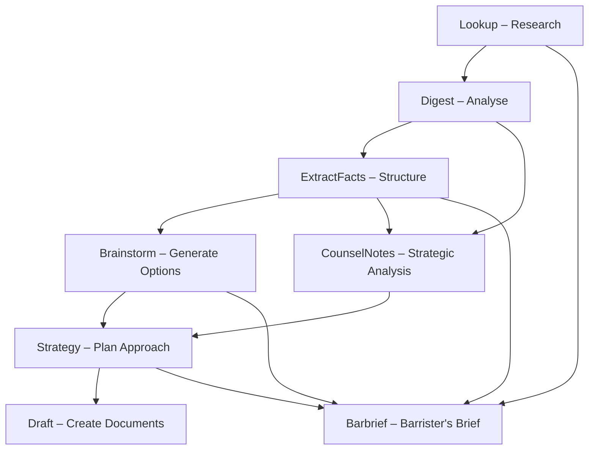

# Project Brief

**LitAssist** is a command‑line tool for automated litigation support tailored to Australian law. It leverages large language models and a managed vector store to provide an end‑to‑end pipeline for legal research, analysis, fact extraction, strategy generation, and document drafting.

## Key Objectives

- Streamline legal research and due diligence workflows  
- Ensure citation accuracy and professional‑grade legal writing  
- Provide transparent reasoning traces for strategic recommendations  
- Deliver repeatable, auditable, end‑to‑end support for litigation documents  

## Scope

- Australian case law research and citation verification  
- Document summarization and structured fact extraction  
- Strategic counsel's notes with advocate perspective analysis
- Creative and orthodox strategy brainstorming  
- Citation‑verified document drafting with retrieval‑augmented generation
- Comprehensive barrister's briefs for litigation proceedings
