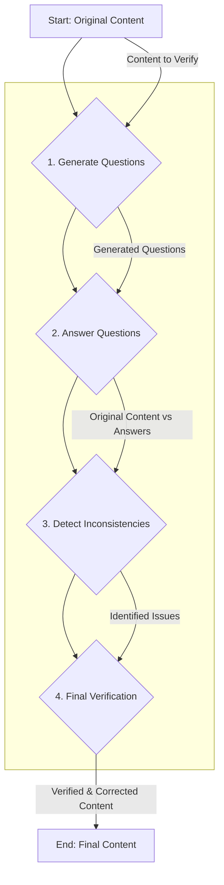

# System Patterns

## Architecture Overview

- **CLI Entry Point**: `litassist/cli.py` defines the top-level Click commands.
- **Command Modules**: Each workflow (lookup, digest, extractfacts, brainstorm, strategy, draft, counselnotes, barbrief) lives under `litassist/commands/`.
- **Core Services**:
  - **LLM Integration** in `litassist/llm.py` with `LLMClientFactory`.
  - **Citation Validation** in `litassist/citation_patterns.py` and `litassist/citation_verify.py`.
  - **Prompt Templates** in `litassist/prompts/*.yaml`.
  - **Vector Retrieval** via Pinecone in `litassist/helpers/retriever.py` and `litassist/helpers/pinecone_config.py`.

## Pipeline Pattern

LitAssist commands form a linear pipeline:
```
Lookup → Digest → ExtractFacts → Brainstorm → Strategy → Draft → Barbrief
         ↓                                              ↘
      CasePlan                                      CounselNotes
```
- **Chunk-Based Processing (July 2025):** Digest and strategy commands now split large documents into 50k token chunks for LLM processing. This enables handling of documents exceeding API token limits while preserving context.
- **Digest Command Hinting (June 2025):** The `digest` command now supports an optional `--hint` argument, allowing users to provide a text hint to focus LLM analysis on topics related to the hint. This enables targeted processing of non-legal and general documents.
- **Digest Multiple Files (July 2025):** The `digest` command now accepts multiple input files via repeated FILE arguments. All files are processed individually then combined with clear source attribution, enabling comprehensive document digestion in a single run.
- **Research-Informed Brainstorm (June 2025):** The `brainstorm` command now supports a `--research` option, allowing one or more lookup report files to be provided. When used, the orthodox strategies prompt is dynamically injected with the research context, enabling research-grounded strategy generation. The unorthodox strategies remain purely creative. All prompt logic is managed via YAML templates; no LLM prompt text is hardcoded in Python.
- **Multiple Input Files (July 2025):** The `extractfacts` command now accepts multiple input files via repeated FILE arguments. All files are combined with clear source attribution before processing, enabling comprehensive fact extraction from multiple documents in a single run.
- **CasePlan Executable Scripts (July 18, 2025):** The `caseplan` command now generates executable bash scripts that extract all CLI commands from the workflow plan. This enables users to execute the entire recommended workflow automatically, with phase-based organization and helpful comments.

Each stage:
1. Reads inputs (files/arguments)
2. Invokes LLM with structured prompts
3. Applies citation verification (zero‑tolerance enforcement or warnings)
4. Writes timestamped outputs in `outputs/`
5. Logs metadata and performance in `logs/`

## Verification Architecture

LitAssist employs a multi-layered verification strategy, orchestrated by `litassist/verification_chain.py`. This consists of a standard, three-stage chain for baseline validation and an advanced Chain of Verification (CoVe) for deep-contextual analysis.

### Standard Verification Chain

The `run_verification_chain` function executes a sequential, fail-fast process:

1.  **Stage 1: Pattern Validation (Offline)**: Performs fast, offline checks using `validate_citation_patterns` to catch malformed citations, generic names, and future dates. High-risk commands (`extractfacts`, `strategy`) may exit early if issues are found.
2.  **Stage 2: Database Verification (Online)**: If patterns are valid, it uses `verify_all_citations` to check citation existence against authoritative databases (Jade.io). Strict commands may exit early if unverified citations are found.
3.  **Stage 3: LLM Correction (Online)**: For commands requiring the highest accuracy (`extractfacts`, `strategy`, `draft`), an LLM (`verification` client) reviews the content and a report of the previous stages to make final corrections.

### Chain of Verification (CoVe)

For the most critical workflows, `run_cove_verification` implements the Chain of Verification method to minimize factual hallucinations. This is a self-consistency check driven entirely by LLMs, without local parsing.



1.  **Question Generation**: An LLM (`cove-questions` client) generates a series of critical questions based on the input document to identify ambiguous or unsubstantiated claims.
2.  **Contextual Answering**: A separate LLM (`cove-answers` client) answers these questions. Crucially, it retrieves the full text of any legal citations mentioned, providing deep context for its answers.
3.  **Inconsistency Detection**: A third LLM (`cove-verify` client) compares the original document against the independent answers, identifying any discrepancies or hallucinations.
4.  **Regeneration**: If inconsistencies are found, a final LLM call (`cove-final` client) regenerates the content, correcting it based on the verified information. If no issues are found, the original content is passed through unchanged.

## Structured Output Patterns

- **JSON-First Extraction (June 2025)**:
  - Lookup command implements "Prompt Engineering First" principle for --extract options
  - LLM instructed to return structured JSON: `{"extract_type": ["item1", "item2", ...]}`
  - Client-side parsing attempts `json.loads()` first, falls back to regex patterns if JSON parsing fails
  - Eliminates fragile regex parsing while maintaining backward compatibility
  - Pattern applicable to other commands requiring structured data extraction

## Logging and Timing

- **Configuration Centralization**: `config.yaml` controls log format and verbosity.
- **@timed Decorator**: Applied to long‑running operations to record durations.
- **Audit Logs**: Stored in `logs/<command>_YYYYMMDD-HHMMSS.{json|md}` with prompts, responses, and timing.

## Design Patterns

- **Factory Pattern**: `LLMClientFactory` abstracts model configuration.
- **Decorator Pattern**: `@timed` for instrumentation.
- **Template Method**: Prompt-loading mechanism from YAML templates.
- **Strategy Pattern**: Separate reasoning‑trace modules for orthodox, unorthodox, and analysis stages.
- **Repository Pattern**: Pinecone wrapper for semantic search in a vector store.

## LLMClientFactory Configuration Pattern

**October 2025 Update:** Major model upgrade implementing three-tier strategy for optimal accuracy and cost-efficiency. See `docs/development/claude_llm_model_recommendations_oct_2025.md` for complete analysis and implementation details.

### Three-Tier Model Strategy

**Tier 1: Critical Verification (GPT-5 Pro)**
- **Purpose**: Maximum accuracy for critical legal soundness checking
- **Hallucination Rate**: <1% (industry-leading)
- **Commands**: verify-soundness, verification-heavy, cove-final
- **Cost**: Premium, justified by superior accuracy
- **BYOK**: Required (Tier 4+ OpenAI API key)

**Tier 2: Fast Verification (GPT-5)**
- **Purpose**: Balanced speed and accuracy for standard verification
- **Hallucination Rate**: 1.4-1.6%
- **Commands**: verification, cove-answers
- **Cost**: Moderate
- **BYOK**: Required (Tier 4+ OpenAI API key)

**Tier 3: Legal Reasoning (Claude Sonnet 4.5)**
- **Purpose**: State-of-the-art legal domain knowledge and reasoning
- **Hallucination Rate**: ~2-3%
- **Commands**: 14 commands including strategy, extractfacts, digest, caseplan, brainstorm-orthodox
- **Cost**: 80% reduction vs Claude Opus 4.1 ($3/$15 vs $15/$75)
- **Rationale**: Explicitly "state of the art on complex litigation tasks" per Anthropic

### Current Command Configurations

**Strategic Analysis:**
- **CounselNotes**: `openai/o3-pro`, reasoning_effort=high, max_completion_tokens=8192
- **Strategy**: `anthropic/claude-sonnet-4.5`, temp=0.2, top_p=0.8, thinking_effort=max
- **ExtractFacts**: `anthropic/claude-sonnet-4.5`, temp=0, top_p=0.15, thinking_effort=high
- **Barbrief**: `openai/o3-pro`, reasoning_effort=high, max_completion_tokens=32768

**Brainstorming:**
- **Brainstorm-Orthodox**: `anthropic/claude-sonnet-4.5`, temp=0.3, top_p=0.7, thinking_effort=medium
- **Brainstorm-Unorthodox**: `x-ai/grok-4`, temp=0.9, top_p=0.95
- **Brainstorm-Analysis**: `openai/o3-pro`, reasoning_effort=high, max_completion_tokens=8192

**Verification:**
- **Verification-Heavy** (Critical): `openai/gpt-5-pro`, temp=0.2, top_p=0.3, thinking_effort=max
- **Verification** (Standard): `openai/gpt-5`, temp=0.2, top_p=0.3
- **Verification-Light** (Spelling): `anthropic/claude-sonnet-4.5`, temp=0, top_p=0.2

**Document Processing:**
- **Digest-Summary**: `anthropic/claude-sonnet-4.5`, temp=0.2, top_p=0.3, thinking_effort=medium
- **Digest-Issues**: `anthropic/claude-sonnet-4.5`, temp=0.2, top_p=0.5, thinking_effort=high
- **Lookup**: `google/gemini-2.5-pro`, temp=0.2, top_p=0.4 (1M context window)

**Configuration Philosophy:**
- Three-tier strategy optimizes accuracy vs cost based on task criticality
- GPT-5 family for maximum verification accuracy where needed
- Claude Sonnet 4.5 for superior legal reasoning at reduced cost
- o3-pro for technical drafting and comprehensive analysis
- Thinking effort parameters enable extended reasoning on complex tasks
- All configurations require force verification for professional legal accountability

**Impact:**
- 40-50% overall cost reduction across application
- Superior legal reasoning quality (state-of-the-art for litigation)
- <1.6% hallucination rate on all verification tasks
- 380 unit tests passing with all new configurations

**Brainstorm Verification Behavior (Updated November 2025):**
- Verification is ALWAYS performed on all brainstorm outputs automatically
- No --verify flag needed or available - verification is mandatory
- All three sub-types (orthodox, unorthodox, analysis) have enforce_citations=True
- Clean single message: "[VERIFYING] Verifying brainstorm strategies..."
- Maintains zero-tolerance citation policy across all strategies
- **Plausibility Assessment System**: Confidence-scored risk annotations on generated strategies
- **Audit Logging**: Detailed plausibility assessments with JSON auto-formatted to markdown
- **Risk Statistics**: Confidence percentages displayed in strategy output
- **Performance Option**: Citation verification can be skipped for faster generation (internal flag)

**CounselNotes Specific Patterns:**
- Multi-document cross-synthesis capabilities
- Five-section strategic analysis framework (Overview, Opportunities, Risks, Recommendations, Management)
- Four JSON extraction modes (all, citations, principles, checklist)
- Multi-chunk consolidation for large document processing

**Barbrief Specific Patterns:**
- 10-section structured brief format (Cover Sheet through Annexures)
- Validates 10-heading case facts from extractfacts command output
- Supports multiple input types: strategies, research, supporting documents
- Hearing-type specific formatting (trial, directions, interlocutory, appeal)
- Uses o3-pro's reasoning capabilities with 32K token output limit (max_completion_tokens)
- Integrates citation verification when --verify flag is used
- Captures reasoning trace for transparency and accountability
- Implementation fixes: LLMClientFactory.for_command method, save_reasoning_trace with 2 args

## Prompt Management

- **YAML Prompts**: All system and user prompts stored in `litassist/prompts/`.
- **Runtime Loading**: Prompts injected into workflows based on command context.
- **Versioning**: Prompt templates updated centrally to apply improvements across commands.
- **Major Updates (July 2025)**: barbrief.yaml, strategies.yaml, verification.yaml, caseplan.yaml, formats.yaml, glob_help_addon.yaml, lookup.yaml, system_feedback.yaml updated for clarity, compliance, and new features.
- **Prompt Engineering**: All prompt logic managed in YAML; no hardcoded LLM templates in Python.
- **Capabilities System**: Updated capabilities.yaml to better document command interactions and extraction options (July 18, 2025).

## Infrastructure Patterns (July 18, 2025)

- **CI/CD Pipeline**: GitHub Actions workflow (`ci.yml`) runs pytest on all PRs for Python 3.11 and 3.12.
- **Pre-commit Hooks**: Configured to run pytest with fast-fail on every commit via `.pre-commit-config.yaml`.
- **Test Fixtures**: Migrated from `tempfile` to pytest's `tmp_path` fixture for better test isolation.
- **Python Version**: Updated requirement to >=3.11 to leverage modern Python features and maintain compatibility.
- **Documentation Organization**: Analysis and planning docs moved to `docs/development/` for clearer structure.

## Logging Infrastructure Patterns (November 2025)

- **Markdown Default**: Log format switched from JSON to markdown as default for better readability
- **JSON Auto-Formatting**: LLM responses in JSON automatically formatted to rich markdown in logs
- **Comprehensive Error Logging**: All LLM call/response messages logged with full error context
- **Output Location**: Outputs saved to current working directory instead of package directory
- **Parameter Error Handling**: Enhanced fail-fast detection for invalid LLM parameters
- **Anti-Injection Protection**: Prompt injection protection added for all LLM calls
- **Raw Output Persistence**: Pre-verification outputs saved for audit trail compliance

## Verification Flag Patterns (November 2025)

- **--heavy Flag**: Premium verification using gpt-5-pro for critical documents (verify command)
- **--noverify Flag**: Skip verification entirely (extractfacts, draft, strategy commands)
- **Default Behavior**: Standard verification uses claude-opus-4.1 (cost-optimized from gpt-5-pro)
- **Flag Handling**: verify_content_if_needed() properly respects verify_flag parameter
- **Audit Trail**: Raw pre-verification output always persisted regardless of verification choice
